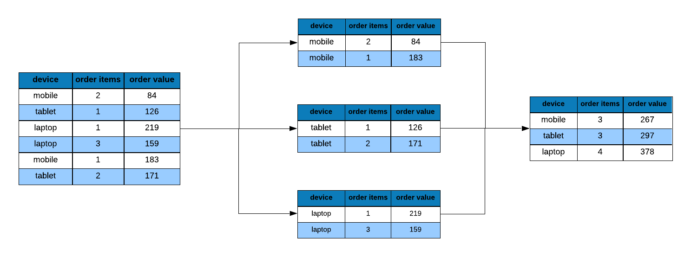

## {data-background="dplyr.png"}

## Agenda

<hr>

- filter rows
- select variables/columns
- sort/arrange data
- generate new variables
- create grouped summaries

## Introduction

<hr>

According to  a [survey](http://visit.crowdflower.com/rs/416-ZBE-142/images/CrowdFlower_DataScienceReport_2016.pdf) by [CrowdFlower](https://www.crowdflower.com/), data scientists spend most of their time cleaning and manipulating data rather than mining or modeling them for insights. As such, it becomes important to have tools that make data manipulation faster and easier. In today's post, we introduce you to [dplyr](http://dplyr.tidyverse.org/), a grammar of data manipulation.

<br>

```{r img1, echo=FALSE, out.width="70%", fig.align="center"}

```

## Libraries

<hr>


```{r dplyr1, eval=FALSE}
library(dplyr)
library(readr)
```

```{r libs, echo=FALSE, eval=TRUE, results='hide', message=FALSE}
library(dplyr)
library(readr)
```

## dplyr Verbs

<hr>


- `select`
- `filter`
- `arrange`
- `mutate`
- `summarise`

## {data-background="casestudy.png"}

## Data

<hr>

```{r show, echo=FALSE, eval=TRUE, message=FALSE}
ecom <- 
  read_csv('https://raw.githubusercontent.com/rsquaredacademy/datasets/master/web.csv',
    col_types = cols_only(device = col_factor(levels = c("laptop", "tablet", "mobile")),
      referrer = col_factor(levels = c("bing", "direct", "social", "yahoo", "google")),
      purchase = col_logical(), n_pages = col_double(), n_visit = col_double(),
      duration = col_double(), order_value = col_double(), order_items = col_double()
    )
  )

ecom
```


## Data Dictionary

<hr>

- referrer: referrer website/search engine
- device: device used to visit the website
- n_pages: number of pages visited
- duration: time spent on the website (in seconds)
- purchase: whether visitor purchased
- order_value: order value of visitor (in dollars)

## Case Study

<hr>

- what is the average order value by device types?
- what is the average number of pages visited by purchasers and non-purchasers?
- what is the average time on site for purchasers vs non-purchasers?
- what is the average number of pages visited by purchasers and non-purchasers using mobile?


## Average Order Value

<hr>

<br>

```{r img2, echo=FALSE, out.width="80%", fig.align="center"}
knitr::include_graphics("image.jpg")
```

## AOV by Devices

<hr>

<br>

```{r img12, echo=FALSE, out.width="80%", fig.align="center"}
knitr::include_graphics("dplyr_aov_map.png")
```

## AOV by Devices

<hr>

```{r case}
ecom %>%
  filter(purchase) %>%
  select(device, order_value) %>%
  group_by(device) %>%
  summarise_all(funs(revenue = sum, orders = n())) %>%
  mutate(
    aov = revenue / orders
  ) %>%
  select(device, aov)
```


## {data-background="filter.png"}

## Filter 

<hr>

<br>
<br>

```{r img4, echo=FALSE, out.width="100%", fig.align="center"}
knitr::include_graphics("filter_1.png")
```

## Filter all visits from mobile

<hr>

```{r dplyr2}
filter(ecom, device == "mobile")
```

## Visits from mobile that converted

<hr>

<br>
<br>

```{r img5, echo=FALSE, out.width="100%", fig.align="center"}
knitr::include_graphics("filter_2.png")
```

## Visits from mobile that converted

<hr>

```{r dplyr3}
filter(ecom, device == "mobile", purchase)
```

## Visits from mobile & visited > 5 pages 

<hr>

```{r dplyr4}
filter(ecom, device == "mobile", n_pages > 5)
```

## Case Study

<hr>

```{r dplyr5}
filter(ecom, purchase)
```

## {data-background="select.png"}

## Select device and purchase columns 

<hr>

<br>
<br>

```{r img6, echo=FALSE, out.width="100%", fig.align="center"}
knitr::include_graphics("select_1.png")
```

## Select device and duration column

<hr>

```{r dplyr6}
select(ecom, device, duration)
```

## Select Multiple Columns

<hr>

<br>
<br>

```{r img7, echo=FALSE, out.width="100%", fig.align="center"}
knitr::include_graphics("select_2.png")
```

## Select all columns from referrer to order items

<hr> 

```{r dplyr7}
select(ecom, referrer:order_items)
```

## Select Multiple Columns

<hr>

<br>
<br>

```{r img8, echo=FALSE, out.width="100%", fig.align="center"}

```

## Select all columns excluding n_pages and duration

<hr>

```{r dplyr8}
select(ecom, -n_pages, -duration)
```

## Case Study

<hr>


```{r dplyr9}
select(ecom, device, order_value)
```

## Case Study

<hr>


```{r dplyr10}
ecom1 <- filter(ecom, purchase)
ecom2 <- select(ecom1, device, order_value)
ecom2
```

## {data-background="group.png"}

## Group data by referrer type 

<hr>

```{r dplyr11}
group_by(ecom, referrer)
```

## Case Study

<hr>

```{r dplyr12}
ecom3 <- group_by(ecom2, device)
ecom3
```

## {data-background="summarise.png"}

## Summarize: Total Order Value

<hr>

<br>
<br>

```{r img10, echo=FALSE, out.width="100%", fig.align="center"}

```

## Case Study

<hr>

```{r dplyr13}
ecom4 <- summarise(ecom3, revenue = sum(order_value),
          orders = n())
ecom4
```

## Case Study

<hr>

```{r dplyr14}
ecom4 <- summarise_all(ecom3, funs(revenue = sum, orders = n()))
ecom4
```

## {data-background="mutate.png"}

## Mutate

<hr>

<br>
<br>

```{r img11, echo=FALSE, out.width="100%", fig.align="center"}
knitr::include_graphics("mutate_1.png")
```

## Case Study

<hr>

```{r dplyr15}
ecom5 <- mutate(ecom4, aov = revenue / orders)
ecom5
```

## {data-background="select.png"}

## Select Relevant Columns

<hr>

```{r dplyr16}
ecom6 <- select(ecom5, device, aov)
ecom6
```

## Arrange Data

<hr>

```{r img13, echo=FALSE, out.width="100%", fig.align="center"}

```

## Ascending Order

<hr>

```{r arrange_eg}
arrange(ecom, n_pages)
```

## Descending Order

<hr>

```{r arrange_eg2}
arrange(ecom , desc(n_pages))
```

## Multiple Variables

<hr>

```{r arrange_eg3}
arrange(ecom, n_visit, desc(n_pages))
```

## Case Study

<hr>

```{r arrange4}
arrange(ecom6, aov)
```

## {data-background="aov2.png"}

## AOV by Devices

<hr>

```{r dplyr17}
ecom1 <- filter(ecom, purchase)
ecom2 <- select(ecom1, device, order_value)
ecom3 <- group_by(ecom2, device)
ecom4 <- summarise_all(ecom3, funs(revenue = sum, orders = n()))
ecom5 <- mutate(ecom4, aov = revenue / orders)
ecom6 <- select(ecom5, device, aov)
ecom6
```


## AOV by Devices

<hr>

```{r dplyr18}
ecom %>%
  filter(purchase) %>%
  select(device, order_value) %>%
  group_by(device) %>%
  summarise_all(funs(revenue = sum, orders = n())) %>%
  mutate(
    aov = revenue / orders
  ) %>%
  select(device, aov)
```


## Practice Questions

<hr>

- what is the average number of pages visited by purchasers and non-purchasers?
- what is the average time on site for purchasers vs non-purchasers?
- what is the average number of pages visited by purchasers and non-purchasers using mobile?

## {data-background="thankyou.png"}
