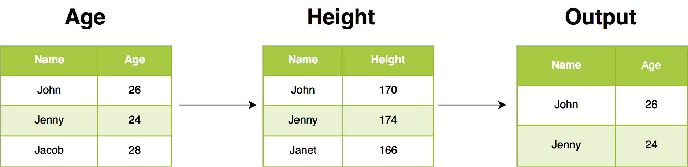

## {data-background="dplyr.png"}

## Agenda

<hr>

- inner join
- left join
- right join
- semi join 
- anti join 
- full join 

## {data-background="casestudy.png"}

## Case Study

<hr>

- details of customers who have placed orders and their order details
- details of customers and their orders irrespective of whether a customer has 
placed orders or not.
- get customer details for all orders
- get customer data, if available, for all orders
- details of customers who have not placed orders
- details of all customers and all orders

## Case Study

<hr>

<br>
<br>

```{r img1, echo=FALSE, out.width="100%", fig.align="center"}
knitr::include_graphics("join_data.png")
```

## Libraries

<hr>

```{r dplyr1, echo=FALSE, eval=TRUE, results='hide', message=FALSE}
library(dplyr)
library(readr)
options(tibble.width = Inf)
```

```{r dplyr1a, echo=TRUE, eval=FALSE, results='hide', message=FALSE}
library(dplyr)
library(readr)
```

## Data: Orders

<hr>

```{r dplyr25, eval=FALSE}
order <- read_delim('https://raw.githubusercontent.com/rsquaredacademy/datasets/master/order.csv', delim = ';')
```

```{r dplyr2, echo=FALSE, eval=TRUE, message=FALSE}
order <- read_delim('https://raw.githubusercontent.com/rsquaredacademy/datasets/master/order.csv', delim = ';')
order
```

## Data: Customers

<hr>

```{r dplyr26, eval=FALSE}
customer <- read_delim('https://raw.githubusercontent.com/rsquaredacademy/datasets/master/customer.csv', delim = ';')
```

```{r dplyr, echo=FALSE, eval=TRUE, message=FALSE}
customer <- read_delim('https://raw.githubusercontent.com/rsquaredacademy/datasets/master/customer.csv', delim = ';')
customer
```

## Example Data

<hr>

<br>
<br>

```{r img2, echo=FALSE, out.width="100%", fig.align="center"}

```

## {data-background="innerjoin.png"}

## Inner Join

<hr>

<br>
<br>

```{r img3, echo=FALSE, out.width="100%", fig.align="center"}
knitr::include_graphics("draw_inner.png")
```

## Case Study

<hr>

```{r dplyr3}
inner_join(customer, order, by = "id")
```

## {data-background="leftjoin.png"}

## Left Join

<hr>

<br>
<br>

```{r img4, echo=FALSE, out.width="100%", fig.align="center"}
knitr::include_graphics("draw_left.png")
```

## Case Study

<hr>

```{r dplyr4}
left_join(customer, order, by = "id")
```

## {data-background="rightjoin.png"}

## Right Join

<hr>

<br>
<br>

```{r img5, echo=FALSE, out.width="100%", fig.align="center"}
knitr::include_graphics("draw_right.png")
```

## Case Study

<hr>

```{r dplyr5}
right_join(customer, order, by = "id")
```

## {data-background="semijoin.png"}

## Semi Join

<hr>

<br>
<br>

```{r img6, echo=FALSE, out.width="100%", fig.align="center"}

```

## Case Study

<hr>

```{r dplyr6}
semi_join(customer, order, by = "id")
```

## {data-background="antijoin.png"}

## Anti Join

<hr>

<br>
<br>

```{r img7, echo=FALSE, out.width="100%", fig.align="center"}

```

## Case Study

<hr>

```{r dplyr7}
anti_join(customer, order, by = "id")
```

## {data-background="fulljoin.png"}

## Full Join

<hr>

<br>
<br>

```{r img8, echo=FALSE, out.width="100%", fig.align="center"}
knitr::include_graphics("draw_full.png")
```

## Case Study

<hr>

```{r dplyr8}
full_join(customer, order, by = "id")
```

## {data-background="thankyou.png"}

