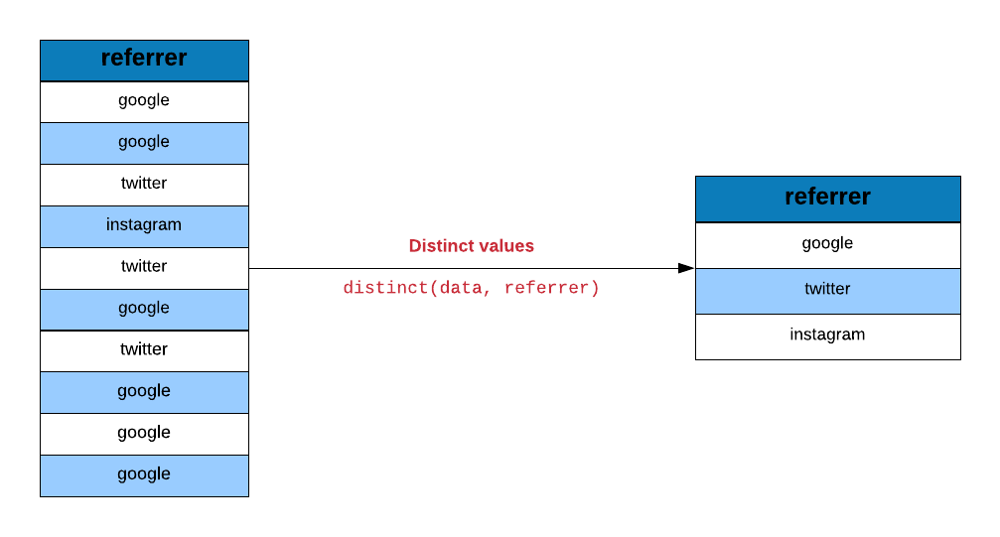
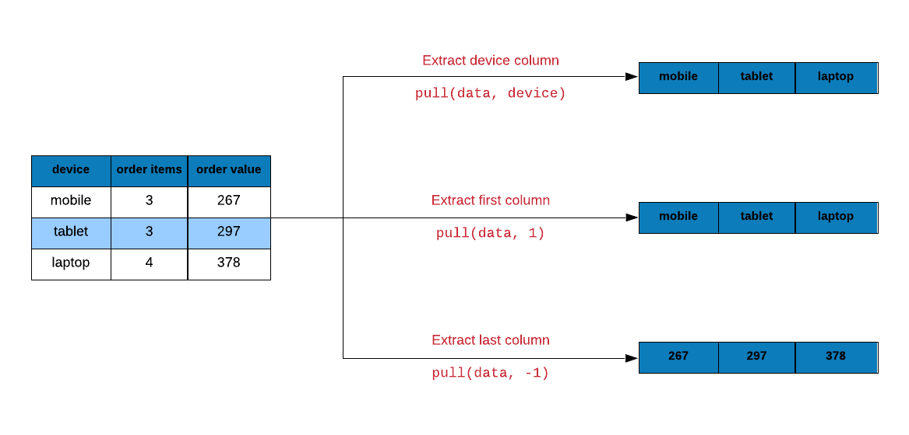
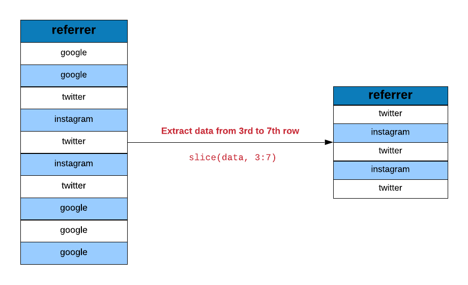
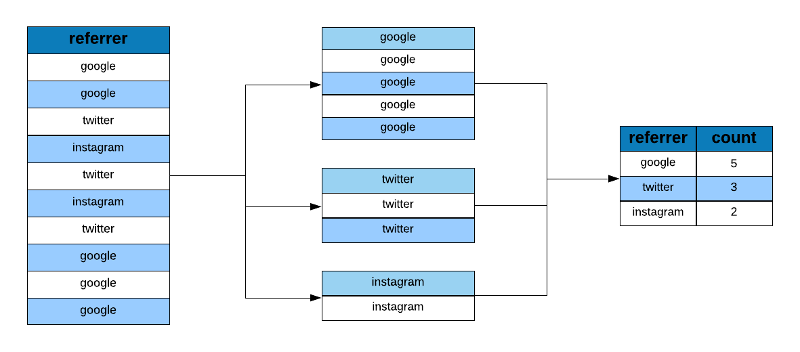

## {data-background="dplyr.png"}

## Agenda

<hr>

- extract unique rows 
- rename columns
- sample data
- extract columns
- slice rows
- arrange rows
- compare tables
- extract/mutate data using predicate functions
- count observations for different levels of a variable

## Case Study

<hr>

Let us look at a case study (e-commerce data) and see how we can use dplyr helper functions to answer questions we have about and to modify/transform the underlying data set. You can download the data from [here](https://github.com/rsquaredacademy/datasets/blob/master/web.csv) or import it directly using `read_csv()` from the [readr](readr.tidyverse.org) package.

## Libraries

<hr>


```{r libs2a, eval=FALSE}
library(dplyr)
library(readr)
```

```{r libs2b, echo=FALSE, eval=TRUE, results='hide', message=FALSE}
library(dplyr)
library(readr)
```

## Data

<hr>

```{r import, eval=FALSE}
ecom <- read_csv('https://raw.githubusercontent.com/rsquaredacademy/datasets/master/web.csv')
```


```{r show, echo=FALSE, eval=TRUE, message=FALSE}
ecom <- read_csv('https://raw.githubusercontent.com/rsquaredacademy/datasets/master/web.csv')
ecom
```

## Data Dictionary

<hr>

- id: row id
- referrer: referrer website/search engine
- os: operating system
- browser: browser
- device: device used to visit the website
- n_pages: number of pages visited
- duration: time spent on the website (in seconds)
- repeat: frequency of visits
- country: country of origin
- purchase: whether visitor purchased
- order_value: order value of visitor (in dollars)

```{r dplyr1, echo=FALSE, eval=TRUE, results='hide', message=FALSE}
library(dplyr)
options(tibble.width = Inf)
```

## Distinct

<hr>

<br>
<br>

```{r img1, echo=FALSE, out.width="100%", fig.align="center"}

```

## Traffic Sources

<hr>

```{r dplyr2}
distinct(ecom, referrer)
```

## Device Types

<hr>

```{r dplyr30}
distinct(ecom, device)
```

## Rename

<hr>

<br>
<br>

```{r img2, echo=FALSE, out.width="100%", fig.align="center"}
knitr::include_graphics("rename_1.png")
```

## Rename Columns

<hr>

```{r dplyr3}
rename(ecom, time_on_site = duration)
```

## Sampling

<hr>

<br>
<br>

```{r img3, echo=FALSE, out.width="100%", fig.align="center"}
knitr::include_graphics("sample_frac_n.png")
```

## Sampling Data

<hr>

```{r dplyr4}
sample_n(ecom, size = 700)
```

## Sampling Data

<hr>

```{r dplyr6}
sample_frac(ecom, size = 0.7)
```

## Extract Columns

<hr>

<br>
<br>

```{r img4, echo=FALSE, out.width="100%", fig.align="center"}

```

## Extract Device Column

<hr>

```{r dplyr8}
pull(ecom, device)
```

## Extract First Column

<hr>

```{r dplyr9}
pull(ecom, 1)
```

## Extract Last Column

<hr>

```{r dplyr10}
pull(ecom, -1)
```

## Extract Rows

<hr>

<br>

```{r img5, echo=FALSE, out.width="100%", fig.align="center"}

```

## Extract First 20 Rows

<hr>

```{r dplyr11}
slice(ecom, 1:20)
```

## Extract Last Row

<hr>

```{r dplyr12}
slice(ecom, n())
```

## Tally

<hr>

<br>
<br>

```{r img6, echo=FALSE, out.width="100%", fig.align="center"}

```

## Tabulate Referrers

<hr>

```{r dplyr14}
ecom %>%
  group_by(referrer) %>%
  tally()
```

## Tabulate Referrers and Bouncers

<hr>

```{r dplyr15}
ecom %>%
  group_by(referrer, bouncers) %>%
  tally()
```

## Tabulate Referrers and Purchasers

<hr>

```{r dplyr16}
ecom %>%
  group_by(referrer, purchase) %>%
  tally()
```

## Tabulate Referrers & Converts

<hr>

```{r dplyr25}
ecom %>%
  group_by(referrer, purchase) %>%
  tally() %>%
  filter(purchase == 'true')
```

## Count

<hr>

```{r dplyr17}
count(ecom, referrer, purchase)
```

## Arrange

<hr>

<br>
<br>

```{r img7, echo=FALSE, out.width="100%", fig.align="center"}
knitr::include_graphics("arrange_1.png")
```

## Top 2 Referrers by Orders

<hr>

```{r dplyr18}
ecom %>%
  count(referrer, purchase) %>%
  filter(purchase == 'true') %>%
  arrange(desc(n)) %>%
  top_n(n = 2)
```

## Between

<hr>

```{r dplyr19}
ecom %>%
  pull(n_pages) %>%
  between(5, 15) 
```

## Case When

<hr>

```{r dplyr20}
ecom %>%
  select(n_pages, order_value) %>%
  mutate(
    type = case_when(
      n_pages == 1 ~ 'Bouncers',
      order_value > 0 ~ 'Converts',
      TRUE ~ 'Others'
    )
  )
```

## Select First Observation

<hr>

```{r dplyr21}
ecom %>%
  pull(referrer) %>%
  nth(1)

ecom %>%
  pull(referrer) %>%
  first()
```

## Select 1000th Observation

<hr>

```{r dplyr22}
ecom %>%
  pull(referrer) %>%
  nth(1000)
```

## Select Last Observation

<hr>

```{r dplyr23}
ecom %>%
  pull(referrer) %>%
  last()
```

## {data-background="thankyou.png"}

<!-- To do: -->
<!--   - explain case study data -->
