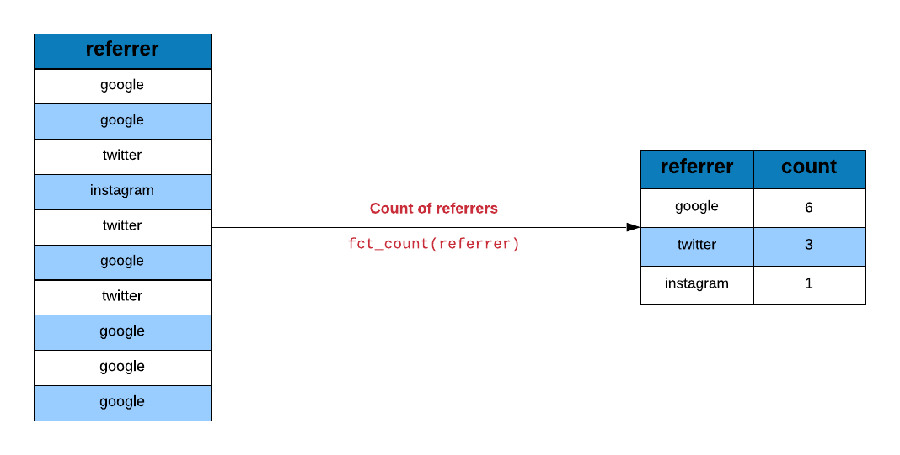
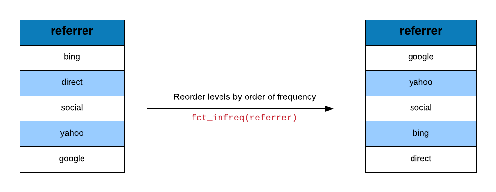
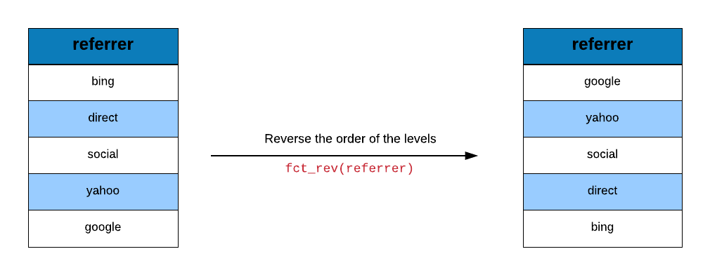
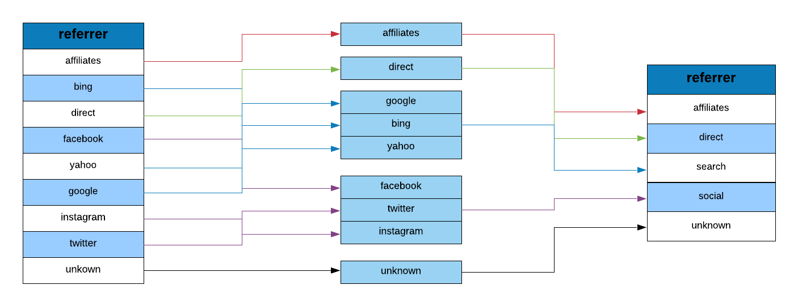
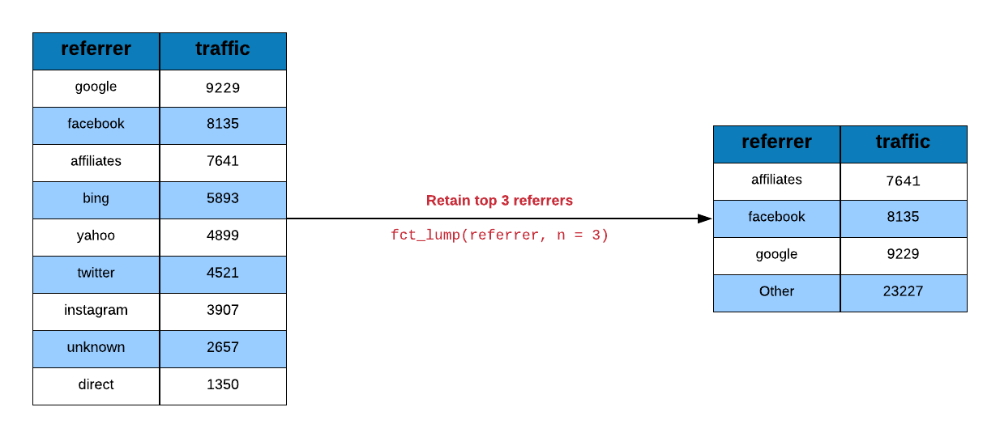
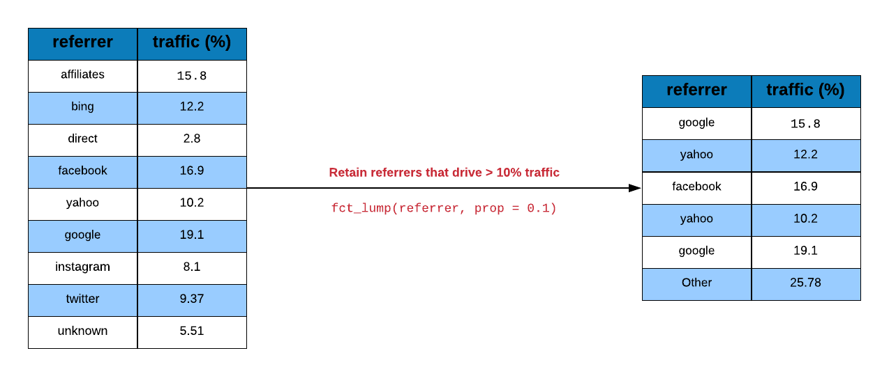
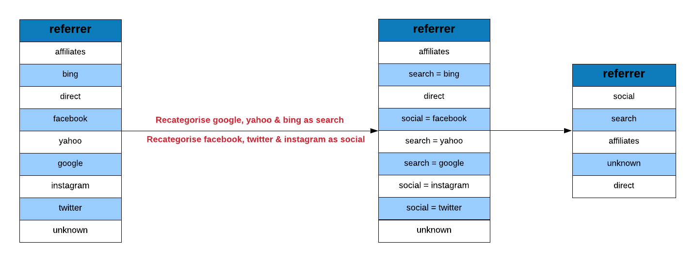
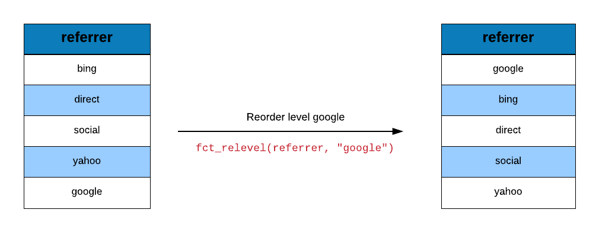
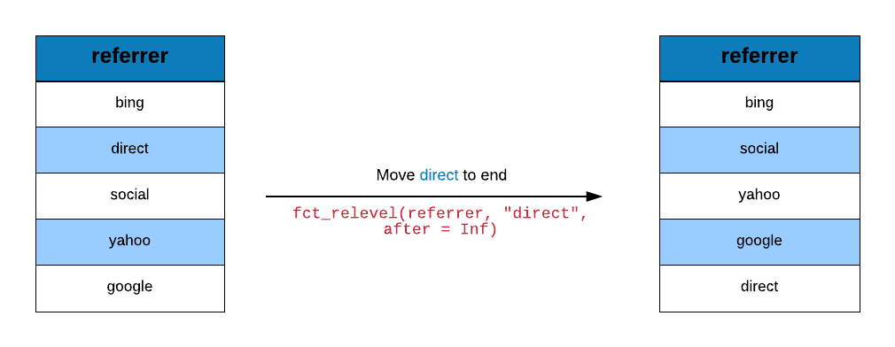
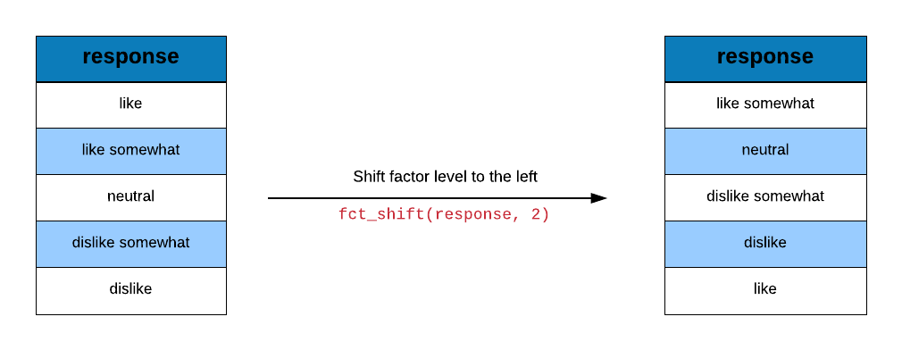

## {data-background="forcats.png"}

## Agenda

<hr>

- understand categorical data
- ordinal vs nominal data
- how to create factors 
- how to check 
    - number of levels
    - names of levels
- how to create ordered factors 
- how to
    - tabulate levels
    - reorder levels
    - reverse levels
    - collapse levels
    - recode levels
    - recategorize levels
    - shift levels

## Libraries

<hr>

```{r cat, eval=FALSE}
library(forcats)
library(magrittr)
library(dplyr)
library(readr)
```

```{r cat1, echo=FALSE, eval=TRUE, results='hide', message=FALSE}
library(forcats)
library(magrittr)
library(dplyr)
library(readr)
```

## Categorical/Qualitative Data

<hr>

## Ordinal Data

<hr>

## Nominal Data

<hr>

## Factors

<hr>

## Levels

<hr>

## Level Names

<hr>

## Ordered Factors

<hr>

## Case Study: Data 

<hr>

```{r import2e, echo=FALSE, message=FALSE}
web_traffic <- 
  read_csv('https://raw.githubusercontent.com/rsquaredacademy/datasets/master/web_traffic.csv',
    col_types = list(
      col_factor(levels = c("google", "facebook", "affiliates", 
    	"bing", "yahoo", "twitter", "instagram", "unknown", "direct")
      )
    )
  )
```

<br>

```{r import2, eval=TRUE, echo=FALSE, message=FALSE}
web_traffic
```

## Extract Column

<hr>

```{r import2a}
traffics <- use_series(web_traffic, traffics)
traffics
```

## Case Study

<hr>

- compute the frequency of different referrers
- collapse referrers with low sample size into a single group
- club traffic from social media websites into a new category
- group referrers with traffic below a threshold into a single category

## Count

<hr>

<br>
<br>

```{r img1, echo=FALSE, out.width="100%", fig.align="center"}

```
 
## Tabulate Referrers

<hr>

```{r cat2}
fct_count(traffics)
```

## Levels

<hr>

```{r cat22}
levels(traffics)
```

## Reorder Factor Levels

<hr>

<br>
<br>

```{r img2, echo=FALSE, out.width="100%", fig.align="center"}

```

## Sort Referrer by Frequency

<hr>

```{r cat23}
traffics %>%
  fct_infreq() %>%
  levels()
```

## Sort Referrer by Order of Appearance 

<hr>

```{r inorder}
traffics %>%
  fct_inorder() %>%
  levels()
```

## Reverse Levels

<hr>

<br>
<br>

```{r img3, echo=FALSE, out.width="100%", fig.align="center"}

```

## Reverse Levels

<hr>

```{r cat25}
traffics %>%
  fct_rev() %>%
  levels()
```

## Tabulate Referrer

<hr>

```{r cat6}
fct_count(traffics)
```

## Collapse Levels

<hr>

<br>
<br>

```{r img4, echo=FALSE, out.width="100%", fig.align="center"}

```

## Collapse Referrer Categories

<hr>

```{r cat7}
traffics %>% 
  fct_collapse(
  social = c("facebook", "twitter", "instagram"),
  search = c("google", "bing", "yahoo")) %>% 
  fct_count() 
```

## Lump Categories

<hr>

<br>
<br>

```{r img5, echo=FALSE, out.width="100%", fig.align="center"}

```

## Lump Infrequent Referrer Types

<hr>

```{r cat8, echo=FALSE}
fct_count(traffics)
```

```{r cat8b}
traffics %>% 
  fct_lump() %>% 
  table()
```

## Retain top 3 referrers

<hr>

```{r cat9, echo=FALSE}
traffics %>% 
  fct_count() %>% 
  arrange(desc(n))
```

```{r cat17}
traffics %>% 
  fct_lump(n = 3) %>% 
  table()
```

## Lump Categories

<hr>

<br>
<br>

```{r img6, echo=FALSE, out.width="100%", fig.align="center"}

```

## Lump Referrer Types with less than 10% traffic

<hr>

```{r cat12, echo=FALSE}
traffics %>% 
  fct_count() %>%
  mutate(
    percent = round((n / sum(n)) * 100, 2)
  )
```

```{r cat16}
traffics %>% 
  fct_lump(prop = 0.1) %>% 
  table()
```

## Lump Referrer Types with less than 15% traffic

<hr>

```{r cat13, echo=FALSE}
traffics %>% 
  fct_count() %>%
  mutate(
    percent = round((n / sum(n)) * 100, 2)
  )
```

```{r cat18}
traffics %>% 
  fct_lump(prop = 0.15) %>% 
  table()
```

## Retain 3 Referrer Types with lowest traffic

<hr>

```{r cat14, echo=FALSE}
traffics %>% 
  fct_count() %>% 
  arrange(n)
```

```{r cat19}
traffics %>% 
  fct_lump(n = -3) %>% 
  table()
```

## Retain 3 Referrer Types with less than 10% traffic

<hr>

```{r cat15, echo=FALSE}
traffics %>% 
  fct_count() %>%
  mutate(
    percent = round((n / sum(n)) * 100, 2)
  )
```

```{r cat20}
traffics %>% 
  fct_lump(prop = -0.1) %>% 
  table()
```

## Drop Levels

<hr>

<br>
<br>

```{r img7, echo=FALSE, out.width="100%", fig.align="center"}
knitr::include_graphics("fct_drop.png")
```

## Replace Levels

<hr>

<br>
<br>

```{r img8, echo=FALSE, out.width="100%", fig.align="center"}
knitr::include_graphics("fct_others_1.png")
```

## Replace Levels with Other

<hr>

```{r other_1}
fct_other(traffics, keep = c("google", "yahoo")) %>% levels()
```

## Replace Levels

<hr>

<br>
<br>

```{r img9, echo=FALSE, out.width="100%", fig.align="center"}
knitr::include_graphics("fct_others_2.png")
```

## Replace Levels with Other

<hr>

```{r other_2}
fct_other(traffics, drop = c("instagram", "twitter")) %>% levels()
```

## Recode Levels

<hr>

<br>
<br>

```{r img10, echo=FALSE, out.width="100%", fig.align="center"}

```

## Recode Levels

<hr>

```{r recode}
fct_recode(traffics, search = "bing", 
                     search = "yahoo", 
                     search = "google",
                     social = "facebook", 
                     social = "twitter", 
                     social = "instagram") %>%
  levels()
```

## Reorder Levels

<hr>

<br>
<br>

```{r img11, echo=FALSE, out.width="100%", fig.align="center"}

```

## Reorder Levels

<hr>

```{r relevel_1}
fct_relevel(traffics, "twitter") %>% levels()
```

## Reorder Levels

<hr>

<br>
<br>

```{r img12, echo=FALSE, out.width="100%", fig.align="center"}

```

## Reorder Levels

<hr>

```{r relevel_2}
fct_relevel(traffics, "google", after = 2) %>% levels()
```

## Reorder Levels

<hr>

<br>
<br>

```{r img13, echo=FALSE, out.width="100%", fig.align="center"}

```

## Reorder Levels

<hr>

```{r relevel_3}
fct_relevel(traffics, "facebook", after = Inf) %>% levels()
```

## Data 

<hr>

```{r import3, eval=FALSE, message=FALSE}
response
```

```{r import3a, echo=FALSE, message=FALSE}
response <- read_csv('https://raw.githubusercontent.com/rsquaredacademy/datasets/master/response.csv',
  col_types = list(col_factor(levels = c("like", "like somewhat", "neutral", 
    "dislike somewhat", "dislike"), ordered = TRUE)))

response
```

## Data

<hr>

```{r import2n}
responses <- use_series(response, response)
responses
```

## Shift Levels

<hr>

<br>
<br>

```{r img14, echo=FALSE, out.width="100%", fig.align="center"}

```

## Shift Levels

<hr>

```{r shift_1}
fct_shift(responses, 2) %>% levels()
```

## Shift Levels

<hr>

<br>
<br>

```{r img15, echo=FALSE, out.width="100%", fig.align="center"}
knitr::include_graphics("fct_shift_2.png")
```

## Shift Levels

<hr>

```{r shift_2}
fct_shift(responses, -2) %>% levels()
```

## References 

<hr>

- https://forcats.tidyverse.org/index.html
- http://r4ds.had.co.nz/factors.html

## {data-background="thankyou.png"}
  