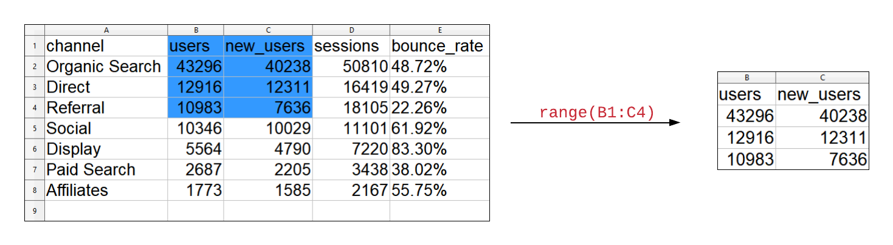
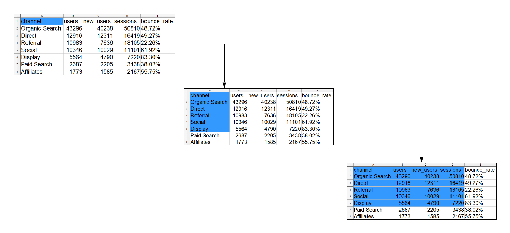
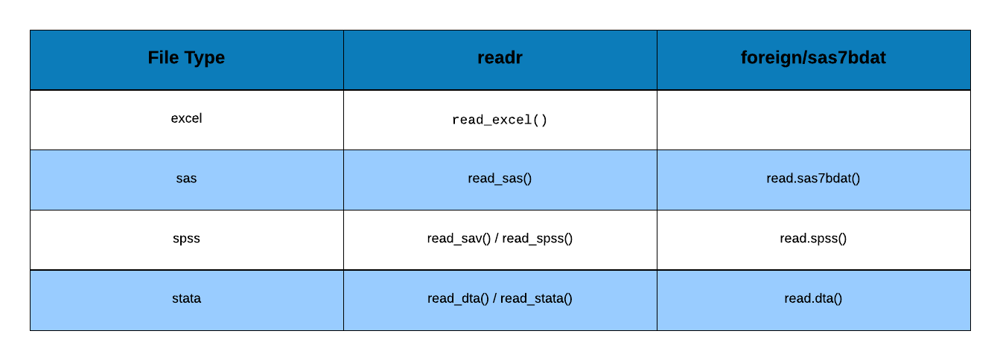

## {data-background="import.png"}

## Agenda

<hr>

Read data from 

  - xls
  - xlsx
  - SAS
  - SPSS
  - STATA

## Libraries

<hr>

```{r importlib1,eval=FALSE}
library(readxl)
library(haven)
```

```{r importlib2, echo=FALSE, eval=TRUE, results='hide', message=FALSE}
library(readxl)
library(haven)
```

## Overview

<hr>

- list sheets in an excel file
- read data from an excel sheet
- read specific cells
- read specific rows
- read specific columns

## List Sheets

<hr>

```{r import55}
excel_sheets('sample.xls')
```

## Read Sheet

<hr>

```{r import56, echo=TRUE, results='markup', message=FALSE}
read_excel('sample.xls', sheet = 1)
```

## Read Specific Cells

<hr>

<br>
<br>
<br>
<br>

```{r import74, echo=FALSE, out.width="100%", fig.align="center"}

```

## Read Specific Cells

<hr>

```{r import58, echo=TRUE, results='markup', message=FALSE}
read_excel('sample.xls', sheet = 1, range = "B1:C4")
```

## Read Specific Cells

<hr>

<br>

```{r import75, echo=FALSE, out.width="100%", fig.align="center"}
knitr::include_graphics("readxl_anchored_lucid.png")
```

## Read Specific Cells

<hr>

```{r import61, echo=TRUE, results='markup', message=FALSE}
read_excel('sample.xls', sheet = 1, col_names = FALSE,
  range = anchored("A4", dim = c(3, 2)))
```

## Read Specific Cells

<hr>

<br>

```{r import76, echo=FALSE, out.width="100%", fig.align="center"}

```

## Read Specific Cells

<hr>

```{r import65a, echo=TRUE, results='markup', message=FALSE}
read_excel('sample.xls', sheet = 1,
  range = cell_limits(c(1, 1), c(6, 4)))
```

## Read Specific Cells

<hr>

```{r import65, echo=TRUE, results='markup', message=FALSE}
read_excel('sample.xls', sheet = 1,
  range = cell_limits(c(1, 2), c(NA, NA)))
```

## Read Specific Cells

<hr>

```{r import66, echo=TRUE, results='markup', message=FALSE}
read_excel('sample.xls', sheet = 1,
  range = cell_limits(c(1, NA), c(NA, 2)))
```

## Read Single Column

<hr>

```{r import64, echo=TRUE, results='markup', message=FALSE}
read_excel('sample.xls', sheet = 1, range = cell_cols(2))
```


## Read Specific Rows

<hr>

```{r import62, echo=TRUE, results='markup', message=FALSE}
read_excel('sample.xls', sheet = 1, range = cell_rows(1:4))
```

## Read Specific Columns

<hr>

```{r import63, echo=TRUE, results='markup', message=FALSE}
read_excel('sample.xls', sheet = 1, range = cell_cols(2:3))
```

## Read Specific Cells

<hr>

<br>

```{r import77, echo=FALSE, out.width="80%", fig.align="center"}
knitr::include_graphics("range_summary.png")
```

## Statistical Softwares

<hr>

- SAS
- SPSS
- STATA

## STATA

<hr>

```{r import68, echo=TRUE, results='markup', message=FALSE}
read_stata('airline.dta')  
```

## SPSS

<hr>

```{r import71, echo=TRUE, results='markup', message=FALSE}
read_spss('employee.sav')  
```

## SAS

<hr>

```{r import73, echo=TRUE, results='markup', message=FALSE}
read_sas('airline.sas7bdat')
```

## Summary

<hr>

<br>
<br>
<br>
<br>

```{r import78, echo=FALSE, out.width="100%", fig.align="center"}

```

## {data-background="thankyou.png"}
