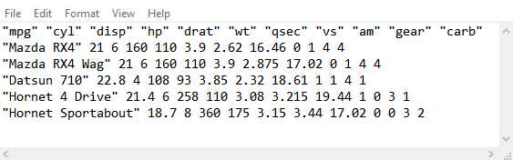
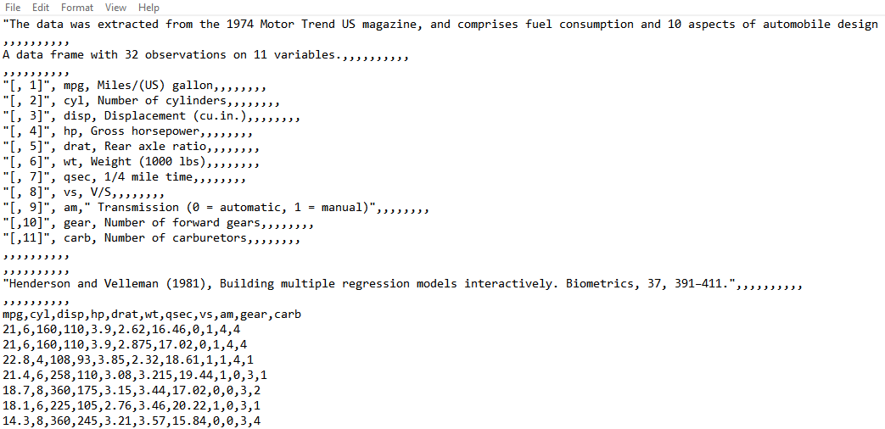
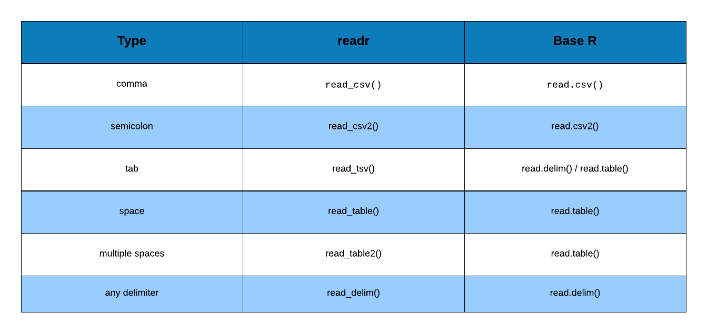

## {data-background="import.png"}

## Agenda

<hr>

- read data from flat or delimited files
- handle column names/header
- skip text/info 
- specify column/variable types
- read specific columns/variables 

## Libraries

<hr>

```{r importlib1,eval=FALSE}
library(readr)
```

```{r importlib2, echo=FALSE, eval=TRUE, results='hide', message=FALSE}
library(readr)
```

## Comma Separated Values

<hr>

<br>
<br>
<br>
<br>

```{r import12, echo=FALSE, out.width="100%", fig.align="center"}

```

## Semi Colon Separated Values

<hr>

<br>
<br>
<br>
<br>

```{r import12a, echo=FALSE, out.width="100%", fig.align="center"}
knitr::include_graphics("mtcars_semicolon.png")
```

## Space Separated Values

<hr>

<br>
<br>
<br>
<br>

```{r import12b, echo=FALSE, out.width="100%", fig.align="center"}

```

## Tab Separated Values

<hr>

<br>
<br>
<br>
<br>

```{r import12c, echo=FALSE, out.width="100%", fig.align="center"}

```

## Read CSV File

<hr>

```{r import2, echo=TRUE, results='markup', message=FALSE}
read_csv('mtcars.csv')
```

## Read CSV File

<hr>

```{r import2a, echo=TRUE, results='markup', message=FALSE}
read_delim('mtcars.csv', delim = ",")
```

## Column Names

<hr>

<br>

```{r import13a, echo=FALSE, out.width="80%", fig.align="center"}

```

<br>

```{r import13b, echo=FALSE, out.width="80%", fig.align="center"}

```

## Column Names 

<hr>

```{r import4a, echo=TRUE, results='markup', message=FALSE}
read_csv('mtcars1.csv')
```

## Column Names 

<hr>

```{r import4, echo=TRUE, results='markup', message=FALSE}
read_csv('mtcars1.csv', col_names = FALSE)
```

## Skip Lines

<hr>

<br>

```{r import14a, echo=FALSE, out.width="100%", fig.align="center"}

```

## Skip Lines 

<hr>

```{r import6a, echo=TRUE, results='markup', message=FALSE}
read_csv('mtcars2.csv')
```

## Skip Lines 

<hr>

```{r import6, echo=TRUE, results='markup', message=FALSE}
read_csv('mtcars2.csv', skip = 19)
```

## Maximum Lines 

<hr>

```{r import8, echo=TRUE, results='markup', message=FALSE}
read_csv('mtcars.csv', n_max = 20)
```

## Column Types

<hr>

<br>

```{r import15a, echo=FALSE, out.width="100%", fig.align="center"}
knitr::include_graphics("column_types_list_canva.png")
```

## Column Types

<hr>

```{r import55, echo=TRUE, results='markup', message=FALSE}
spec_csv('mtcars5.csv')
```

## Column Types

<hr>

<br>

```{r import16a, echo=FALSE, out.width="100%", fig.align="center"}
knitr::include_graphics("column_objective_function_map.png")
```

## Column Types 

<hr>

```{r import10, echo=TRUE, results='markup', message=FALSE}
read_csv('mtcars5.csv', 
         col_types = list(col_double(), col_factor(levels = c(4, 6, 8)),
                          col_double(), col_integer()))
```

## Skip Columns

<hr>

```{r import10a, echo=TRUE, eval=FALSE, results='markup', message=FALSE}
read_csv('mtcars5.csv', 
         col_types = list(col_double(), col_factor(levels = c(4, 6, 8)),
                          col_skip(), col_integer()))
```

```{r import10b, echo=FALSE, results='markup', message=FALSE}
suppressWarnings(read_csv('mtcars5.csv', 
         col_types = list(col_double(), col_factor(levels = c(4, 6, 8)),
                          col_skip(), col_integer())))
```


## Read Specific Columns 

<hr>

```{r import11a, echo=TRUE, eval=FALSE, results='markup', message=FALSE, warnings=FALSE}
read_csv('mtcars5.csv', 
         col_types = cols_only(mpg = col_double(), 
                               cyl = col_factor(levels = c(4, 6, 8))))
```


```{r import11b, echo=FALSE, results='markup', message=FALSE, warnings=FALSE}
suppressWarnings(read_csv('mtcars5.csv', 
         col_types = cols_only(mpg = col_double(), 
                               cyl = col_factor(levels = c(4, 6, 8)))))
```

## Summary

<hr>

<br>

```{r import17a, echo=FALSE, out.width="100%", fig.align="center"}

```

## {data-background="thankyou.png"}
