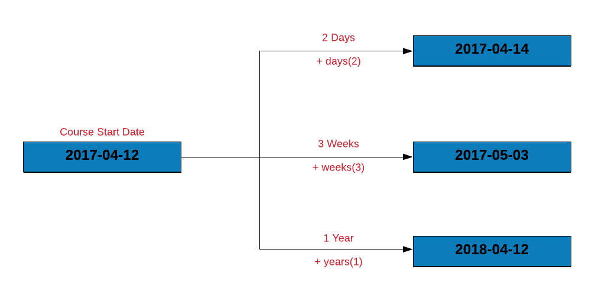
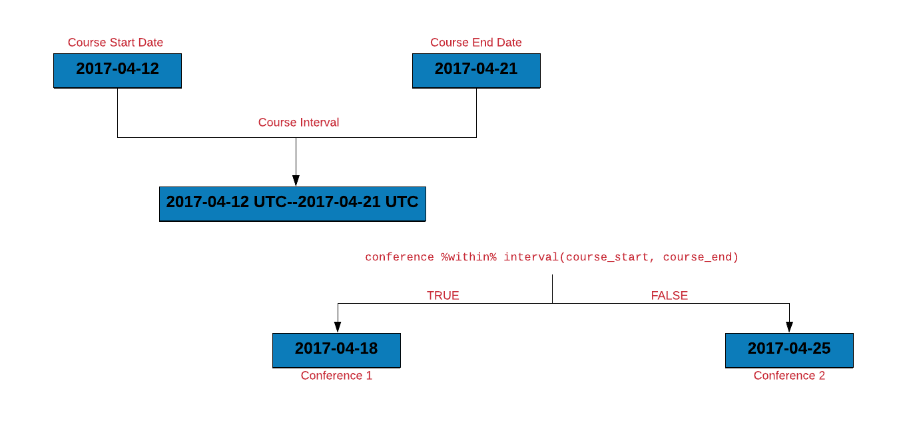

## {data-background="lubridate.png"}

## Agenda

<hr>

- how does R treat date/time?
- create and store date/time variables
- extract date and time components
- compute time differences
- compute time interval and duration
 
## Libraries

<hr>

```{r install, eval=FALSE}
library(lubridate)
library(dplyr)
library(magrittr)
library(readr)
```

```{r lub1, echo=FALSE, eval=TRUE, results='hide', message=FALSE}
library(lubridate)
library(dplyr)
library(magrittr)
library(readr)
```

## Origin

<hr>

```{r origin}
lubridate::origin
```

## Current Date/Time

<hr>

```{r sysdate}
Sys.Date()
Sys.time()
Sys.timezone()
```

## Current Date/Time

<hr>

```{r today}
now()
today()
```

## Current Date/Time

<hr>

```{r today2}
am(now())  
pm(now())
```

## How does R handle date/time?

<hr>

```{r daterhandle1}
mydate <- 2018-08-15
mydate
class(mydate)
```

## How does R handle date/time?

<hr>

```{r daterhandle2}
mydate <- "2018-08-15"
mydate
class(mydate)
```

## How does R handle date/time?

<hr>

```{r daterhandle3}
mydate <- as.Date("2018-08-15")
mydate
class(mydate)
```

## Date from Character

<hr>

```{r daterhandle4}
mydate <- as_date("2018-08-15")
mydate
class(mydate)
```

## Date & Timezone

<hr>

```{r daterhandle5}
mydate <- as_date("2018-08-15", tz = "Asia/Calcutta")
mydate
class(mydate)
```

## Date/Time & Timezone

<hr>

```{r daterhandle6}
mydate <- as_datetime("2018-08-15 22:30:42", tz = "Asia/Calcutta")
mydate
class(mydate)
```

## Date from Days

<hr>

```{r daterhandle7}
days   <- 4215
mydate <- as_date(days, origin = "2000-01-01")
mydate
```

## Date/Time from Days

<hr>

```{r daterhandle8}
days   <- 4215
mydate <- as_datetime(days, origin = "2000-01-01")
mydate
```

## ISO 8601 Format

<hr>

<br>
<br>

```{r img_iso, echo=FALSE, out.width="100%", fig.align="center"}
knitr::include_graphics("iso.png")
```

## Data

<hr>

```{r import, eval=FALSE}
transact <- read_csv('https://raw.githubusercontent.com/rsquaredacademy/datasets/master/transact.csv')
```

```{r show, echo=FALSE, eval=TRUE, message=FALSE}
transact <- readr::read_csv('https://raw.githubusercontent.com/rsquaredacademy/datasets/master/transact.csv')
transact
```

## Data Dictionary

<hr>

The data set has 3 columns. All the dates are in the format (yyyy-mm-dd).

- Invoice: invoice date 
- Due: due date
- Payment: payment date

## Case Study

<hr>

- extract date, month and year from Due
- compute the number of days to settle invoice
- compute days over due
- check if due year is a leap year
- check when due day in february is 29, whether it is a leap year
- how many invoices were settled within due date
- how many invoices are due in each quarter
- what is the average duration between invoice date and payment date

## Day, Month & Year

<hr>

<br>
<br>

```{r img1, echo=FALSE, out.width="100%", fig.align="center"}
knitr::include_graphics("day_week_month.png")
```

## Day, Month & Year

<hr>

```{r lub18}
this_day <- as_date('2017-03-23')
day(this_day)
month(this_day)
year(this_day)
```

## Extract Day, Month & Year from Due Date

<hr>

```{r lub2}
transact %>%
  mutate(
    due_day   = day(Due),
    due_month = month(Due),
    due_year  = year(Due)
  )
```

## Course Duration

<hr>

<br>
<br>

```{r img2, echo=FALSE, out.width="100%", fig.align="center"}
knitr::include_graphics("course_duration.png")
```

## Course Duration

<hr>


```{r lub19}
course_start    <- as_date('2017-04-12')
course_end      <- as_date('2017-04-21')
course_duration <- course_end - course_start
course_duration
```


## Days to settle invoice

<hr>

```{r lub3}
transact %>%
  mutate(
    days_to_pay = Payment - Invoice
  )
```

## Days over due

<hr>

```{r lub4}
transact %>%
  mutate(
    delay = Payment - Due
  )
```

## Is due year a leap year?

<hr>

```{r lub5}
transact %>%
  mutate(
    due_year = year(Due),
    is_leap  = leap_year(due_year)
  )
```

## Case Study

<hr>

If the due day happens to be February 29, let us ensure that the due year is a 
leap year. Below are the steps to check if the due year is a leap year:

- we will extract the following from the due date:
    - day
    - month
    - year
- we will then create a new column `is_leap` which will have be set to `TRUE` if 
the year is a leap year else it will be set to `FALSE` 
- filter all the payments due on 29th Feb
- select the following columns:
    - `Due`
    - `is_leap`

## Case Study

<hr>

```{r lub6}
transact %>%
  mutate(
    due_day   = day(Due),
    due_month = month(Due),
    due_year  = year(Due),
    is_leap   = leap_year(due_year)
  ) %>%
  filter(due_month == 2 & due_day == 29) %>%
  select(Due, is_leap) 
```

## Shift Date

<hr>

<br>
<br>

```{r img3, echo=FALSE, out.width="100%", fig.align="center"}

```

## Shift Date

<hr>

```{r lab40}
course_start + days(2)
course_start + weeks(1)
course_start + years(1)
```

## Interval

<hr>

<br>
<br>

```{r img4, echo=FALSE, out.width="100%", fig.align="center"}

```

## Interval

<hr>

```{r lub10}
interval(course_start, course_end)
```

## Shift Interval

<hr>

<br>
<br>

```{r img5, echo=FALSE, out.width="100%", fig.align="center"}
knitr::include_graphics("shift_interval.png")
```

## Shift Interval

<hr>

```{r lab50}
course_interval <- interval(course_start, course_end)
int_shift(course_interval, by = days(1))
int_shift(course_interval, by = weeks(3))
int_shift(course_interval, by = years(1))
```

## Interval Overlap

<hr>

<br>
<br>

```{r img6, echo=FALSE, out.width="100%", fig.align="center"}

```

## Intervals Overlap

<hr>

```{r lub60}
vacation_start    <- as_date('2017-04-19')
vacation_end      <- as_date('2017-04-25')
vacation_interval <- interval(vacation_start, vacation_end)
int_overlaps(course_interval, vacation_interval)
```

## Case Study

<hr>

Let us use intervals to count the number of invoices that were settled within
the due date. To do this, we will:

- create an interval for the invoice and due date
- create a new column `due_next` by incrementing the due date by 1 day
- another interval for `due_next` and the payment date
- if the intervals overlap, the payment was made within the due date 

## Case Study

<hr>

```{r lub7}
transact %>%
  mutate(
    inv_due_interval = interval(Invoice, Due),
    due_next         = Due + days(1),
    due_pay_interval = interval(due_next, Payment),
    overlaps         = int_overlaps(inv_due_interval, due_pay_interval)
  ) %>%
  select(Invoice, Due, Payment, overlaps)
```

## Case Study

<hr>

```{r lub12}
# using int_shift
transact %>%
  mutate(
    inv_due_interval = interval(Invoice, Due),
    due_pay_interval = interval(Due, Payment),  
    due_pay_next     = int_shift(due_pay_interval, by = days(1)),
    overlaps         = int_overlaps(inv_due_interval, due_pay_next)
  ) %>%
  select(Invoice, Due, Payment, overlaps)
```

## Case Study

<hr>

You might be thinking why we incremented the due date by a day before creating
the interval between the due day and the payment day. If we do not increment, 
both the intervals will share a common date i.e. the due date and they will
always overlap as shown in the next example.

## Case Study

<hr>

```{r lub7a}
transact %>%
  mutate(
    inv_due_interval = interval(Invoice, Due),
    due_pay_interval = interval(Due, Payment),
    overlaps         = int_overlaps(inv_due_interval, due_pay_interval)
  ) %>%
  select(Invoice, Due, Payment, overlaps)
```

## Within

<hr>

<br>
<br>

```{r img7, echo=FALSE, out.width="100%", fig.align="center"}

```

## Within

<hr>

```{r lub30}
conference <- as_date('2017-04-15')
conference %within% course_interval
```

## Case Stduy

<hr>

Let us use `%within%` to count the number of invoices that were settled within 
the due date. We will do this by:

- creating an interval for the invoice and due date
- check if the payment date falls within the above interval

## Case Study

<hr>

```{r lub13}
transact %>%
  mutate(
    inv_due_interval = interval(Invoice, Due),
    overlaps         = Payment %within% inv_due_interval
  ) %>%
  select(Due, Payment, overlaps)
```

## Quarter

<hr>

<br>
<br>

```{r img8, echo=FALSE, out.width="100%", fig.align="center"}
knitr::include_graphics("quarter_semester.png")
```

## Quarter

<hr>

```{r lub20}
course_start
quarter(course_start)
quarter(course_start, with_year = TRUE)
semester(course_start)  
```


## Quarter

<hr>

```{r lub8}
transact %>%
  mutate(
    Quarter = quarter(Due)
  )
```

## Case Study

<hr>

```{r lub14}
transact %>%
  mutate(
    Quarter = quarter(Due, with_year = TRUE)
  )
```

## Convert

<hr>

<br>
<br>

```{r img9, echo=FALSE, out.width="100%", fig.align="center"}
knitr::include_graphics("convert.png")
```

## Case Study

<hr>

```{r lub11}
course_interval / dseconds()
course_interval / dminutes()
course_interval / dhours()
course_interval / dweeks()
course_interval / dyears()
```

## Convert

<hr>

<br>
<br>

```{r img10, echo=FALSE, out.width="100%", fig.align="center"}

```

## Case Study

<hr>

```{r lub16}
time_length(course_interval, unit = "seconds")
time_length(course_interval, unit = "minutes")
time_length(course_interval, unit = "hours")
```

## Convert

<hr>

<br>
<br>

```{r img11, echo=FALSE, out.width="100%", fig.align="center"}

```

## Case Study

<hr>

```{r lub17}
as.period(course_interval, unit = "seconds")
as.period(course_interval, unit = "minutes")
as.period(course_interval, unit = "hours")
```

## References

<hr>

- https://lubridate.tidyverse.org/
- http://r4ds.had.co.nz/dates-and-times.html

## {data-background="thankyou.png"}

