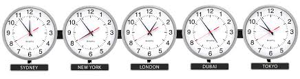

## {data-background="handling-date-and-time-in-r.png"}

## Agenda

<hr>

- get current date/time
- understand date/time classes in R
- date arithmetic
- timezones & daylight savings
- date/time formats
- date/time parsing
- date/time components
- create, update & verify date/time objects
- intervals, duration and period

## Prerequisites

<hr>

- completed [Introduction to R](https://rsquared-academy.thinkific.com/courses/introduction-to-r) course
- laptop/desktop with [R](https://www.r-project.org/) & [RStudio](https://www.rstudio.com/) installed
- internet connection to use [RStudio Cloud](https://rstudio.cloud/)

## Resources

<hr>

- <a href="https://slides.rsquaredacademy.com/data-wrangling/lubridate/datetime.html#/section" target="_blank">Slides</a>
- <a href="https://blog.rsquaredacademy.com/handling-date-and-timr-in-r/" target="_blank">Blog Post</a>
- <a href="https://github.com/rsquaredacademy-education/online-courses/" target="_blank">Code & Data</a>
- <a href="https://rstudio.cloud/project/1072419" target="_blank">RStudio Cloud</a>
- <a href="https://rsquared-academy.thinkific.com/courses/handling-date-and-time-in-r" target="_blank">Online Course</a>
 
```{r lub1, echo=FALSE, eval=TRUE, results='hide', message=FALSE}
library(readr)
library(knitr)
library(kableExtra)
```

## {data-background="title-slide-module-1.png"}

## Current Date/Time

<hr>

<br>
<br>

```{r table_current_date_time, echo=FALSE}
cname   <- c("`Sys.Date()`", "`lubridate::today()`", "`Sys.time()`",
             "`lubridate::now()`", "`lubridate::am()`", "`lubridate::pm()`",
             "`lubridate::leap_year()`")
descrip <- c("Current Date", "Current Date", "Current Time", "Current Time",
             "Whether time occurs in am?", "Whether time occurs in pm?",
             "Check if the year is a leap year?")
data.frame(Function = cname, Description = descrip) %>% 
  kable() %>% 
  kable_styling(
    bootstrap_options = c("striped", "hover", "condensed", "responsive")
  )
```

## Your Turn

<hr>

- get current date
- get current time
- check whether the time occurs in am or pm?
- check whether the following years were leap years
    - 2018
    - 2016
    
## Case Study - Data

<hr>

```{r import, eval=FALSE}
transact <- read_csv('https://raw.githubusercontent.com/rsquaredacademy/datasets/master/transact.csv')
```

```{r show, echo=FALSE, eval=TRUE, message=FALSE}
transact <- readr::read_csv('https://raw.githubusercontent.com/rsquaredacademy/datasets/master/transact.csv')
transact
```

## Case Study

<hr>

- extract date, month and year from Due
- compute the number of days to settle invoice
- compute days over due
- check if due year is a leap year
- check when due day in february is 29, whether it is a leap year
- how many invoices were settled within due date
- how many invoices are due in each quarter
- what is the average duration between invoice date and payment date

## {data-background="title-slide-module-2.png"}

## Date/Time Classes

<hr>

- `Date`
- `POSIXct`
- `POSIXlt`

## ISO 8601 Format

<hr>

<br>
<br>

```{r img_iso, echo=FALSE, out.width="100%", fig.align="center"}

```

## POSIXlt

<hr>

<br>

```{r table_posixlt_1, echo=FALSE}
cname   <- c("`sec`", "`min`", "`hour`", "`mon`", "`zone`", "`wday`", "`mday`",              "`year`", "`yday`", "`isdst`", "`gmtoff`")
descrip <- c("Second", "Minute", "Hour of the day", "Month of the year (0-11",
             "Timezone", "Day of week", "Day of month","Years since 1900", 
             "Day of year", "Daylight saving flag", 
             "Offset is seconds from GMT")
data.frame(Component = cname, Description = descrip) %>% 
  kable() %>% 
  kable_styling(
    bootstrap_options = c("striped", "hover", "condensed", "responsive")
  )
```

## Your Turn

<hr>

R 1.0.0 was released on `2000-02-29 08:55:23 UTC`. Save it as 

- `Date` using character 
- `Date` using origin and number
- `POSIXct`
- `POSIXlt` and extract 
    - month day
    - day of year
    - month
    - zone
- ISODate

## {data-background="title-slide-module-3.png"}

## Date Arithmetic - Course Length

<hr>

<br>
<br>

```{r img2, echo=FALSE, out.width="100%", fig.align="center"}
knitr::include_graphics("course_duration.png")
```

## Date Arithmetic - Shift Date

<hr>

<br>
<br>

```{r img3, echo=FALSE, out.width="100%", fig.align="center"}
knitr::include_graphics("shift_dates.png")
```

## Your Turn

<hr>

- compute the length of a vacation which begins on `2020-04-19` and ends on `2020-04-25`
- recompute the length of the vacation after shifting the vacation start and end date by `10` days and `2` weeks
- compute the days to settle invoice and days overdue from the `receivables.csv` data set
- compute the length of employment (only for those employees who have been terminated) from the `hr-data.csv` data set (use date of hire and termination)

## {data-background="title-slide-module-4.png"}

## Timezones

<hr>

<br>
<br>
<br>
<br>

```{r img_timezones, fig.align='center', out.width="200%", echo=FALSE}

```

## Daylight Savings

<hr>

<br>
<br>

```{r img_daylight, fig.align='center', out.width="200%", echo=FALSE}
knitr::include_graphics('lub_daylight_savings.png')
```

## Your Turn

<hr>

- check the timezone you live in
- check if daylight savings in on
- check the current time in **UTC** or a different time zone 

## {data-background="title-slide-module-5.png"}

## Date & Time Formats

<hr>

- December 12, 2019"
- 12th Dec, 2019
- Dec 12th, 19
- 12-Dec-19
- 2019 December
- 12.12.19

## Conversion Specifications

<hr>

<br>
<br>

```{r table_formats_1, echo=FALSE}
cname   <- c("`%d`", "`%m`", "`%b`", "`%B`", "`%y`", "`%Y`", "%H", "%M", "%S")
descrip <- c("Day of the month (decimal number)",
             "Month (decimal number)",
             "Month (abbreviated)",
             "Month (full name)",
             "Year (2 digit)",
             "Year (4 digit)",
             "Hour",
             "Minute",
             "Second")
example <- c(12, 12, "Dec", "December", 19, 2019, 08, 05, 03)
data.frame(Specification = cname, Description = descrip, Example = example) %>% 
  kable() %>% 
  kable_styling(
    bootstrap_options = c("striped", "hover", "condensed", "responsive")
  )
```

## Your Turn

<hr>

Below, we have specified `July 5th, 2019` in different ways. Create the date using `as.Date()` while specifying the correct format for each of them.

- `05.07.19`
- `5-July 2019`
- `July 5th, 2019`
- `July 05, 2019`
- `2019-July- 05`
- `05/07/2019`
- `07/05/2019`
- `7/5/2019`
- `07/5/19`
- `2019-07-05`

## {data-background="title-slide-module-6.png"}

## Parse Date & Time

<hr>

<br>
<br>

```{r table_formats_pdt, echo=FALSE}
cname   <- c("19-07-05", "2019-07-05", "05-07-2019", "07-05-2019")
descrip <- c("`ymd`", "`ymd`", "`dmy`", "`mdy`")
data.frame(Date = cname, Specification = descrip) %>% 
  kable() %>% 
  kable_styling(
    bootstrap_options = c("striped", "hover", "condensed", "responsive")
  )
```

## Your Turn

<hr>

Below, we have specified `July 5th, 2019` in different ways. Parse the dates using `strptime()` or `parse_date_time()` or any other helper function.

- `July-05-19`
- `JUL-05-19`
- `05.07.19`
- `5-July 2019`
- `July 5th, 2019`
- `July 05, 2019`
- `2019-July- 05`
- `05/07/2019`
- `07/05/2019`
- `7/5/2019`
- `2019-07-05`

## {data-background="title-slide-module-7.png"}

## Date & Time Components

<hr>

- year
- month
- date
- week
- day
- quarter
- semester
- hour
- minute
- second
- timezone

## Year, Month & Week

<hr>

<br>
<br>


```{r table_components_1, echo=FALSE}
cname   <- c("`year()`", "`month()`", "`month(label = TRUE)`", 
             "`month(abbr = FALSE)`", "`months()`", "`week()`")
descrip <- c("Get year", "Get month (number)", "Get month (abbreviated name)", 
             "Get month (full name)", "Get month", "Get week")
data.frame(Function = cname, Description = descrip) %>% 
  kable() %>% 
  kable_styling(
    bootstrap_options = c("striped", "hover", "condensed", "responsive")
  )
```

## Day

<hr>

<br>
<br>


```{r table_components_2, echo=FALSE}
cname   <- c("`day`", "`mday()`", "`wday()`", "`qday()`", "`yday()`", 
             "`weekdays()`", "`days_in_month()`")
descrip <- c("Get day", "Day of the month", "Day of the week", "Day of quarter",
             "Day of year", "Day of week", "Days in the month")
data.frame(Function = cname, Description = descrip) %>% 
  kable() %>% 
  kable_styling(
    bootstrap_options = c("striped", "hover", "condensed", "responsive")
  )
```

## Hour, Minute & Seconds

<hr>

<br>
<br>


```{r table_components_3, echo=FALSE}
cname   <- c("`hour()`", "`minute()`", "`second()`", "`seconds()`")
descrip <- c("Get hour", "Get minute", "Get second", 
             "Number of seconds since `1970-01-01`")
data.frame(Function = cname, Description = descrip) %>% 
  kable() %>% 
  kable_styling(
    bootstrap_options = c("striped", "hover", "condensed", "responsive")
  )
```

## Quarter & Semester

<hr>

```{r img_quarter_semester, fig.align='center', echo=FALSE, out.width="100%"}
knitr::include_graphics('quarter_semester.png')
```

## Quarter & Semester

<hr>

<br>
<br>

```{r table_components_4, echo=FALSE}
cname   <- c("`quarter()`", "`quarter(with_year = TRUE)`", 
             "`quarter(fiscal_start = 4)`", "`quarters()`", "`semester()`")
descrip <- c("Get quarter", "Quarter with year", "Fiscal starts in April",
             "Get quarter", "Get semester")
data.frame(Function = cname, Description = descrip) %>% 
  kable() %>% 
  kable_styling(
    bootstrap_options = c("striped", "hover", "condensed", "responsive")
  )
```


## Case Study - Day, Month & Year

<hr>

<br>
<br>

```{r img1, echo=FALSE, out.width="100%", fig.align="center"}

```

## Case Study - Data Sanitization

<hr>

Let us do some data sanitization. If the due day happens to be February 29, 
let us ensure that the due year is a leap year. Below are the steps to check 
if the due year is a leap year:

- we will extract the following from the due date:
    - day
    - month
    - year
- we will then create a new column `is_leap` which will have be set to `TRUE` if 
the year is a leap year else it will be set to `FALSE` 
- filter all the payments due on 29th Feb
- select the following columns:
    - `Due`
    - `is_leap`

## Your Turn

<hr>

Get the R release dates using `r_versions()` from the **rversions** package and tabulate the following

- year 
- month with label
- weekday with label
- hour
- and quarter

## {data-background="title-slide-module-8.png"}

## Create, Update & Verify

<hr>

- `make_date()`
- `make_datetime()`
- `update()`

## Date Sequence

<hr>

<br>
<br>

```{r table_seq_date, echo=FALSE}
cname   <- c("`from`", "`by`", "`to`", "`length.out`", "`along.with`")
descrip <- c("Starting date of the sequence", "End date of the sequence", 
             "Date increment of the sequence", "Length of the sequence",
             "Use length of this value as length of sequence")
data.frame(Function = cname, Description = descrip) %>% 
  kable() %>% 
  kable_styling(
    bootstrap_options = c("striped", "hover", "condensed", "responsive")
  )
```

## Your Turn

<hr>

R 2.0.0 was released on `2004-10-04 14:24:38`. Create this date using

- `make_date()` 
- `make_datetime()`
- and update to `2013-04-03 07:12:36` (R 3.0.0 release date)

## {data-background="title-slide-module-9.png"}

## Interval

<hr>

<br>
<br>

```{r img4, echo=FALSE, out.width="100%", fig.align="center"}
knitr::include_graphics("course_interval.png")
```

## Shift Interval

<hr>

<br>
<br>

```{r img5, echo=FALSE, out.width="100%", fig.align="center"}
knitr::include_graphics("shift_interval.png")
```

## Interval Overlap

<hr>

<br>
<br>

```{r img6, echo=FALSE, out.width="100%", fig.align="center"}
knitr::include_graphics("interval_overlap.png")
```

## Case Study

<hr>

Let us use intervals to count the number of invoices that were settled within
the due date. To do this, we will:

- create an interval for the invoice and due date
- create a new column `due_next` by incrementing the due date by 1 day
- another interval for `due_next` and the payment date
- if the intervals overlap, the payment was made within the due date 

## Within

<hr>

<br>
<br>

```{r img7, echo=FALSE, out.width="100%", fig.align="center"}
knitr::include_graphics("within.png")
```

## Case Stduy

<hr>

Let us use `%within%` to count the number of invoices that were settled within 
the due date. We will do this by:

- creating an interval for the invoice and due date
- check if the payment date falls within the above interval

## Duration

<hr>

<br>

```{r img_convert, echo=FALSE, out.width="100%", fig.align="center"}
knitr::include_graphics("convert.png")
```

## Period 

<hr>

<br>

```{r img_as_period, echo=FALSE, out.width="100%", fig.align="center"}
knitr::include_graphics("as_period.png")
```

## Time Length

<hr>

<br>

```{r img_time_length, echo=FALSE, out.width="100%", fig.align="center"}
knitr::include_graphics("time_length.png")
```

## {data-background="title-slide-module-10.png"}

## Rounding Dates

<hr>

We will explore functions for rounding dates

- to the nearest value using `round_dates()`
- down using `floor_date()`
- up using `ceiling_date()`

## Rounding Dates

<hr>

The unit for rounding can be any of the following:

- second
- minute
- hour
- day
- week
- month
- bimonth
- quarter
- season
- halfyear
- and year

## Your Turn

<hr>

- round up R release dates to hours
- round down R release dates to minutes
- rollback R release dates to the beginning of the month

## Connect with Us

<hr>

- Website     (https://www.rsquaredacademy.com/)
- Free Online R Courses   (https://rsquared-academy.thinkific.com/)
- R Packages  (https://pkgs.rsquaredacademy.com)
- Shiny Apps  (https://apps.rsquaredacademy.com)
- Blog        (https://blog.rsquaredacademy.com)
- GitHub      (https://github.com/rsquaredacademy)
- YouTube     (https://www.youtube.com/user/rsquaredin/)
- Twitter     (https://twitter.com/rsquaredacademy)
- Facebook    (https://www.facebook.com/rsquaredacademy/)
- Linkedin    (https://in.linkedin.com/company/rsquared-academy)

## {data-background="thankyou.png"}

