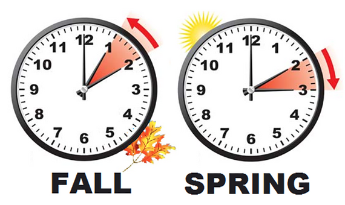
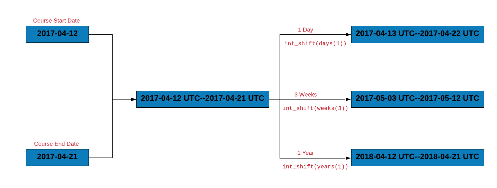

## {data-background="lubridate.png"}

## Connect with Us

<hr>

- Website     (https://www.rsquaredacademy.com/)
- Free Online R Courses   (https://rsquared-academy.thinkific.com/)
- R Packages  (https://pkgs.rsquaredacademy.com)
- Shiny Apps  (https://apps.rsquaredacademy.com)
- Blog        (https://blog.rsquaredacademy.com)
- GitHub      (https://github.com/rsquaredacademy)
- YouTube     (https://www.youtube.com/user/rsquaredin/)
- Twitter     (https://twitter.com/rsquaredacademy)
- Facebook    (https://www.facebook.com/rsquaredacademy/)
- Linkedin    (https://in.linkedin.com/company/rsquared-academy)

## Agenda

<hr>

- get current date/time
- understand date/time classes in R
- date arithmetic
- timezones & daylight savings
- date/time formats
- date/time parsing
- date/time components
- create, update & verify date/time objects
- intervals, duration and period

## Prerequisites

<hr>

- completed [Introduction to R](https://rsquared-academy.thinkific.com/courses/introduction-to-r) course
- laptop/desktop with [R](https://www.r-project.org/) & [RStudio](https://www.rstudio.com/) installed
- internet connection to use [RStudio Cloud](https://rstudio.cloud/)

## Resources

<hr>

- <a href="https://slides.rsquaredacademy.com/data-wrangling/lubridate/datetime.html#/section" target="_blank">Slides</a>
- <a href="https://blog.rsquaredacademy.com/working-with-databases-using-r/" target="_blank">Blog Post</a>
- <a href="https://github.com/rsquaredacademy-education/online-courses/" target="_blank">Code & Data</a>
- <a href="https://rstudio.cloud/project/430439" target="_blank">RStudio Cloud</a>
- <a href="https://rsquared-academy.thinkific.com/courses/working-with-databases-using-r" target="_blank">Online Course</a>
 
## Libraries

<hr>

```{r install, eval=FALSE}
library(lubridate)
library(readr)
library(dplyr)
library(magrittr)
library(rversions)
```

```{r lub1, echo=FALSE, eval=TRUE, results='hide', message=FALSE}
library(lubridate)
library(dplyr)
library(magrittr)
library(readr)
library(rversions)
library(knitr)
library(kableExtra)
```

## Current Date/Time

<hr>

<br>
<br>

```{r table_current_date_time, echo=FALSE}
cname   <- c("`Sys.Date()`", "`lubridate::today()`", "`Sys.time()`",
             "`lubridate::now()`", "`lubridate::am()`", "`lubridate::pm()`",
             "`lubridate::leap_year()`")
descrip <- c("Current Date", "Current Date", "Current Time", "Current Time",
             "Whether time occurs in am?", "Whether time occurs in pm?",
             "Check if the year is a leap year?")
data.frame(Function = cname, Description = descrip) %>% 
  kable() %>% 
  kable_styling(
    bootstrap_options = c("striped", "hover", "condensed", "responsive")
  )
```

## Current Date

<hr>

```{r c_sysdate}
Sys.Date()
lubridate::today()
```

## Current Time

<hr>

```{r c_systime}
Sys.time()
lubridate::now()
```

## AM or PM?

<hr>

```{r c_am_pm}
am(now())  
pm(now())
```

## Leap Year

<hr>

```{r c_leap_year}
lubridate::leap_year(Sys.Date())
```

## Your Turn

<hr>

- get current date
- get current time
- check whether the time occurs in am or pm?
- check whether the following years were leap years
    - 2018
    - 2016
    
## Case Study - Data

<hr>

```{r import, eval=FALSE}
transact <- read_csv('https://raw.githubusercontent.com/rsquaredacademy/datasets/master/transact.csv')
```

```{r show, echo=FALSE, eval=TRUE, message=FALSE}
transact <- readr::read_csv('https://raw.githubusercontent.com/rsquaredacademy/datasets/master/transact.csv')
transact
```

## Case Syudy - Data Dictionary

<hr>

The data set has 3 columns. All the dates are in the format (yyyy-mm-dd).

<br>
<br>

```{r table_data_dict, echo=FALSE}
cname   <- c("Invoice", "Due", "Payment")
descrip <- c("Invoice Date", "Due Date", "Payment Date")
data.frame(Column = cname, Description = descrip) %>% 
  kable() %>% 
  kable_styling(
    bootstrap_options = c("striped", "hover", "condensed", "responsive")
  )
```

## Case Study

<hr>

- extract date, month and year from Due
- compute the number of days to settle invoice
- compute days over due
- check if due year is a leap year
- check when due day in february is 29, whether it is a leap year
- how many invoices were settled within due date
- how many invoices are due in each quarter
- what is the average duration between invoice date and payment date

## How does R handle date/time?

<hr>

```{r daterhandle2}
release_date <- 2019-12-12
release_date
class(release_date)
```

## How does R handle date/time?

<hr>

```{r daterhandle3}
release_date <- "2019-12-12"
release_date
class(release_date)
```

## Date/Time Classes

<hr>

```{r daterhandle4}
class(Sys.Date())
class(lubridate::now())
class(release_date)
```

## Date/Time Classes

<hr>

- `Date`
- `POSIXct`
- `POSIXlt`

## Date Class

<hr>

```{r daterhandle6}
unclass(Sys.Date())
```

## Internal Representation

<hr>

```{r daterhandle7}
release_date <- as.Date("2019-12-12")
release_date - as.Date("1970-01-01")
unclass(release_date)
```

## Origin

<hr>

```{r daterhandle8}
lubridate::origin
```

## Convert Numeric

<hr>

```{r c_convert_numeric}
as.Date(18242, origin = "1970-01-01")
as.Date(7285, origin = "2000-01-01")
```

## ISO 8601 Format

<hr>

<br>
<br>

```{r img_iso, echo=FALSE, out.width="100%", fig.align="center"}
knitr::include_graphics("iso.png")
```

## ISO 8601 Format

<hr>

```{r iso_date}
ISOdate(year  = 2019,
        month = 12,
        day   = 12,
        hour  = 8,
        min   = 5, 
        sec   = 3,
        tz    = "UTC")
```

## POSIX

<hr>

```{r c_posix_now}
class(lubridate::now())
```

## POSIX

<hr>

```{r c_posix_now_unclass}
unclass(lubridate::now())
```

## POSIXct

<hr>

```{r c_release_date_posixct}
release_date <- as.POSIXct("2019-12-12 08:05:03")
class(release_date)
unclass(release_date) 
```

## POSIXlt

<hr>

```{r c_release_date_posixlt_1}
release_date <- as.POSIXlt("2019-12-12 08:05:03")
release_date
```

## POSIXlt

<hr>

```{r release_date_posixlt_2}
release_date <- as.POSIXlt("2019-12-12 08:05:03")
unclass(release_date)
```

## POSIXlt

<hr>

```{r release_date_posixlt_3}
release_date <- as.POSIXlt("2019-12-12 08:05:03")
unlist(release_date)
```

## POSIXlt

<hr>

```{r release_date_posixlt_4}
release_date <- as.POSIXlt("2019-12-12 08:05:03")
release_date$hour
release_date$mon
release_date$zone
```

## POSIXlt

<hr>

<br>

```{r table_posixlt_1, echo=FALSE}
cname   <- c("`sec`", "`min`", "`hour`", "`mon`", "`zone`", "`wday`", "`mday`",              "`year`", "`yday`", "`isdst`", "`gmtoff`")
descrip <- c("Second", "Minute", "Hour of the day", "Month of the year (0-11",
             "Timezone", "Day of week", "Day of month","Years since 1900", 
             "Day of year", "Daylight saving flag", 
             "Offset is seconds from GMT")
data.frame(Component = cname, Description = descrip) %>% 
  kable() %>% 
  kable_styling(
    bootstrap_options = c("striped", "hover", "condensed", "responsive")
  )
```

## Your Turn

<hr>

R 1.0.0 was released on `2000-02-29 08:55:23 UTC`. Save it as 

- `Date` using character 
- `Date` using origin and number
- `POSIXct`
- `POSIXlt` and extract 
    - month day
    - day of year
    - month
    - zone
- ISODate

## Date Arithmetic - Course Length

<hr>

<br>
<br>

```{r img2, echo=FALSE, out.width="100%", fig.align="center"}
knitr::include_graphics("course_duration.png")
```

## Date Arithmetic - Course Length

<hr>

```{r lub19}
course_start    <- as_date('2017-04-12')
course_end      <- as_date('2017-04-21')
course_duration <- course_end - course_start
course_duration
```

## Date Arithmetic - Shift Date

<hr>

<br>
<br>

```{r img3, echo=FALSE, out.width="100%", fig.align="center"}
knitr::include_graphics("shift_dates.png")
```

## Date Arithmetic - Shift Date

<hr>

```{r lab40}
course_start + days(2)
course_start + weeks(1)
course_start + years(1)
```

## Case Study - Days to Settle Invoice

<hr>

```{r lub3}
transact %>%
  mutate(
    days_to_pay = Payment - Invoice
  )
```

## Case Study - Days Over Due

<hr>

```{r lub4}
transact %>%
  mutate(
    delay = Payment - Due
  )
```

## Your Turn

<hr>

- compute the length of a vacation which begins on `2020-04-19` and ends on `2020-04-25`
- recompute the length of the vacation after shifting the vacation start and end date by `10` days and `2` weeks
- compute the days to settle invoice and days overdue from the `receivables.csv` data set
- compute the length of employment (only for those employees who have been terminated) from the `hr-data.csv` data set (use date of hire and termination)

## Timezones

<hr>

<br>
<br>
<br>
<br>

```{r img_timezones, fig.align='center', out.width="200%", echo=FALSE}
knitr::include_graphics('lub_timezones.jpg')
```

## Timezones 

<hr>

- UTC (Coordinated Universal Time)
- GMT (Greenwich Meridian Time)

## Timezones 

<hr>

```{r sys_time_zones}
Sys.timezone()
lubridate::tz(Sys.time())
```

## Timezones 

<hr>

```{r get_time_zone}
Sys.getenv("TZ")
Sys.setenv(TZ = "Asia/Calcutta")
```

## Daylight Savings

<hr>

<br>
<br>

```{r img_daylight, fig.align='center', out.width="200%", echo=FALSE}

```


## Daylight Savings

<hr>

```{r dst}
dst(Sys.Date()) 
```

## Your Turn

<hr>

- Check the timezone you live in
- Check if daylight savings in on
- Check the current time in **UTC** or a different time zone 

## Date & Time Formats

<hr>

<br>
<br>


```{r table_formats_sample, echo=FALSE}
cname   <- c("December 12, 2019", "12th Dec, 2019", "Dec 12th, 19", "12-Dec-19",
             "2019 December", "12.12.19") 
data.frame(Format = cname) %>% 
  kable() %>% 
  kable_styling(
    bootstrap_options = c("striped", "hover", "condensed", "responsive")
  )
```

## Conversion Specifications

<hr>

<br>
<br>

```{r table_formats_1, echo=FALSE}
cname   <- c("`%d`", "`%m`", "`%b`", "`%B`", "`%y`", "`%Y`", "%H", "%M", "%S")
descrip <- c("Day of the month (decimal number)",
             "Month (decimal number)",
             "Month (abbreviated)",
             "Month (full name)",
             "Year (2 digit)",
             "Year (4 digit)",
             "Hour",
             "Minute",
             "Second")
example <- c(12, 12, "Dec", "December", 19, 2019, 08, 05, 03)
data.frame(Specification = cname, Description = descrip, Example = example) %>% 
  kable() %>% 
  kable_styling(
    bootstrap_options = c("striped", "hover", "condensed", "responsive")
  )
```

## Format - 19/12/12

<hr>

<br>
<br>
<br>

```{r table_formats_ex_1, echo=FALSE}
cname   <- c("19", "12", "12")
descrip <- c("`%y`", "`%m`", "`%d`")
data.frame(Date = cname, Specification = descrip) %>% 
  kable() %>% 
  kable_styling(
    bootstrap_options = c("striped", "hover", "condensed", "responsive")
  )
```

## Format - 2019-Dec-12

<hr>

<br>
<br>
<br>

```{r table_formats_ex_2, echo=FALSE}
cname   <- c("2019", "Dec", "12")
descrip <- c("`%Y`", "`%b`", "`%d`")
data.frame(Date = cname, Specification = descrip) %>% 
  kable() %>% 
  kable_styling(
    bootstrap_options = c("striped", "hover", "condensed", "responsive")
  )
```

## Format - 19/12/12 08:05:03

<hr>

<br>
<br>
<br>

```{r table_formats_ex_3, echo=FALSE}
cname   <- c("19", "12", "12", "08", "05", "03")
descrip <- c("`%y`", "`%m`", "`%d`", "`%H`", "`%M`", "`%S`")
data.frame(Date = cname, Specification = descrip) %>% 
  kable() %>% 
  kable_styling(
    bootstrap_options = c("striped", "hover", "condensed", "responsive")
  )
```

## Your Turn

<hr>

Below, we have specified `July 5th, 2019` in different ways. Specify the correct format for each of them.

- `July-05-19`
- `JUL-05-19`
- `05.07.19`
- `5-July 2019`
- `July 5th, 2019`
- `July 05, 2019`
- `2019-July- 05`
- `05/07/2019`
- `07/05/2019`
- `7/5/2019`
- `07/5/19`
- `2019-07-05`

## Parse Date & Time

<hr>

```{r strptime_1}
rel_date <- strptime("20191212", format = "%Y%m%d")
class(rel_date)
```

## Parse Date & Time

<hr>

```{r}
rel_date_strf <- strftime(rel_date)
class(rel_date_strf)

rel_date_format <- format(rel_date)
class(rel_date_format)

rel_date_char <- as.character(rel_date)
class(rel_date_char)
```

## Parse Date & Time

<hr>

```{r parse_date_time}
release_date <- c("19-12-12", "20191212", "19-12 12")
parse_date_time(release_date, "ymd")
parse_date_time(release_date, "y m d")
parse_date_time(release_date, "%y%m%d")
```

## Parse Date & Time

<hr>

```{r table_formats_pdt, echo=FALSE}
cname   <- c("19-07-05", "2019-07-05", "05-07-2019", "07-05-2019")
descrip <- c("`ymd`", "`ymd`", "`dmy`", "`mdy`")
data.frame(Date = cname, Specification = descrip) %>% 
  kable() %>% 
  kable_styling(
    bootstrap_options = c("striped", "hover", "condensed", "responsive")
  )
```

## Parse Date & Time

<hr>

```{r parse_ymd_1}
# year/month/date
ymd("2019-12-12")

# year/month/date
ymd("19/12/12")

# date/month/year
dmy(121219)
```

## Parse Date & Time

<hr>

```{r parse_ymd_2}
# year/month/date/hour/minute/second
ymd_hms(191212080503)

# hour/minute/second
hms("8, 5, 3")

# hour/minute/second
hms("08:05:03")
```

## Parse Date & Time

<hr>

```{r parse_ymd_3}
# minute/second
ms("5,3")

# hour/minute
hm("8, 5")
```

## Your Turn

<hr>

Below, we have specified `July 5th, 2019` in different ways. Parse the dates using `strptime()` or `parse_date_time()` or any other helper function.

- `July-05-19`
- `JUL-05-19`
- `05.07.19`
- `5-July 2019`
- `July 5th, 2019`
- `July 05, 2019`
- `2019-July- 05`
- `05/07/2019`
- `07/05/2019`
- `7/5/2019`
- `07/5/19`
- `2019-07-05`


## Date & Time Components

<hr>

- year
- month
- date
- week
- day
- quarter
- semester
- hour
- minute
- second
- timezone

## Year, Month & Week

<hr>

```{r table_components_1, echo=FALSE}
cname   <- c("`year()`", "`month()`", "`month(label = TRUE)`", 
             "`month(abbr = FALSE)`", "`months()`", "`week()`")
descrip <- c("Get year", "Get month (number)", "Get month (abbreviated name)", 
             "Get month (full name)", "Get month", "Get week")
data.frame(Function = cname, Description = descrip) %>% 
  kable() %>% 
  kable_styling(
    bootstrap_options = c("striped", "hover", "condensed", "responsive")
  )
```

## Year

<hr>

```{r year}
release_date <- ymd_hms("2019-12-12 08:05:03")
year(release_date) 
```

## Month

<hr>

```{r month_1}
month(release_date)
month(release_date, label = TRUE)
month(release_date, label = TRUE, abbr  = FALSE)
months(release_date)
```

## Week

<hr>

```{r week}
week(release_date)
```

## Day

<hr>

```{r table_components_2, echo=FALSE}
cname   <- c("`day`", "`mday()`", "`wday()`", "`qday()`", "`yday()`", 
             "`weekdays()`", "`days_in_month()`")
descrip <- c("Get day", "Day of the month", "Day of the week", "Day of quarter",
             "Day of year", "Day of week", "Days in the month")
data.frame(Function = cname, Description = descrip) %>% 
  kable() %>% 
  kable_styling(
    bootstrap_options = c("striped", "hover", "condensed", "responsive")
  )
```

## Day

<hr>

```{r day_1}
day(release_date)
mday(release_date)                 
qday(release_date)                 
yday(release_date)                 
```

## Day

<hr>

```{r day_2}
wday(release_date)  
wday(release_date, label = TRUE)
wday(release_date, label = TRUE, abbr  = FALSE)  
```

## Day

<hr>

```{r day_3}
weekdays(release_date)
weekdays(release_date, abbreviate = TRUE)
```

## Days in Month

<hr>

```{r days_in_month}
days_in_month(release_date)
```

## Hour, Minute & Seconds

<hr>

```{r table_components_3, echo=FALSE}
cname   <- c("`hour()`", "`minute()`", "`second()`", "`seconds()`")
descrip <- c("Get hour", "Get minute", "Get second", 
             "Number of seconds since `1970-01-01`")
data.frame(Function = cname, Description = descrip) %>% 
  kable() %>% 
  kable_styling(
    bootstrap_options = c("striped", "hover", "condensed", "responsive")
  )
```

## Hour, Minute & Seconds

<hr>

```{r hour_min_sec_tz}
hour(release_date)
minute(release_date)
second(release_date)
```

## Seconds

<hr>

```{r hour_min_seconds}
seconds(release_date)
```

## Quarter & Semester

<hr>

```{r img_quarter_semester, fig.align='center', echo=FALSE}
knitr::include_graphics('quarter_semester.png')
```

## Quarter

<hr>

```{r quarter_1}
quarter(release_date)
quarter(release_date, with_year = TRUE)
quarter(release_date, fiscal_start = 4)    
```

## Quarter

<hr>

```{r quarter_4}
quarters(release_date)
```

## Quarter & Semester

<hr>

```{r table_components_4, echo=FALSE}
cname   <- c("`quarter()`", "`quarter(with_year = TRUE)`", 
             "`quarter(fiscal_start = 4)`", "`quarters()`", "`semester()`")
descrip <- c("Get quarter", "Quarter with year", "Fiscal starts in April",
             "Get quarter", "Get semester")
data.frame(Function = cname, Description = descrip) %>% 
  kable() %>% 
  kable_styling(
    bootstrap_options = c("striped", "hover", "condensed", "responsive")
  )
```


## Case Study - Day, Month & Year

<hr>

<br>
<br>

```{r img1, echo=FALSE, out.width="100%", fig.align="center"}
knitr::include_graphics("day_week_month.png")
```

## Case Study - Day, Month & Year

<hr>

```{r lub18}
this_day <- as_date('2017-03-23')
day(this_day)
month(this_day)
year(this_day)
```

## Case Study - Extract Day, Month & Year from Due Date

<hr>

```{r lub2}
transact %>%
  mutate(
    due_day   = day(Due),
    due_month = month(Due),
    due_year  = year(Due)
  )
```

## Case Study - Is due year a leap year?

<hr>

```{r lub5}
transact %>%
  mutate(
    due_year = year(Due),
    is_leap  = leap_year(due_year)
  )
```

## Case Study - Data Sanitization

<hr>

Let us do some data sanitization. If the due day happens to be February 29, 
let us ensure that the due year is a leap year. Below are the steps to check 
if the due year is a leap year:

- we will extract the following from the due date:
    - day
    - month
    - year
- we will then create a new column `is_leap` which will have be set to `TRUE` if 
the year is a leap year else it will be set to `FALSE` 
- filter all the payments due on 29th Feb
- select the following columns:
    - `Due`
    - `is_leap`

## Case Study - Data Sanitization

<hr>

```{r lub6}
transact %>%
  mutate(
    due_day   = day(Due),
    due_month = month(Due),
    due_year  = year(Due),
    is_leap   = leap_year(due_year)
  ) %>%
  filter(due_month == 2 & due_day == 29) %>%
  select(Due, is_leap) 
```

## Case Study - Invoices Distribution by Quarter

Let us count the invoices due for each quarter.

```{r lub8}
transact %>%
  mutate(
    quarter_due = quarter(Due)
  ) %>%
  count(quarter_due)
```

## Your Turn

Get the R release dates using `r_versions()` from the **rversions** package and
tabulate the following

- year 
- month with label
- weekday with label
- hour
- and quarter

## Create, Update & Verify

<hr>

```{r make_date}
make_date(year  = 2019,
          month = 12,
          day   = 12)
```

## Create, Update & Verify

<hr>

```{r make_datetime}
make_datetime(year  = 2019,
              month = 12,
              day   = 12,
              hour  = 08,
              min   = 05,
              sec   = 03,
              tz    = "UTC")
```

## Update 

<hr>

```{r update}
prev_release <- ymd("2019-07-05")
prev_release %>% 
  update(year  = 2019,
         month = 12,
         mday  = 12)
```

## Date Sequence

<hr>

```{r table_seq_date, echo=FALSE}
cname   <- c("`from`", "`by`", "`to`", "`length.out`", "`along.with`")
descrip <- c("Starting date of the sequence", "End date of the sequence", 
             "Date increment of the sequence", "Length of the sequence",
             "Use length of this value as length of sequence")
data.frame(Function = cname, Description = descrip) %>% 
  kable() %>% 
  kable_styling(
    bootstrap_options = c("striped", "hover", "condensed", "responsive")
  )
```

## Date Sequence 

<hr>

```{r seq_date_1}
seq.Date(from = as.Date("2010-01-01"), to = as.Date("2019-12-31"), by = "year")
```

## Date Sequence 

<hr>

```{r seq_date_2}
seq.Date(from = as.Date("2009-12-12"), to = as.Date("2019-12-12"), by = "quarter")
```

## Date Sequence 

<hr>

```{r seq_date_3}
seq.Date(from = as.Date("2010-01-01"), to = as.Date("2019-12-31"), length.out = 10)
```

## Date Sequence 

<hr>

```{r seq_date_4}
seq.Date(from = as.Date("2010-01-01"), by = "year", length.out = 10)
```

## Date Sequence 

<hr>

```{r seq_date_5}
seq.Date(from = as.Date("2010-01-01"), by = "2 year", length.out = 10)
```

## Date Sequence 

<hr>

```{r seq_date_6}
seq.Date(from = as.Date("2010-01-01"), by = "-2 year", length.out = 10)
```

## Date Sequence 

<hr>

```{r seq_date_7}
seq.Date(from = as.Date("2010-01-01"), by = "-2 year", along.with = 1:10)
```

## Verify Type

<hr>

```{r check_type}
is.Date(release_date)
is.POSIXct(release_date)
is.POSIXlt(release_date)
```

## Your Turn

- R 2.0.0 was released on `2004-10-04 14:24:38`. Create this date using both
`make_date()` and `make_datetime()`

- R 3.0.0 was released on `2013-04-03 07:12:36`. Update the date created in the
previous step to the above using `update()`.

- Create the years in which the following events were held:
    - Olympics
    - Football World Cup
    - Cricket World Cup
    
    
## Interval

<hr>

<br>
<br>

```{r img4, echo=FALSE, out.width="100%", fig.align="center"}
knitr::include_graphics("course_interval.png")
```

## Interval

<hr>

```{r lub10}
course_start    <- as_date('2017-04-12')
course_end      <- as_date('2017-04-21')
interval(course_start, course_end)
```

## Shift Interval

<hr>

<br>
<br>

```{r img5, echo=FALSE, out.width="100%", fig.align="center"}

```

## Shift Interval

<hr>

```{r lab50}
course_interval <- interval(course_start, course_end)
int_shift(course_interval, by = days(1))
int_shift(course_interval, by = weeks(3))
int_shift(course_interval, by = years(1))
```

## Interval Overlap

<hr>

<br>
<br>

```{r img6, echo=FALSE, out.width="100%", fig.align="center"}
knitr::include_graphics("interval_overlap.png")
```

## Intervals Overlap

<hr>

```{r lub60}
vacation_start    <- as_date('2017-04-19')
vacation_end      <- as_date('2017-04-25')
vacation_interval <- interval(vacation_start, vacation_end)
int_overlaps(course_interval, vacation_interval)
```

## Case Study

<hr>

Let us use intervals to count the number of invoices that were settled within
the due date. To do this, we will:

- create an interval for the invoice and due date
- create a new column `due_next` by incrementing the due date by 1 day
- another interval for `due_next` and the payment date
- if the intervals overlap, the payment was made within the due date 

## Case Study

<hr>

```{r lub7}
transact %>%
  mutate(
    inv_due_interval = interval(Invoice, Due),
    due_next         = Due + days(1),
    due_pay_interval = interval(due_next, Payment),
    overlaps         = int_overlaps(inv_due_interval, due_pay_interval)
  ) %>%
  select(Invoice, Due, Payment, overlaps)
```

## Case Study

<hr>

```{r lub12}
# using int_shift
transact %>%
  mutate(
    inv_due_interval = interval(Invoice, Due),
    due_pay_interval = interval(Due, Payment),  
    due_pay_next     = int_shift(due_pay_interval, by = days(1)),
    overlaps         = int_overlaps(inv_due_interval, due_pay_next)
  ) %>%
  select(Invoice, Due, Payment, overlaps)
```

## Case Study

<hr>

You might be thinking why we incremented the due date by a day before creating
the interval between the due day and the payment day. If we do not increment, 
both the intervals will share a common date i.e. the due date and they will
always overlap as shown in the next example.

## Case Study

<hr>

```{r lub7a}
transact %>%
  mutate(
    inv_due_interval = interval(Invoice, Due),
    due_pay_interval = interval(Due, Payment),
    overlaps         = int_overlaps(inv_due_interval, due_pay_interval)
  ) %>%
  select(Invoice, Due, Payment, overlaps)
```

## Within

<hr>

<br>
<br>

```{r img7, echo=FALSE, out.width="100%", fig.align="center"}
knitr::include_graphics("within.png")
```

## Within

<hr>

```{r lub30}
conference <- as_date('2017-04-15')
conference %within% course_interval
```

## Case Stduy

<hr>

Let us use `%within%` to count the number of invoices that were settled within 
the due date. We will do this by:

- creating an interval for the invoice and due date
- check if the payment date falls within the above interval

## Case Study

<hr>

```{r lub13}
transact %>%
  mutate(
    inv_due_interval = interval(Invoice, Due),
    overlaps         = Payment %within% inv_due_interval
  ) %>%
  select(Due, Payment, overlaps)
```

## Duration

<hr>

```{r duration_1}
duration(50, "seconds")
duration(second = 50)
duration(second = 60)
```

## Duration

<hr>

```{r duration_4}
# minutes
duration(minute = 50)
duration(minute = 60)
```

## Duration

<hr>

```{r duration_4a}
# hours
duration(hour = 23)
duration(hour = 24)
```

## Duration

<hr>

```{r duration_5}
# default
dseconds()
dminutes()
```

## Duration

<hr>

```{r duration_5a}
# seconds
duration(second = 59)
dseconds(59)
```

## Duration

<hr>

```{r duration_5b}
# minutes
duration(minute = 50)
dminutes(50)
```

## Duration

<hr>

```{r duration_5c}
# hours
duration(hour = 36)
dhours(36)
```

## Duration

<hr>

```{r duration_5ca}
# weeks
duration(week = 56)
dweeks(56)
```

## Duration

<hr>

<br>

```{r img_convert, echo=FALSE, out.width="100%", fig.align="center"}
knitr::include_graphics("convert.png")
```

## Duration

<hr>

```{r lub11, collapse = TRUE}
# course length in seconds 
course_interval / dseconds()

# course length in minutes
course_interval / dminutes()

# course length in hours
course_interval / dhours()
```

## Duration

<hr>

```{r lub11a, collapse = TRUE}
# course length in weeks
course_interval / dweeks()

# course length in years
course_interval / dyears()
```

## Period

<hr>

```{r period_examples}
# second
period(5, "second")
period(second = 5)

# minute & second
period(c(3, 5), c("minute", "second"))
period(minute = 3, second = 5)
```

## Period

<hr>

```{r period_examples_1}
# hour, minte & second
period(c(1, 3, 5), c("hour", "minute", "second"))
period(hour = 1, minute = 3, second = 5)

# day, hour, minute & second
period(c(3, 1, 3, 5), c("day", "hour", "minute", "second"))
period(day = 3, hour = 1, minute = 3, second = 5)
```

## Period 

<hr>

<br>

```{r img_as_period, echo=FALSE, out.width="100%", fig.align="center"}
knitr::include_graphics("as_period.png")
```

## Period

<hr>

```{r lub17, collapse = TRUE}
# course length in second
as.period(course_interval, unit = "seconds")

# course length in hours and minutes
as.period(course_interval, unit = "minutes")

# course length in hours, minutes and seconds
as.period(course_interval, unit = "hours")
```


## Time Length

<hr>

<br>

```{r img_time_length, echo=FALSE, out.width="100%", fig.align="center"}
knitr::include_graphics("time_length.png")
```

## Time Length

<hr>

```{r lub16, collapse = TRUE}
# course length in seconds
time_length(course_interval, unit = "seconds")

# course length in minutes
time_length(course_interval, unit = "minutes")

# course length in hours
time_length(course_interval, unit = "hours")
```

## Rounding Dates

<hr>

We will explore functions for rounding dates

- to the nearest value using `round_dates()`
- down using `floor_date()`
- up using `ceiling_date()`

## Rounding Dates

<hr>

The unit for rounding can be any of the following:

- second
- minute
- hour
- day
- week
- month
- bimonth
- quarter
- season
- halfyear
- and year

## Rounding Dates

<hr>

```{r round_dates}
# minute
round_date(release_date, unit = "minute")
round_date(release_date, unit = "mins")
round_date(release_date, unit = "5 mins")
```

## Rounding Dates

<hr>

```{r round_dates_1}
# hour
round_date(release_date, unit = "hour")

# day
round_date(release_date, unit = "day")
```

## Rollback 

<hr>

```{r rollback_1}
rollback(release_date)
rollback(release_date, roll_to_first = TRUE)
```

## Your Turn

<hr>

- round up R release dates to hours
- round down R release dates to minutes
- rollback R release dates to the beginning of the month

## References

<hr>

- https://lubridate.tidyverse.org/
- http://r4ds.had.co.nz/dates-and-times.html

## {data-background="thankyou.png"}

