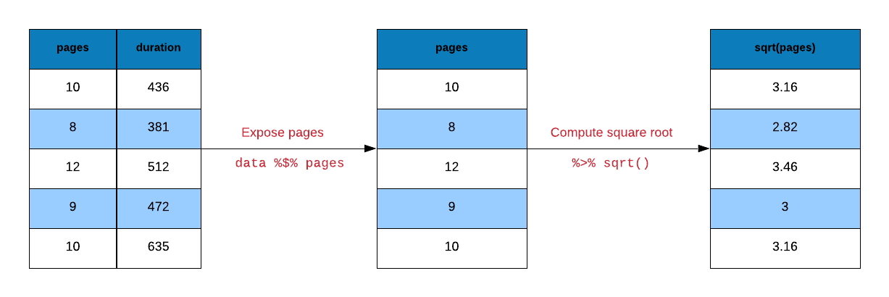
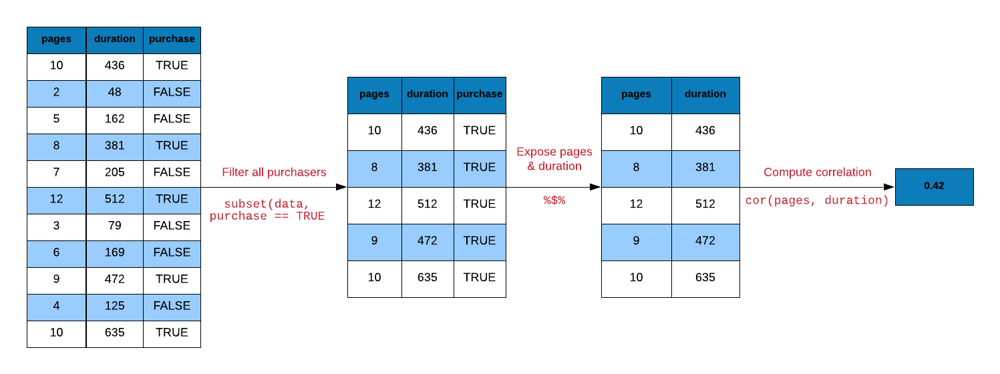

## {data-background="pipes.png"}

## Agenda

<hr>

- what are pipes?
- why use pipes?
- what are the different types of pipes?
- combining operations with pipes
- case studies

## Introduction

<hr>

R code contain a lot of parentheses in case of a sequence of multiple operations. When you are dealing with 
complex code, it results in nested function calls which are hard to read and maintain. The [magrittr](https://CRAN.R-project.org/package=magrittr) package by [Stefan Milton Bache](http://stefanbache.dk/) provides pipes enabling us to write R code that is readable.

Pipes allow us to clearly express a sequence of multiple operations by:

- structuring operations from left to right
- avoiding
    - nested function calls
    - intermediate steps
    - overwriting of original data
- minimizing creation of local variables

## Pipes

<hr>

If you are using [tidyverse](https://www.tidyverse.org/), magrittr will be automatically loaded. We will look at 3 different types of pipes:

- `%>%` : pipe a value forward into an expression or function call
- `%<>%`: result assigned to left hand side object instead of returning it 
- `%$%` : expose names within left hand side objects to right hand side expressions

## Libraries

<hr>

```{r importlib1,eval=FALSE}
library(magrittr)
library(readr)
library(purrr)
library(dplyr)
library(stringr)
```

```{r importlib2, echo=FALSE, eval=TRUE, results='hide', message=FALSE}
library(magrittr)
library(readr)
library(dplyr)
library(purrr)
library(stringr)
```
## Data

<hr>

<br>

```{r show, echo=FALSE, eval=TRUE, message=FALSE}
ecom <- 
  read_csv('https://raw.githubusercontent.com/rsquaredacademy/datasets/master/web.csv',
    col_types = cols_only(
      referrer = col_factor(levels = c("bing", "direct", "social", "yahoo", "google")),
      n_pages = col_double(), duration = col_double(), purchase = col_logical()
    )
  )

ecom
```

## Data Dictionary

<hr>

- referrer: referrer website/search engine
- n_pages: number of pages visited
- duration: time spent on the website (in seconds)
- purchase: whether visitor purchased

## Sample Data

<hr>

```{r ecom_mini}
ecom_mini <- sample_n(ecom, size = 10)
```

## head

<hr>

```{r mag1}
head(ecom, 10)
```

## Using pipe

<hr>

```{r mag2}
ecom %>% head(10)
```

## Square Root 

<hr>

```{r mag3}
y <- ecom_mini$n_pages
y <- sqrt(y)

# combine above steps
sqrt(ecom_mini$n_pages)
```

## Square Root - Using pipe

<hr>

```{r mag4}
# select n_pages variable and assign it to y
ecom_mini %$% 
  n_pages -> y

# compute square root of y and assign it to y 
y %<>% sqrt()
```

## Square Root - Using Pipe

<hr>

<br>
<br>

```{r mag24, echo=FALSE, out.width="100%", fig.align="center"}

```

## Square Root - Using pipe

<hr>

```{r mag5}
ecom_mini %$% 
  n_pages %>% 
  sqrt() -> y

y
```

## Correlation

<hr>

<br>
<br>

```{r mag25, echo=FALSE, out.width="100%", fig.align="center"}

```

## Correlation

<hr>

```{r mag6}
# without pipe
ecom1 <- subset(ecom, purchase)
cor(ecom1$n_pages, ecom1$duration)
```

## Correlation - Using pipe

<hr>

```{r mag6a}
# with pipe
ecom %>%
  subset(purchase) %$% 
  cor(n_pages, duration)

# using filter from dplyr and pipe
ecom %>%
  filter(purchase) %$% 
  cor(n_pages, duration)
```

## Visualization

<hr>

```{r mag21, fig.align='center', fig.height=4, fig.width=6}
barplot(table(subset(ecom, purchase)$referrer))
```

## Visualization

<hr>

<br>

```{r mag26, echo=FALSE, out.width="100%", fig.align="center"}
knitr::include_graphics("pipes_data_visualization.png")
```

## Visualization - Using pipe

<hr>

```{r mag7, fig.align='center', fig.height=4, fig.width=6}
ecom %>%
  subset(purchase) %>%
  extract('referrer') %>%
  table() %>%
  barplot()
```

## Regression

<hr>

```{r mag8}
summary(lm(duration ~ n_pages, data = ecom))
```

## Regression - Using pipe

<hr>

```{r mag22}
ecom %$%
  lm(duration ~ n_pages) %>%
  summary()
```

## String Manipulation

<hr>

```{r mag9}
email <- 'jovialcann@anymail.com'

# without pipe
str_to_upper(str_sub(str_split(email, '@')[[1]][1], start = 1, end = 6))
```

## String Manipulation - Using Pipe

<hr>

```{r mag9a}
# with pipe
email %>%
  str_split(pattern = '@') %>%
  extract2(1) %>%
  extract(1) %>%
  str_sub(start = 1, end = 6) %>%
  str_to_upper()
```

## Data Extraction

<hr>

- `extract()`
- `extract2()`
- `use_series()`

## Extract Column By Name

<hr>

```{r mag10}
ecom_mini['n_pages']
extract(ecom_mini, 'n_pages') 
```

## Extract Column By Position

<hr>

```{r mag23}
ecom_mini[2]
```

## Extract Column By Position

<hr>

```{r mag23a}
extract(ecom_mini, 2) 
```

## Extract Column (as vector)

<hr>

```{r mag11}
ecom_mini$n_pages
```

## Extract Column (as vector)

<hr>

```{r mag11a}
use_series(ecom_mini, 'n_pages') 
```

## Sample List

<hr>

```{r mini_list}
ecom_list <- as.list(ecom_mini)
```

## Extract List Element By Name

<hr>

```{r mag12}
# base
ecom_list[['n_pages']]
ecom_list$n_pages
```

## Extract List Element By Name

<hr>

```{r mag12a}
# magrittr
extract2(ecom_list, 'n_pages')
use_series(ecom_list, n_pages)
```

## Extract List Element By Position

<hr>

```{r mag13}
# base 
ecom_list[[1]]

# magrittr
extract2(ecom_list, 1)
```

## Extract List Element (as vector)

<hr>

```{r mag14}
# base
ecom_list$n_pages

# magrittr
use_series(ecom_list, n_pages)
```

## Arithmetic Operations

<hr>

- `add()`
- `subtract()`
- `multiply_by()`
- `multiply_by_matrix()`
- `divide_by()`
- `divide_by_int()`
- `mod()`
- `raise_to_power()`


## Addition

<hr>

```{r mag15}
1:10 + 1
add(1:10, 1)
`+`(1:10, 1)
```

## Multiplication

<hr>

```{r mag16}
1:10 * 3
multiply_by(1:10, 3)
`*`(1:10, 3)
```

## Division

<hr>

```{r mag17}
1:10 / 2
divide_by(1:10, 2)
`/`(1:10, 2)
```

## Power

<hr>

```{r mag18}
1:10 ^ 2
raise_to_power(1:10, 2)
`^`(1:10, 2)
```

## Logical Operators

<hr>

- `and()`
- `or()`
- `equals()`
- `not()`
- `is_greater_than()`
- `is_weakly_greater_than()`
- `is_less_than()`
- `is_weakly_less_than()`

## Greater Than

<hr>

```{r mag19}
1:10 > 5
is_greater_than(1:10, 5)
`>`(1:10, 5)
```

## Weakly Greater Than

<hr>

```{r mag20}
1:10 >= 5
is_weakly_greater_than(1:10, 5)
`>=`(1:10, 5)
```

## {data-background="thankyou.png"}

