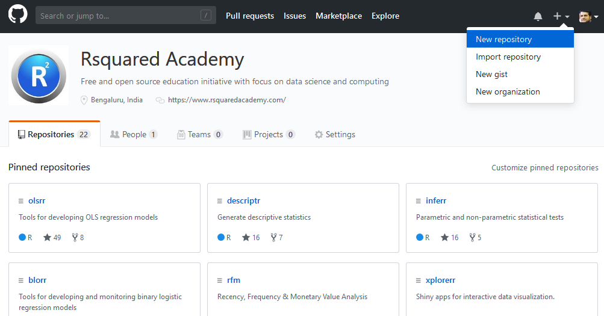
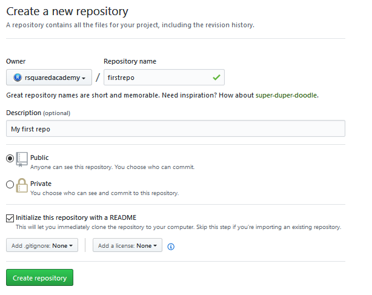
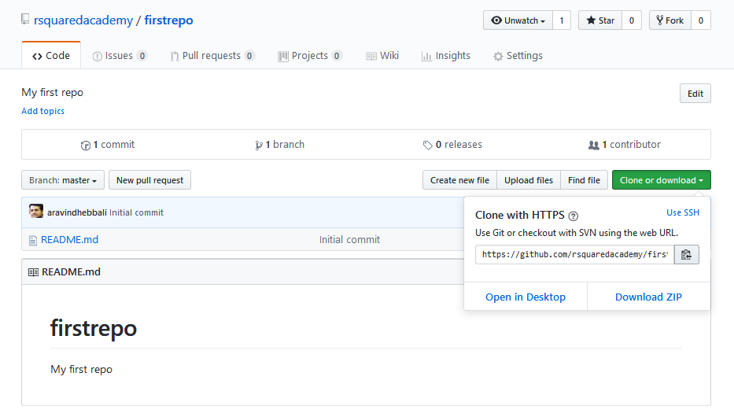
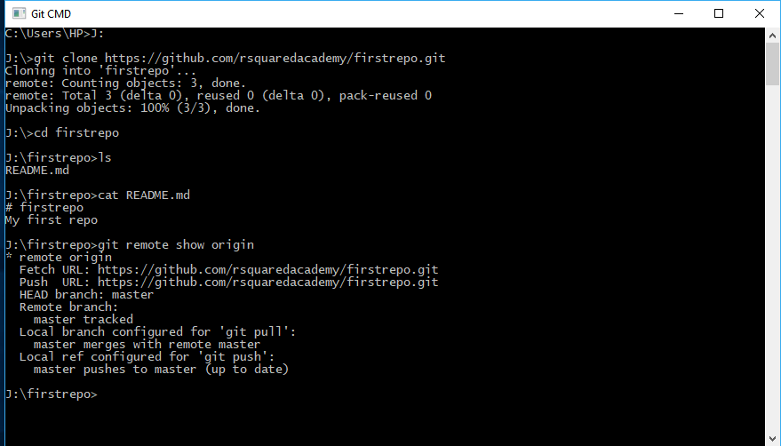
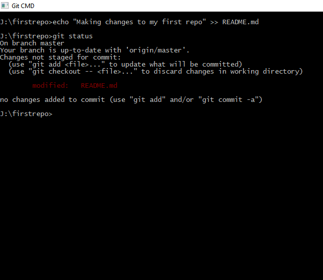
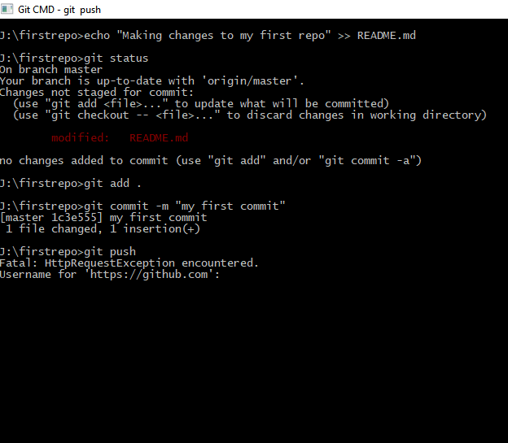
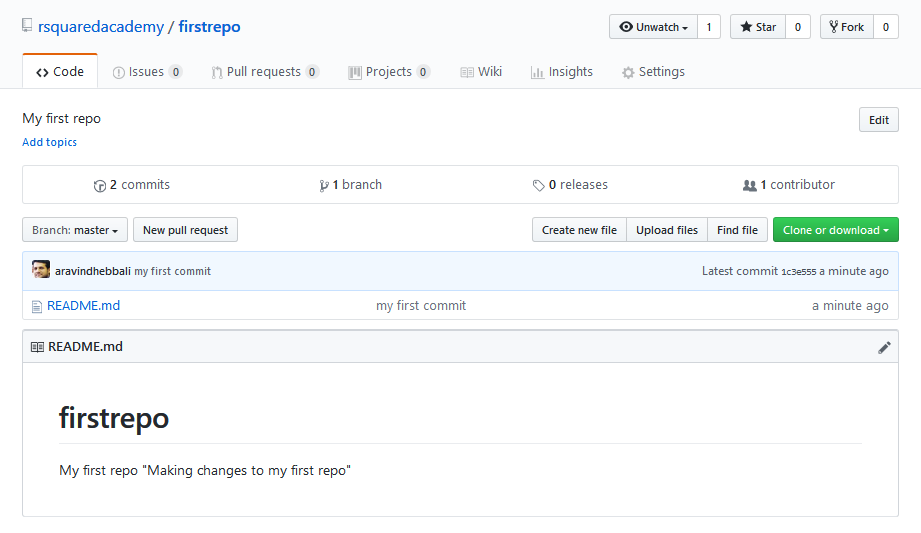
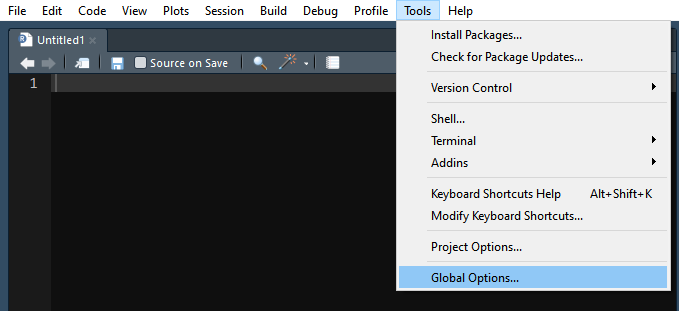
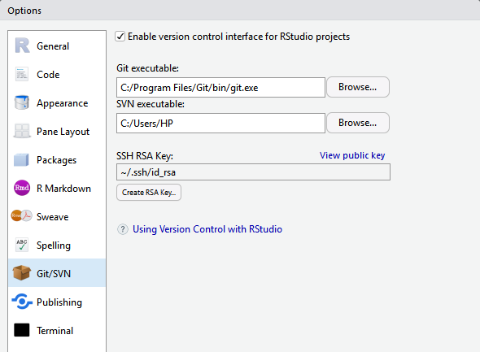

## {data-background="git_banner_3.png"}

## Agenda

<hr>

- configure Git
- connect to GitHub
- configure RStudio

## Configure Git

<hr>

- `git config --global user.name 'your name'`
- `git config --global user.mail 'your mail address'`
- `git config --global --list`

## Connect to GitHub

<hr>

- create a new repository on GitHub
- clone repository to local computer
- make changes to the repository
- register the above changes
- push the changes to the remote repository
- check if the local changes are reflected in the GitHub repository

## Create Repository

<hr>

<br>

```{r img1, echo=FALSE, fig.align='center'}

```

## Create Repository

<hr>

<br>

```{r img2, echo=FALSE, fig.align='center'}

```

## Clone Repository

<hr>

<br>

```{r img3, echo=FALSE, fig.align='center'}

```

## Clone Repository

<hr>

<br>

```{r img4, echo=FALSE, fig.align='center'}

```

## Make Changes

<hr>

<br>

```{r img5, echo=FALSE, fig.align='center'}

```

## Push Changes

<hr>

<br>

```{r img6, echo=FALSE, fig.align='center'}

```

## Confirm Changes

<hr>

<br>

```{r img7, echo=FALSE, fig.align='center'}

```

## Configure RStudio

<hr>

<br>

```{r img8, echo=FALSE, fig.align='center'}

```

## Configure RStudio

<hr>

<br>

```{r img9, echo=FALSE, fig.align='center'}

```

## {data-background="thankyou.png"}
