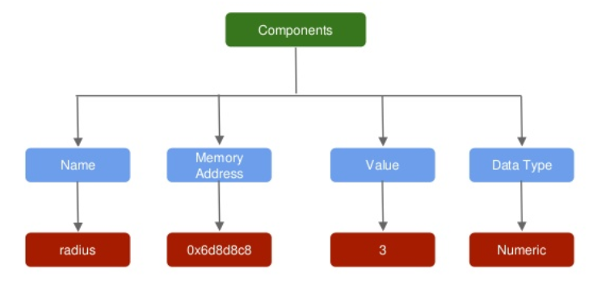

## {data-background="datatypes_banner.png"}

## Introduction

<hr>

In this module, we will learn about variables & data types. Specifically:

- what is a variable?
- how to create variables in R?
- how to use variables created?
- components of a variable
- naming conventions for a variable
- data types
    - numeric/double
    - integer
    - logical
    - character
    - date/time

## {data-background="variables_section.png"}

## What is a variable?

<hr>

- variables are the fundamental elements of any programming language
- they are used to represent values that are likely to change
- they reference memory locations that store information/data

Let us use a simple case study to understand variables. Suppose you are computing the area of a circle whose radius is 3. In R, you can do this straight away as shown below:

```{r var1}
3.14 * 3 * 3
```

But you cannot reuse the radius or the area computed in any other analysis or computation. Let us see how variables can change the above scenario and help us in reusing values and computations.

## Creating Variables

<hr>

A variable consists of 3 components:

- variable name
- assignment operator
- variable value

We can store the value of the radius by creating a variable and assigning it the value. In this case, we create a variable
called `radius` and assign it the value `3` using the assignment operator `<-`.

```{r var2}
radius <- 3
radius
```

Now that we have learnt to create variables, let us see how we can use them for other computations. For our case study,
we will use the `radius` variable to compute the area of a circle.

## Using Variables

<hr>

We will create two variables, `radius` and `pi`, and use them to compute the area of a circle and store it in another variable `area`.

```{r var3}
# assign value 3 to variable radius
radius <- 3

# assign value 3.14 to variable pi
pi <- 3.14

# compute area of circle
area <- pi * radius * radius

# call radius
radius

# call area
area
```

## Components of a Variable

<hr>

<center>

</center>

## Naming Conventions

<hr>

- Name must begin with a letter. Do not use numbers, dollar sign (`$`) or underscore (`_`).
- The name can contain numbers or underscore. Do not use dash (`-`) or period (`.`).
- Do not use the names of keywords and avoid using the names of built in functions.
- Variables are case sensitive; `average` and `Average` would be different variables.
- Use names that are descriptive. Generally, variable names should be nouns.
- If the name is made of more than one word, use underscore to separate the words.

## {data-background="datatypes_section.png"}

## Numeric

<hr>

In R, numbers are represented by the data type `numeric`. We will first create a
variable and assign it a value. Next we will learn a few methods of checking the
type of the variable.

```{r dtype1, collapse=TRUE}
# create two variables
number1 <- 3.5
number2 <- 3

# check data type
class(number1)
class(number2)

# check if data type is numeric
is.numeric(number1)
is.numeric(number2)
```

## Numeric

<hr>

If you carefully observe, `integers` are also treated as `numeric/double`. We
will learn to create integers in a while. In the meanwhile, we have introduced
two new functions in the above example:

- `class()`: returns the `class` or `type`
- `is.numeric()`: tests whether the variable is of type `numeric`

## Integer

<hr>

Unless specified otherwise, integers are treated as `numeric` or `double`. In
this section, we will learn to create variables of the type `integer` and to
convert other data types to `integer`.

- create a variable `number1` and assign it the value `3`
- check the data type of `number1` using `class`
- create a second variable `number2` using `as.integer()` and assign it the value `3`
- check the data type of `number2` using `class`
- finally use `is.integer()` to check the data type of both `number1` and `number2`

## Integer

<hr>

```{r dtype2, collapse=TRUE}
# create a variable and assign it an integer value
number1 <- 3

# create another variable using as.integer
number2 <- as.integer(3)

# check the data type
class(number1)
class(number2)

# use is.integer to check data type
is.integer(number1)
is.integer(number2)
```

## Character

<hr>

Letters, words and group of words are represented by the data type `character`.
All data of type `character` must be enclosed in single or double quotation
marks. In fact any value enclosed in quotes will be treated as `character`. Let
us create two variables to store the first and last name of a some random guy.

```{r dtype3, collapse=TRUE}
# first name
first_name <- "jovial"

# last name
last_name <- 'mann'

# check data type
class(first_name)
class(last_name)

# use is.charactert to check data type
is.character(first_name)
is.character(last_name)
```

## Integer

<hr>

You can coerce any data type to `character` using `as.character()`.

```{r dtype4, collapse=TRUE}
# create variable of different data types
age        <- as.integer(30) # integer
score      <- 9.8            # numeric/double
opt_course <- TRUE           # logical
today      <- Sys.time()     # date time

as.character(age)
as.character(score)
as.character(opt_course)
as.character(today)
```

## Logical

<hr>

Logical data types take only 2 values. Either `TRUE` or `FALSE`. Such data types
are created when we compare two objects in R using comparison or logical
operators.

- create two variables `x` and `y`
- assign them the values `TRUE` and `FALSE` respectively
- use `is.logical()` to check data type
- use `as.logical()` to coerce other data types to `logical`

```{r dtype5, collapse=TRUE}
# create variables x and y
x <- TRUE
y <- FALSE

# check data type
class(x)
is.logical(y)
```

## Logical

<hr>

The outcome of comparison operators is always `logical`. In the below example,
we compare two numbers to see the outcome.

```{r dtype6, collapse=TRUE}
# create two numeric variables
x <- 3
y <- 4

# compare x and y
x > y
x < y

# store the result
z <- x > y
class(z)
```

## Logical

<hr>

`TRUE` is represented by all numbers except `0`. `FALSE` is represented only by
`0` and no other numbers.

```{r dtype7, collapse=TRUE}
# TRUE and FALSE are represented by 1 and 0
as.logical(1)
as.logical(0)

# using numbers
as.numeric(TRUE)
as.numeric(FALSE)

# using different numbers
as.logical(-2, -1.5, -1, 0, 1, 2)
```

## Logical

<hr>

Use `as.logical()` to coerce other data types to `logical`.

```{r dtype8, collapse=TRUE}
# create variable of different data types
age        <- as.integer(30) # integer
score      <- 9.8            # numeric/double
opt_course <- TRUE           # logical
today      <- Sys.time()     # date time

as.logical(age)
as.logical(score)
as.logical(opt_course)
as.logical(today)
```

## Summary

<hr>

- Variables are the building blocks of a programming language
- Variables reference memory locations that store information/data
- An assignment operator `<-` assigns values to a variable
- A variable has the following components:
    - name
    - memory address
    - value
    - data type
- Certain rules must be followed while naming variables


## Summary

<hr>

- numeric, integer, character, logical and date are the basic data types in R
- `class()` or `typeof()` return the data type
- `is.data_type` checks whether the data is of the specified data type
    - `is.numeric()`
    - `is.integer()`
    - `is.character()`
    - `is.logical()`
    - `is.date()`
- `as.data_type` will coerce objects to the specified data type
    - `as.numeric()`
    - `as.integer()`
    - `as.character()`
    - `as.logical()`
    - `as.date()`

## {data-background="thankyou.png"}
