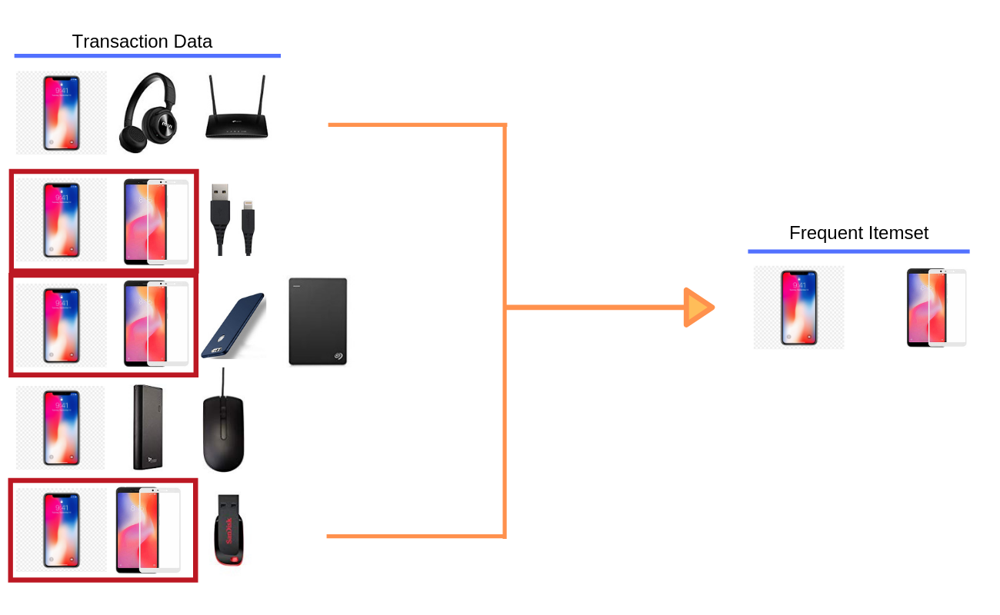

## {data-background="img/mba_cover_image.png"}

## Connect With Us

<hr>

- Website     (https://www.rsquaredacademy.com/)
- Free Online R Courses   (https://rsquared-academy.thinkific.com/)
- R Packages  (https://pkgs.rsquaredacademy.com)
- Shiny Apps  (https://apps.rsquaredacademy.com)
- Blog        (https://blog.rsquaredacademy.com)
- GitHub      (https://github.com/rsquaredacademy)
- YouTube     (https://www.youtube.com/user/rsquaredin/)
- Twitter     (https://twitter.com/rsquaredacademy)
- Facebook    (https://www.facebook.com/rsquaredacademy/)
- Linkedin    (https://in.linkedin.com/company/rsquared-academy)

## Resources

<hr>

- <a href="https://slides.rsquaredacademy.com/mba/mba.html" target="_blank">Slides</a>
- <a href="https://github.com/rsquaredacademy-education/online-courses/tree/master/association-rule-mining-in-r" target="_blank">Code & Data</a>
- <a href="https://rstudio.cloud/project/335377" target="_blank">RStudio Cloud</a>

## {data-background="img/ws_agenda.png"}

<br>
<br>
<br>
<br>
<br>

>- What?
>- Why?
>- How?
>- Use Cases
>- Demo

## {data-background="img/ws_section_intro.png"}

## Introduction

<hr>

```{r mba_intro, fig.align='center', out.width="100%", echo=FALSE}

```

## What?

<hr>

```{r mba_what, fig.align='center', out.width="100%", echo=FALSE}

```

## Why ?

<hr>

<br>
<br>

```{r why, fig.align='center', out.width="100%", echo=FALSE}
knitr::include_graphics("img/mba_why.png")
```

## Advantages

<hr>

```{r advantages, fig.align='center', out.width="100%", echo=FALSE}
knitr::include_graphics("img/mba_advantages.png")
```

## Use Cases

<hr>

<br>
<br>

```{r use_cases, fig.align='center', out.width="100%", echo=FALSE}
knitr::include_graphics("img/mba_use_cases.png")
```

## Simple Example

<hr>

```{r simple_example, fig.align='center', out.width="100%", echo=FALSE}

```

## Steps

<hr>

```{r steps, fig.align='center', out.width="100%", echo=FALSE}

```

## Itemset

<hr>

```{r itemset, fig.align='center', out.width="100%", echo=FALSE}

```

## Antecedent & Consequent

<hr>

```{r ante_cons, fig.align='center', out.width="100%", echo=FALSE}
knitr::include_graphics("img/mba_antecedent_consequent.png")
```

## Support

<hr>

```{r support, fig.align='center', out.width="100%", echo=FALSE}
knitr::include_graphics("img/mba_support.png")
```

## Confidence 

<hr>

```{r confidence, fig.align='center', out.width="100%", echo=FALSE}

```

## Lift

<hr>

```{r lift, fig.align='center', out.width="100%", echo=FALSE}

```

## {data-background="img/ws_section_case_studies.png"}

## Data

<hr>

- <a href="http://archive.ics.uci.edu/ml/datasets/online+retail#" target="_blank">UCI</a>
- <a href="https://data.world/datasets/market-basket-analysis" target="_blank">data.world</a>

## Data Dictionary

<hr>

- invoice number
- stock code
- description
- quantity
- invoice date
- unit price
- customer id
- country

## Libraries

<hr>

```{r libs, message=FALSE, warning=FALSE}
library(readxl)
library(readr)
library(mbar)
library(arules)
library(arulesViz)
library(magrittr)
library(dplyr)
library(lubridate)
library(forcats)
library(ggplot2)
```

## Preprocessing

<hr>

<br>
<br>

```{r mba_preprocess, fig.align='center', out.width="100%", echo=FALSE}

```

## Preprocessing

<hr>

```{r preprocess}
mba_data     <- read_excel("online-retail.xlsx")
transactions <- mbar_prep_data(mba_data, InvoiceNo, Description)
head(transactions)
```

## What time of day do people purchase?

<hr>

<br>

```{r eda_1, echo=FALSE, fig.align='center', fig.height=5}
purchase_time <-
  mba_data %>%
  group_by(InvoiceDate) %>%
  slice(1) %>%
  mutate(time_of_day = hour(InvoiceDate)) %>%
  pull(time_of_day) %>%
  as.factor() %>%
  fct_count()

purchase_time %>%
  ggplot() +
  geom_col(aes(x = f, y = n), fill = "blue") +
  xlab("Hour of Day") + ylab("Transactions") +
  ggtitle("Hourly Transaction Distribution")  
```

## How many items are purchased on an average?

<hr>

```{r eda_2}
items <- 
  mba_data %>%
  group_by(InvoiceNo) %>%
  summarize(count = n()) %>%
  pull(count) 

mean(items)
median(items)
```

## Most Purchased Items

<hr>

```{r eda_4}
mba_data %>%
  group_by(Description) %>%
  summarize(count = n()) %>%
  arrange(desc(count))
```

## Average Order Value

<hr>

```{r eda_5}
total_revenue <- 
  mba_data %>%
  group_by(InvoiceNo) %>%
  summarize(order_sum = sum(UnitPrice)) %>%
  pull(order_sum) %>%
  sum()

total_transactions <- 
  mba_data %>%
  group_by(InvoiceNo) %>%
  summarize(n()) %>%
  nrow()

total_revenue / total_transactions
```

## Read Data

<hr>

```{r read_data, warning=FALSE, message=FALSE}
basket_data <- read.transactions("transaction_data.csv", format = "basket", 
  sep = ",")
basket_data
```

## Data Summary

<hr>

```{r summary}
summary(basket_data)
```

## Item Frequency Plot

<hr>

```{r plot_freq, fig.align='center', fig.height=5}
itemFrequencyPlot(basket_data, topN = 10, type = 'absolute')
```

## Generate Rules

<hr>

```{r rules_generate}
rules <- apriori(basket_data, parameter = list(supp=0.009, conf=0.8, 
	target = "rules", maxlen = 4))
```

## Rules Summary

<hr>

```{r rules_summary}
summary(rules)
```

## Inspect Rules

<hr>

```{r rules_inspect}
basket_rules <- sort(rules, by = 'confidence', decreasing = TRUE)
inspect(basket_rules[1:10])
```

## Redundant Rules

<hr>

<br>
<br>

```{r red_rule_1, fig.align='center', out.width="100%", echo=FALSE}
knitr::include_graphics("J:/R/blog_research/mba/img/mba_redundant_rule_1.png")
```

## Redundant Rules

<hr>

<br>
<br>

```{r red_rule_2, fig.align='center', out.width="100%", echo=FALSE}
knitr::include_graphics("J:/R/blog_research/mba/img/mba_redundant_rule_2.png")
```

## Redundant Rules

<hr>

<br>
<br>

```{r red_rule_3, fig.align='center', out.width="100%", echo=FALSE}
knitr::include_graphics("J:/R/blog_research/mba/img/mba_redundant_rule_3.png")
```

## Redundant Rules

<hr>

```{r rules_redundant_print}
inspect(rules[is.redundant(rules)])
```

## Non Redundant Rules

<hr>

```{r rules_unique}
inspect(rules[!is.redundant(rules)])
```

## What influenced purchase of product X?

<hr>

```{r rhs, message=FALSE}
sugar_rules <- apriori(basket_data, parameter = list(supp = 0.009, conf = 0.8), 
  appearance = list(default = "lhs", rhs = "SUGAR"))
```

## What influenced purchase of product X?

<hr>

```{r rhs2}
rules_sugar <- sort(sugar_rules, by = "confidence", decreasing = TRUE)
inspect(rules_sugar)
```

## What purchases did product X influence?

<hr>

```{r lhs, message=FALSE}
sugar_rules <- apriori(basket_data, parameter = list(supp = 0.009, conf = 0.8), 
  appearance = list(default = "rhs", lhs = "SUGAR")) 
```

## What purchases did product X influence?

<hr>

```{r lhs2, message=FALSE}
rules_sugar <- sort(sugar_rules, by = "confidence", decreasing = TRUE)
inspect(rules_sugar)
```

## Top Rules by Support

<hr>

```{r top_rules_supp}
supp_rules <- sort(rules, by = 'support', decreasing = TRUE)
top_rules <- supp_rules[1:10]
inspect(top_rules)
```

## Top Rules by Confidence

<hr>

```{r top_rules_conf}
conf_rules <- sort(rules, by = 'confidence', decreasing = TRUE)
top_rules <- conf_rules[1:10]
inspect(top_rules)
```

## Top Rules by Lift

<hr>

```{r top_rules_lift}
lift_rules <- sort(rules, by = 'lift', decreasing = TRUE)
top_rules <- lift_rules[1:10]
inspect(top_rules)
```

## Scatter Plot

<hr>

```{r plot_scatter, fig.align='center', fig.height=5, warning=FALSE, message=FALSE}
plot(basket_rules)
```

## Network Plot

<hr>

```{r plot_network, fig.align='center', fig.height=5}
plot(top_rules, method = 'graph')
```

## Directionality of rule is lost while using lift

<hr>

<br>
<br>

```{r mba_lift_warn, fig.align='center', out.width="100%", echo=FALSE}

```

## Confidence as a measure can be misleading

<hr>

<br>
<br>

```{r mba_conf_warn, fig.align='center', out.width="100%", echo=FALSE}

```

## {data-background="img/ws_section_summary.png"}

## {data-background="img/mba_summary_meme.png"}

## Summary

<hr>

- unsupervised data mining technique
- uncovers products frequently bought together
- creates if-then scenario rules
- cost-effective, insightful and actionable
- association rule mining has applications in several industries
- directionality of rule is lost while using lift
- confidence as a measure can be misleading

## {data-background="img/thankyou.png"}

