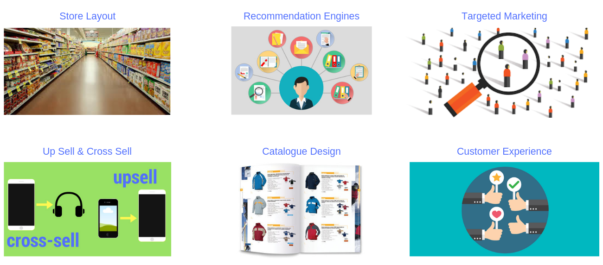
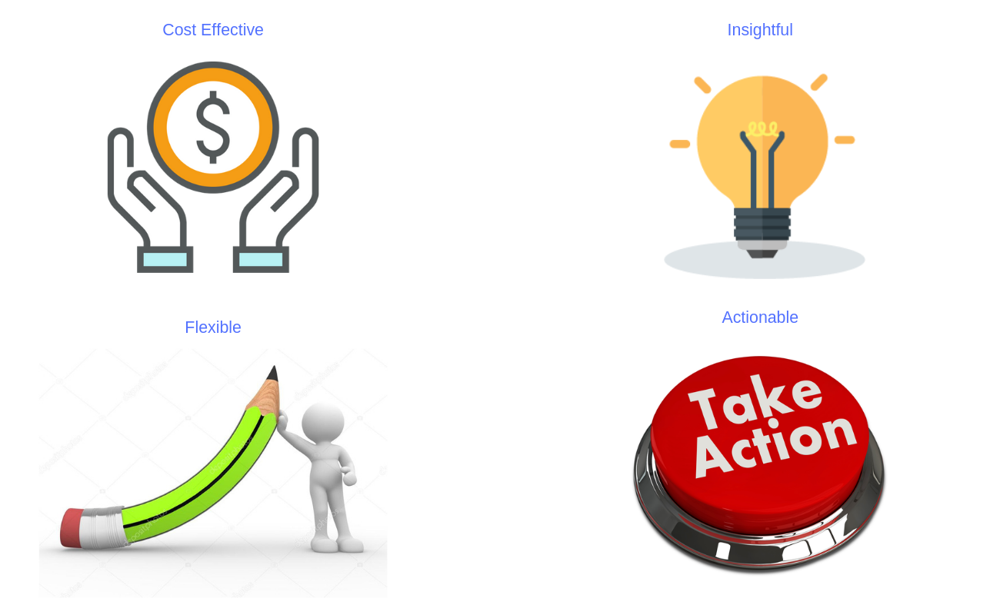
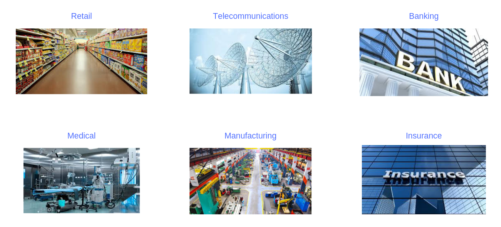
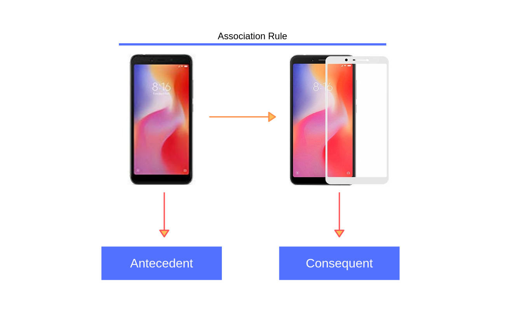
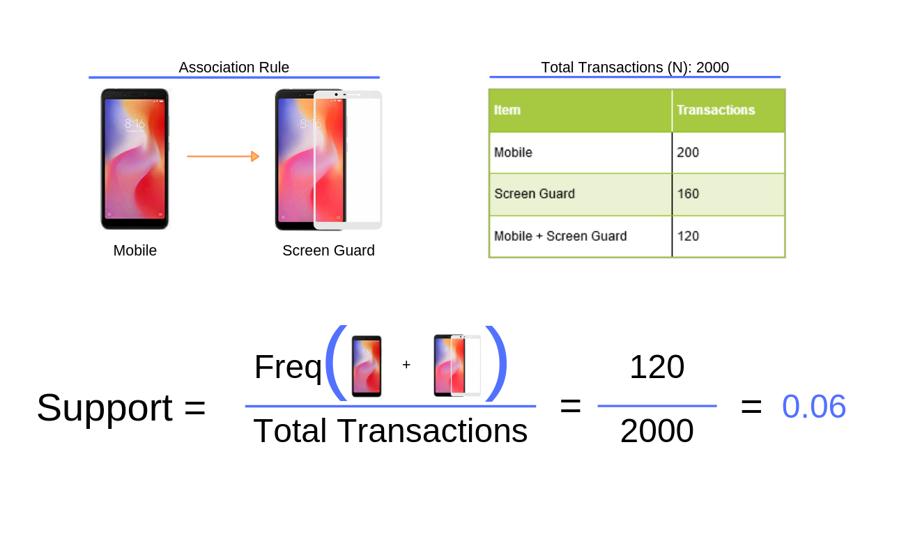

## {data-background="img/mba_cover_image.png"}

## Connect With Us

<hr>

- Website     (https://www.rsquaredacademy.com/)
- Free Online R Courses   (https://rsquared-academy.thinkific.com/)
- R Packages  (https://pkgs.rsquaredacademy.com)
- Shiny Apps  (https://apps.rsquaredacademy.com)
- Blog        (https://blog.rsquaredacademy.com)
- GitHub      (https://github.com/rsquaredacademy)
- YouTube     (https://www.youtube.com/user/rsquaredin/)
- Twitter     (https://twitter.com/rsquaredacademy)
- Facebook    (https://www.facebook.com/rsquaredacademy/)
- Linkedin    (https://in.linkedin.com/company/rsquared-academy)

## {data-background="img/ws_agenda.png"}

<br>
<br>
<br>
<br>
<br>

>- What?
>- Why?
>- How?
>- Use Cases
>- Demo

## {data-background="img/ws_section_intro.png"}

## What?

<hr>

```{r mba_what, fig.align='center', out.width="100%", echo=FALSE}
knitr::include_graphics("img/mba_what.png")
```

## Why ?

<hr>

<br>
<br>

```{r why, fig.align='center', out.width="100%", echo=FALSE}

```

## Advantages

<hr>

```{r advantages, fig.align='center', out.width="100%", echo=FALSE}

```

## Use Cases

<hr>

<br>
<br>

```{r use_cases, fig.align='center', out.width="100%", echo=FALSE}

```

## Simple Example

<hr>

```{r simple_example, fig.align='center', out.width="100%", echo=FALSE}
knitr::include_graphics("img/mba_items_description.png")
```

## Steps

<hr>

```{r steps, fig.align='center', out.width="100%", echo=FALSE}
knitr::include_graphics("img/mba_steps.png")
```

## Itemset

<hr>

```{r itemset, fig.align='center', out.width="100%", echo=FALSE}
knitr::include_graphics("img/mba_itemset.png")
```

## Antecedent & Consequent

<hr>

```{r ante_cons, fig.align='center', out.width="100%", echo=FALSE}

```

## Support

<hr>

```{r support, fig.align='center', out.width="100%", echo=FALSE}

```

## Confidence 

<hr>

```{r confidence, fig.align='center', out.width="100%", echo=FALSE}
knitr::include_graphics("img/mba_confidence.png")
```


## Lift

<hr>

```{r lift, fig.align='center', out.width="100%", echo=FALSE}
knitr::include_graphics("img/mba_lift.png")
```

## {data-background="img/ws_section_case_studies.png"}

## {data-background="img/thankyou.png"}

