## {data-background="img/regex_cover_image.png"}

## {data-background="img/regex_meme.png"}

## Connect With Us

<hr>

- Website     (https://www.rsquaredacademy.com/)
- Free Online R Courses   (https://rsquared-academy.thinkific.com/)
- R Packages  (https://pkgs.rsquaredacademy.com)
- Shiny Apps  (https://apps.rsquaredacademy.com)
- Blog        (https://blog.rsquaredacademy.com)
- GitHub      (https://github.com/rsquaredacademy)
- YouTube     (https://www.youtube.com/user/rsquaredin/)
- Twitter     (https://twitter.com/rsquaredacademy)
- Facebook    (https://www.facebook.com/rsquaredacademy/)
- Linkedin    (https://in.linkedin.com/company/rsquared-academy)

## Resources

<hr>

- <a href="https://slides.rsquaredacademy.com/regex/regex.html" target="_blank">Slides</a>
- <a href="https://github.com/rsquaredacademy-education/online-courses/tree/master/association-rule-mining-in-r" target="_blank">Code & Data</a>
- <a href="https://rstudio.cloud/project/335377" target="_blank">RStudio Cloud</a>

## {data-background="img/ws_agenda.png"}

<br>
<br>
<br>
<br>
<br>

- what are regular expressions?
- why use regular expression?
- what can you do with regular expressions?
	- find a word in a string
	- replace string
	- match a single character
	- match one of any of several letters
	- match series of range of characters

## {data-background="img/ws_section_intro.png"}

## {data-background="img/regex_what.png"}

## {data-background="img/regex_why.png"}

## {data-background="img/regex_use_case_1.png"}

## {data-background="img/regex_use_case_2.png"}

## {data-background="img/regex_use_case_3.png"}

## {data-background="img/regex_use_case_4.png"}

## {data-background="img/regex_use_case_5.png"}

## {data-background="img/regex_use_case_6.png"}
 
## Libraries

<hr>

```{r install, eval=TRUE, message=FALSE, warning=FALSE}
library(dplyr)
library(readr)
```

```{r str1, echo=FALSE, eval=TRUE, results='hide', message=FALSE}
library(dplyr)
```

## Data

<hr>

```{r read_data, message=FALSE}
read_csv("data/package_names.csv") %>%
  pull(1) -> r_packages 
r_packages
```

## Top R Packages

<hr>

```{r top_downloads}
top_downloads <- c("devtools", "rlang", "dplyr", "Rcpp", "tibble",    
                   "ggplot2", "glue", "pillar", "cli", "data.table")
top_downloads
```

## grep

<hr>

<br>

```{r grep_index, echo=FALSE, fig.align="center", out.width="100%"}
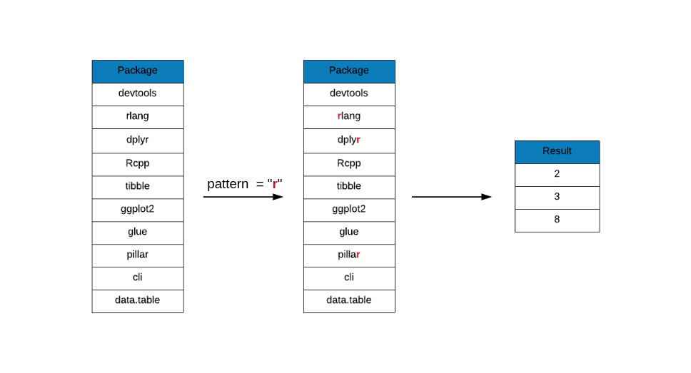
```

## grep

<hr>

```{r grep_code}
grep(x = top_downloads, pattern = "r")
```

## grep - Value

<hr>

<br>

```{r grep_value, echo=FALSE, fig.align="center", out.width="100%"}
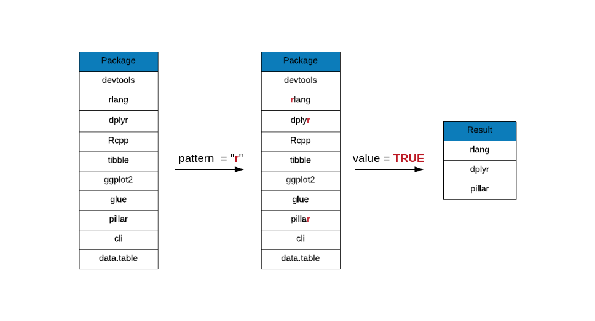
```

## grep - Value

<hr>

```{r grep_value_code}
grep(x = top_downloads, pattern = "r", value = TRUE)
```

## grep - Ignore Case

<hr>

<br>

```{r grep_ignore_case, echo=FALSE, fig.align="center", out.width="100%"}
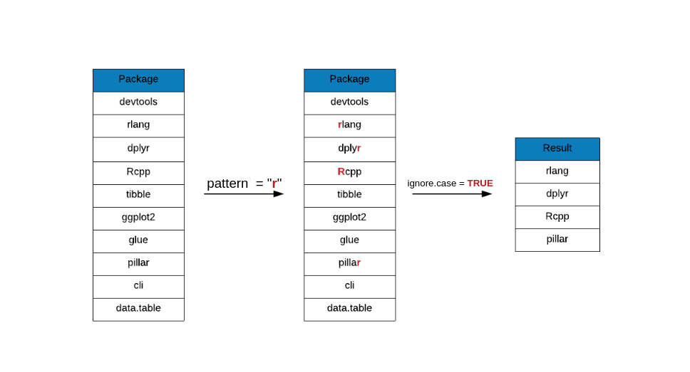
```

## grep - Ignore Case

<hr>

```{r grep_ignore_case_code}
grep(x = top_downloads, pattern = "r", value = TRUE, ignore.case = TRUE)
grep(x = top_downloads, pattern = "R", value = TRUE)
grep(x = top_downloads, pattern = "R", value = TRUE, ignore.case = TRUE)
```

## grep - Invert

<hr>

<br>

```{r grep_invert, echo=FALSE, fig.align="center", out.width="100%"}
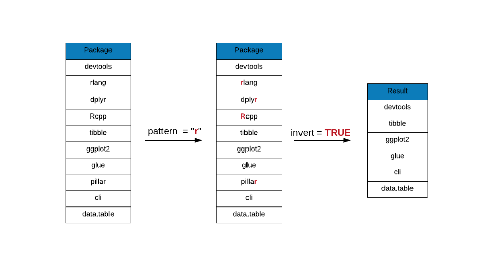
```

## grep - Invert

<hr>

```{r grep_invert_code}
grep(x = top_downloads, pattern = "r", value = TRUE, invert = TRUE)
grep(x = top_downloads, pattern = "r", value = TRUE, 
     invert = TRUE, ignore.case = TRUE)
```

## grepl

<hr>

<br>

```{r grepl, echo=FALSE, fig.align="center", out.width="100%"}
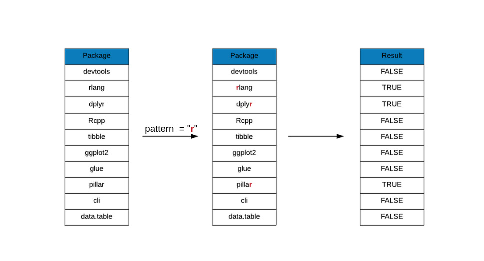
```

## grepl

<hr>

```{r grepl_code}
grepl(x = top_downloads, pattern = "r")
```

## grepl - Ignore Case

<hr>

<br>

```{r grepl_ignore_case, echo=FALSE, fig.align="center", out.width="100%"}
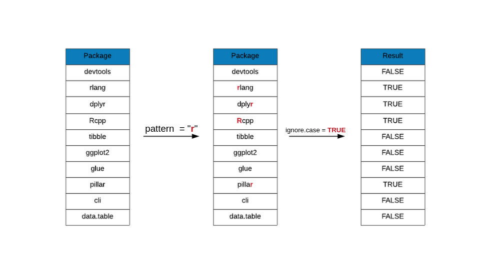
```

## grepl - Ignore Case

<hr>

```{r grepl_ignore_case_code}
grepl(x = top_downloads, pattern = "r", ignore.case = TRUE)
```

## regexpr

<hr>

```{r regexpr}
rr_pkgs <- c("purrr", "olsrr", "blorr")
regexpr("r", rr_pkgs)
```

## gregexpr

<hr>

```{r gregexpr}
gregexpr("r", rr_pkgs)
```

## regexec

<hr>

```{r regexec}
regexec("r", rr_pkgs)
```

## sub

<hr>

<br>

```{r sub, echo=FALSE, fig.align="center", out.width="100%"}
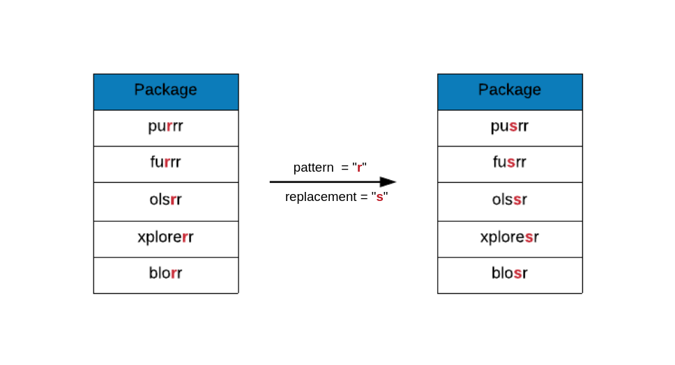
```

## sub

<hr>

```{r sub_code}
rr_pkgs <- c("purrr", "olsrr", "blorr")
sub(x = rr_pkgs, pattern = "r", replacement = "s")
```

## gsub

<hr>

<br>

```{r gsub, echo=FALSE, fig.align="center", out.width="100%"}
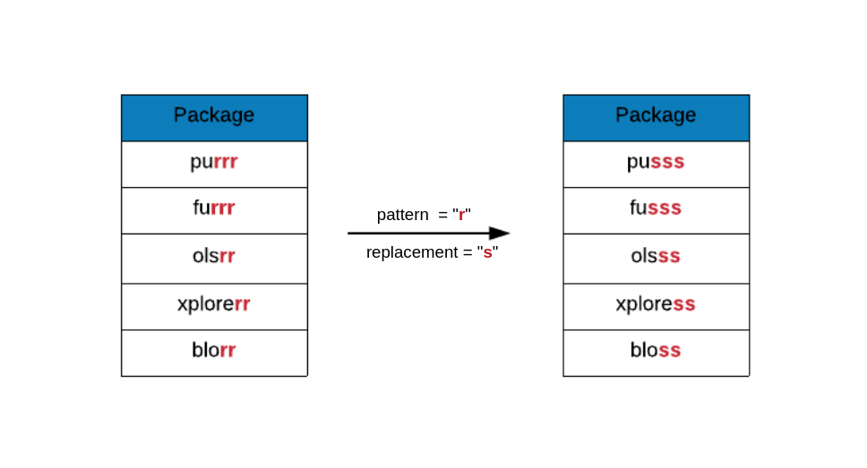
```

## gsub

<hr>

```{r gsub_code}
gsub(x = rr_pkgs, pattern = "r", replacement = "s")
```

## Anchors - Start

<hr>

<br>

```{r anchor_start}, echo=FALSE, fig.align="center", out.width="100%"}
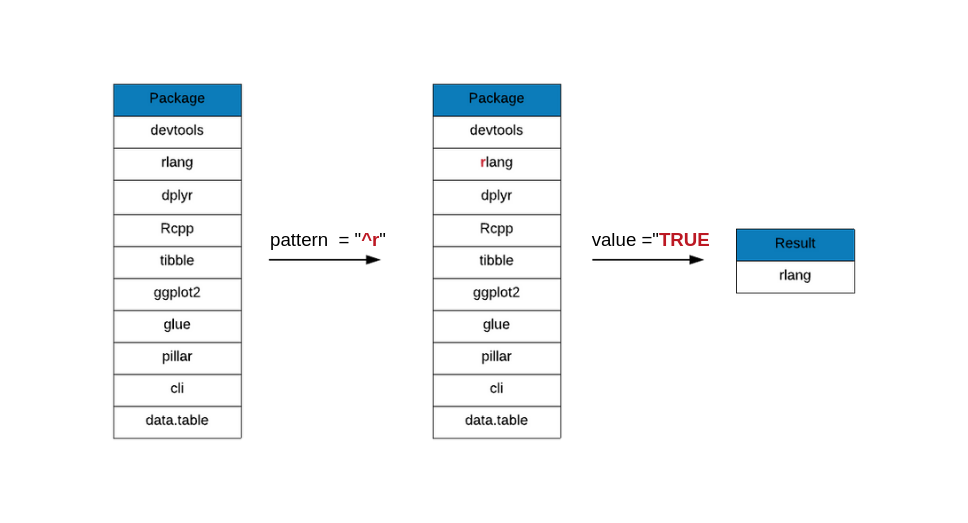
```

## Anchors - Start

<hr>

```{r anchor_start_code}
grep(x = top_downloads, pattern = "^r", value = TRUE)
```

## Anchors - Start (Ignore Case)

<hr>

<br>

```{r anchor_start_ignore_case, echo=FALSE, fig.align="center", out.width="100%"}
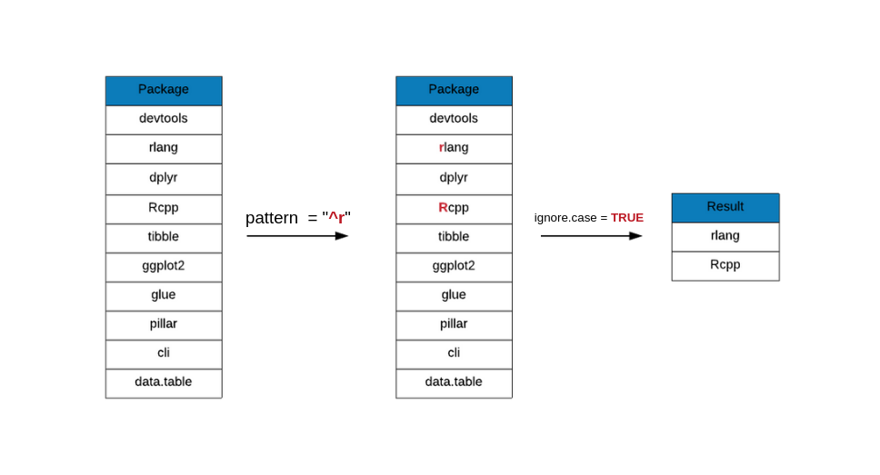
```

## Anchors - Start (Ignore Case)

<hr>

```{r anchor_start_ignore_case_code}
grep(x = top_downloads, pattern = "^r", value = TRUE, ignore.case = TRUE)
```

## Anchors - End

<hr>

<br>

```{r anchor_end, echo=FALSE, fig.align="center", out.width="100%"}
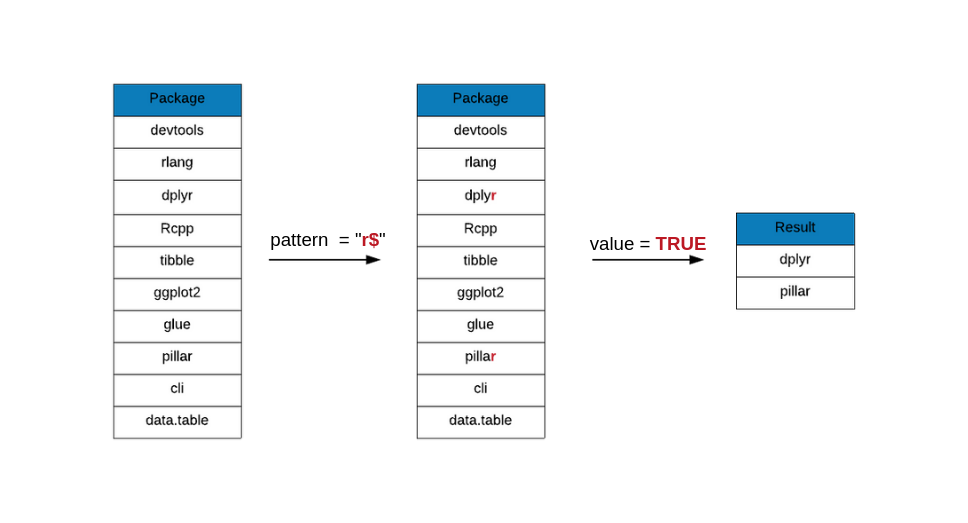
```

## Anchors - End

<hr>

```{r anchor_end_code}
grep(x = top_downloads, pattern = "r$", value = TRUE)
```

## Meta Characters

<hr>

<br>

```{r meta_characters, echo=FALSE, fig.align="center", out.width="50%"}
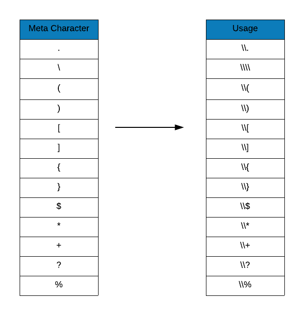
```

## Quantifiers - Dot

<hr>

<br>

```{r quantifier_dot, echo=FALSE, fig.align="center", out.width="100%"}
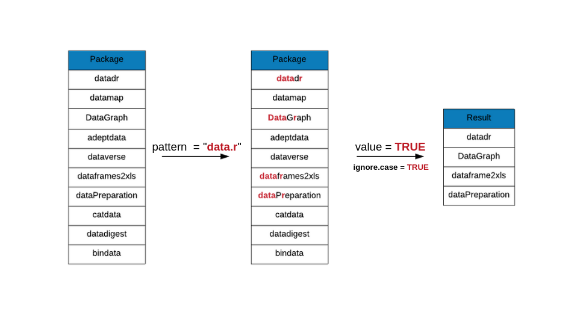
```

## Quantifiers - Dot

<hr>

```{r quantifier_dot_code_1}
data_pkgs <- grep(x = r_packages, pattern = "data", value = TRUE)
grep(x = data_pkgs, pattern = "data.r", value = TRUE, ignore.case = TRUE)
```

## Quantifiers - Dot

<hr>

```{r quantifier_dot_code_2}
grep(x = data_pkgs, pattern = "data...r", value = TRUE, ignore.case = TRUE)
```

## Quantifiers - Dot

<hr>

```{r quantifier_dot_code_3}
grep(x = r_packages, pattern = "data(.){3}r", value = TRUE, ignore.case = TRUE)
```

## Quantifiers - Dot

<hr>

```{r quantifier_dot_code_4}
grep(x = r_packages, pattern = "stat..r", value = TRUE, ignore.case = TRUE)
```

## Quantifiers- ?

<hr>

<br>

```{r quantifier_mark_1, echo=FALSE, fig.align="center", out.width="100%"}
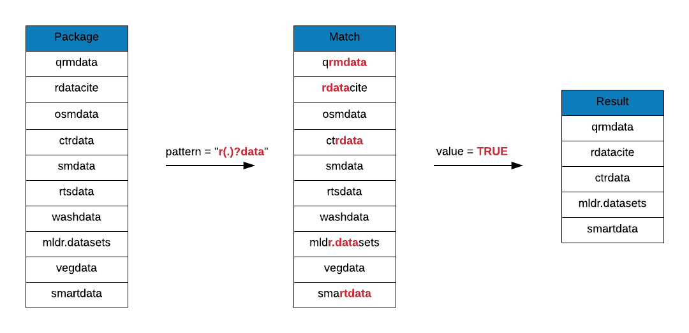
```

## Quantifiers- ?

<hr>

```{r quantifier_question_code_1}
grep(x = data_pkgs, pattern = "r(.)?data", value = TRUE)
```

## Quantifiers -?

<hr>

<br>

```{r quantifier_mark_2, echo=FALSE, fig.align="center", out.width="100%"}

```

## Quantifiers- ?

<hr>

```{r quantifier_question_code_2}
grep(x = data_pkgs, pattern = "r(\\.)?data", value = TRUE)
```


## Quantifiers - ?

<hr>

<br>

```{r quantifier_mark_3, echo=FALSE, fig.align="center", out.width="100%"}
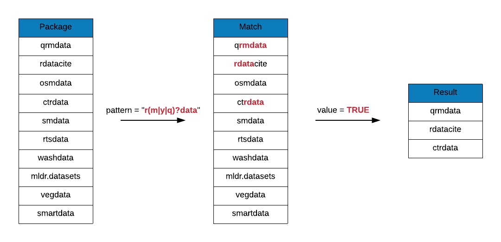
```

## Quantifiers- ?

<hr>

```{r quantifier_question_code_3}
grep(x = data_pkgs, pattern = "r(m|y|q)?data", value = TRUE)
```


## Quantifiers - ?

<hr>

<br>

```{r quantifier_mark_4, echo=FALSE, fig.align="center", out.width="100%"}
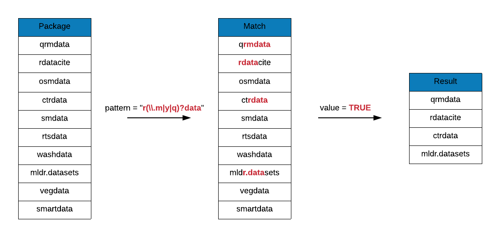
```

## Quantifiers- ?

<hr>

```{r quantifier_question_code_4}
grep(x = data_pkgs, pattern = "r(\\.|m|y|q)?data", value = TRUE)
```


## Quantifiers - *

<hr>

<br>

```{r quantifier_star, echo=FALSE, fig.align="center", out.width="100%"}
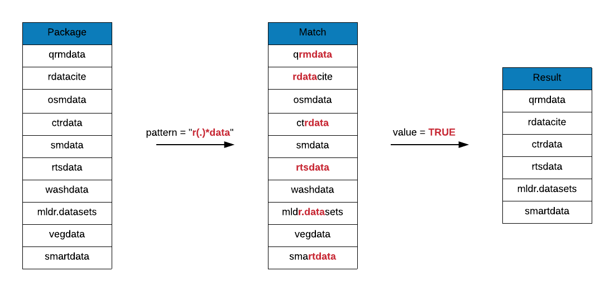
```

## Quantifiers - *

<hr>

```{r quantifier_star_code}
grep(x = data_pkgs, pattern = "r(.)*data", value = TRUE)
```

## Quantifiers - +

<hr>

<br>

```{r quantifier_plus, echo=FALSE, fig.align="center", out.width="100%"}
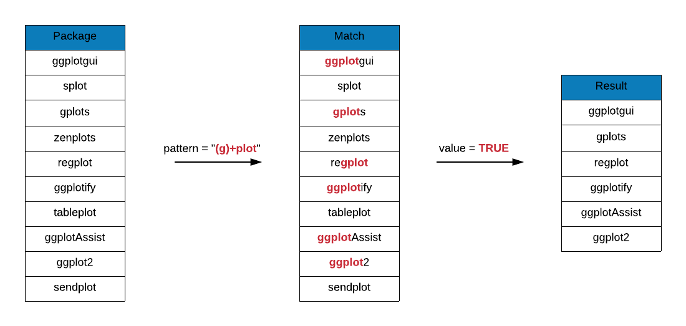
```

## Quantifiers - +

<hr>

```{r quantifier_plus_code}
plot_pkgs <- grep(x = r_packages, pattern = "plot", value = TRUE)
grep(x = plot_pkgs, pattern = "(g)+plot", value = TRUE, ignore.case = TRUE)
```

## Quantifiers - {n}

<hr>

<br>

```{r quantifier_exact_n_match, echo=FALSE, fig.align="center", out.width="100%"}
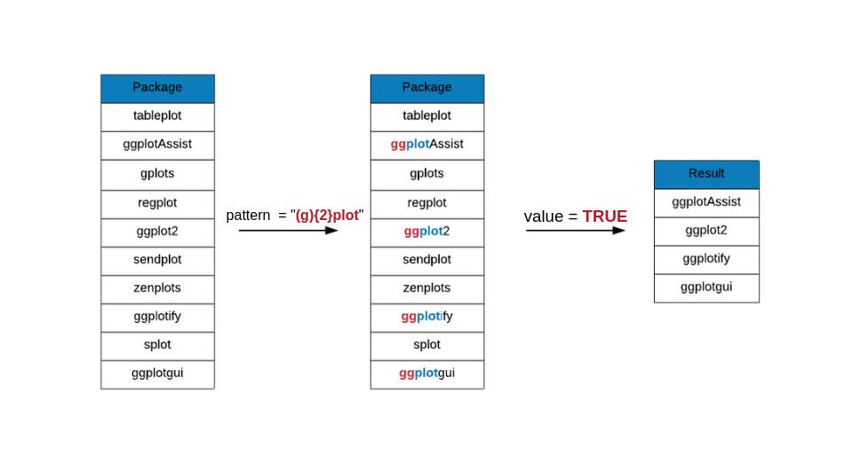
```

## Quantifiers - {n}

<hr>

```{r quantifier_n_code}
grep(x = plot_pkgs, pattern = "(g){2}plot", value = TRUE)
```

## Quantifiers - {n, }

<hr>

<br>

```{r quantifier_match_one_or_more, echo=FALSE, fig.align="center", out.width="100%"}

```

## Quantifiers - {n, }

<hr>

```{r quantifier_n_or_more_code}
grep(x = plot_pkgs, pattern = "(g){1, }plot", value = TRUE)
```

## Quantifiers - {n, m}

<hr>

<br>

```{r quantifier_match_between, echo=FALSE, fig.align="center", out.width="100%"}
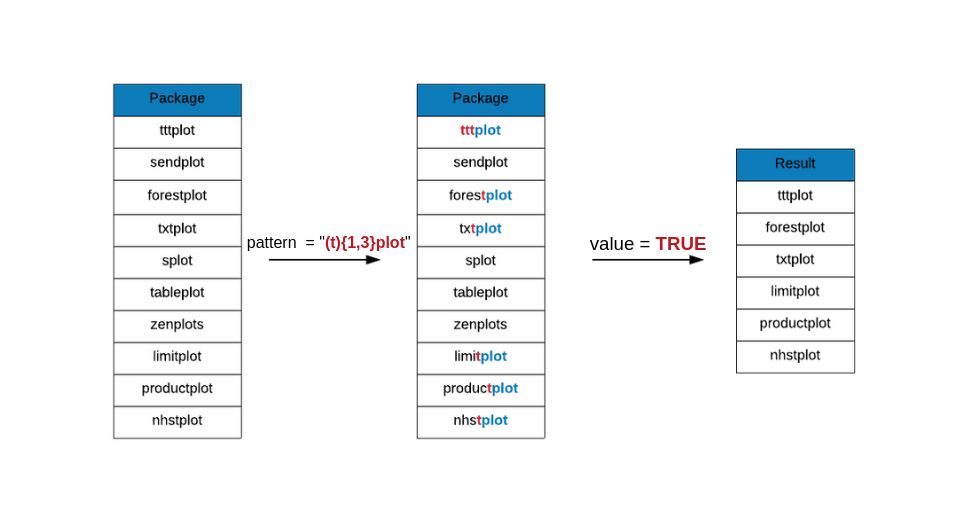
```

## Quantifiers - {n, m}

<hr>

```{r quantifier_between_code}
grep(x = plot_pkgs, pattern = "(t){1,3}plot", value = TRUE)
```

## OR

<hr>

<br>

```{r or_round, echo=FALSE, fig.align="center", out.width="100%"}
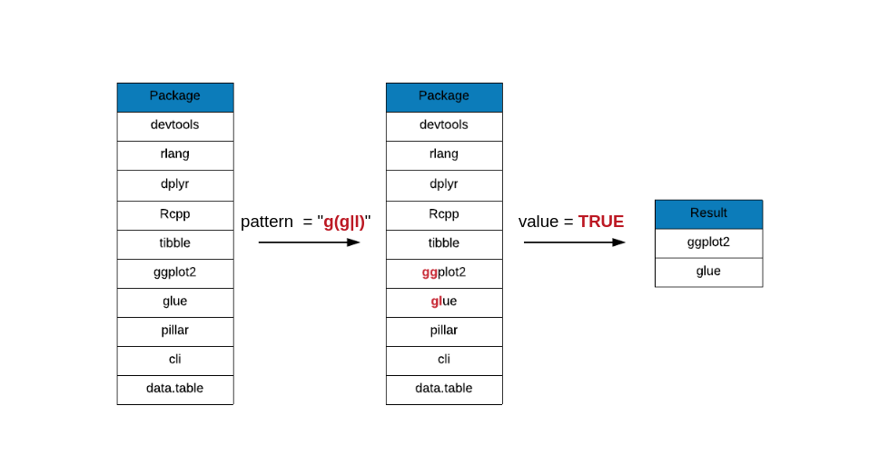
```

## OR

<hr>

```{r or_round_code}
grep(x = top_downloads, pattern = "g(g|l)", value = TRUE)
```

## OR

<hr>

<br>

```{r or_square, echo=FALSE, fig.align="center", out.width="100%"}
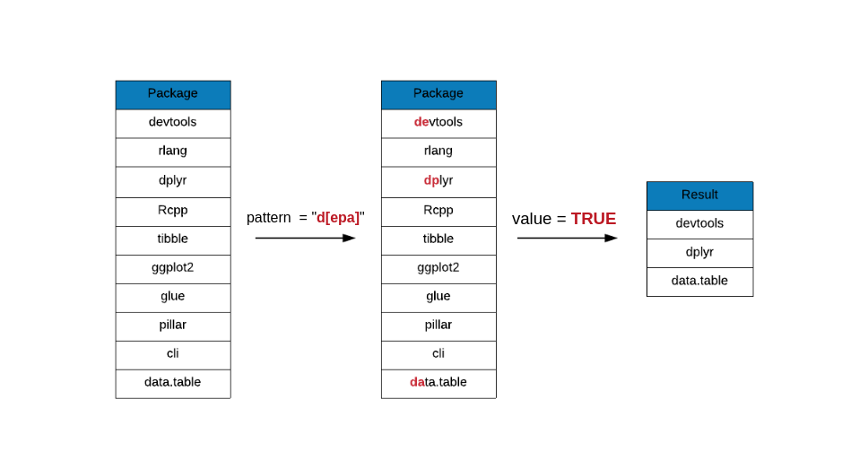
```

## OR

<hr>

```{r or_square_code}
grep(x = top_downloads, pattern = "d[epa]", value = TRUE)
```

## Digit

<hr>

<br>

```{r sequence_digit, echo=FALSE, fig.align="center", out.width="100%"}
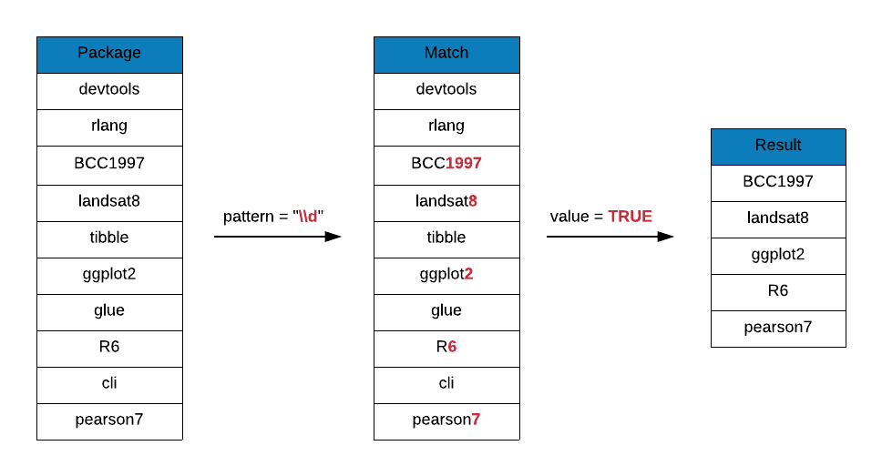
```

## Digit

<hr>

```{r digit_code}
grep(x = r_packages, pattern = "\\d", value = TRUE)
```

## Non Digit

<hr>

<br>

```{r sequence_non_digit, echo=FALSE, fig.align="center", out.width="100%"}
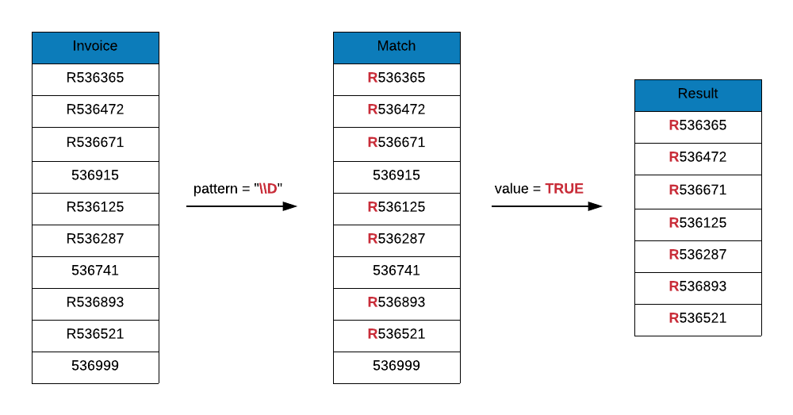
```

## Non Digit

<hr>

```{r non_digit_code}
invoice_id <- c("R536365", "R536472", "R536671", "536915", "R536125", "R536287",
                "536741", "R536893", "R536521", "536999")
grep(x = invoice_id, pattern = "\\D", value = TRUE)
```

## Space

<hr>

<br>

```{r sequence_space, echo=FALSE, fig.align="center", out.width="100%"}
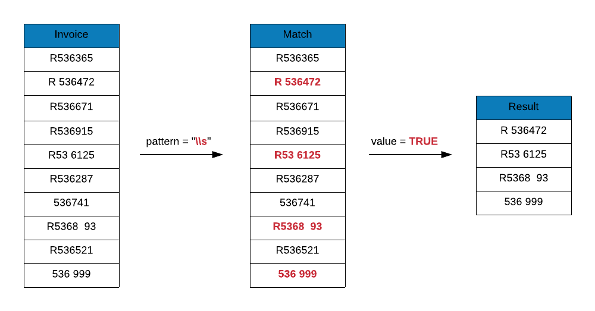
```

## Space

<hr>

```{r space_code}
grep(x = c("R536365", "R 536472", "R536671", "R536915", "R53 6125", "R536287",
           "536741", "R5368  93", "R536521", "536 999"), 
     pattern = "\\s", value = TRUE)
```

## Non Space

<hr>

<br>

```{r sequence_non_space, echo=FALSE, fig.align="center", out.width="100%"}
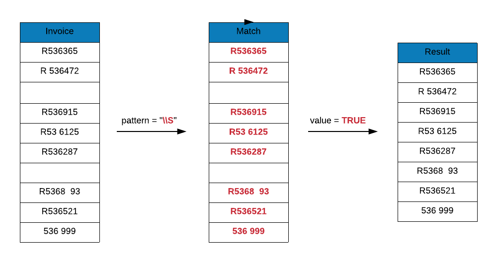
```

## Non Space

<hr>

```{r non_space_code}
grep(x = c("R536365", "R 536472", " ", "R536915", "R53 6125", "R536287",
           " ", "R5368  93", "R536521", "536 999"), 
     pattern = "\\S", value = TRUE)
```

## Word

<hr>

<br>

```{r sequence_word, echo=FALSE, fig.align="center", out.width="100%"}

```

## Word

<hr>

```{r word_code}
grep(x = c("R536365", "%+$!#@?", "R536671", "R536915", "$%+#!@?", "R5362@87",
           "53+67$41", "R536893", "@$+%#!", "536#999"), 
     pattern = "\\w", value = TRUE)
```

## Non Word

<hr>

<br>

```{r sequence_non_word, echo=FALSE, fig.align="center", out.width="100%"}
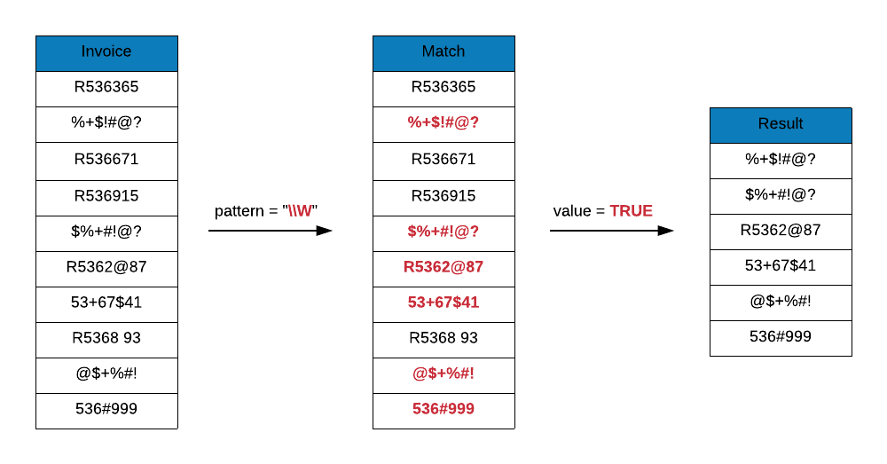
```

## Non Word

<hr>

```{r non_word_code}
grep(x = c("R536365", "%+$!#@?", "R536671", "R536915", "$%+#!@?", "R5362@87",
           "53+67$41", "R536893", "@$+%#!", "536#999"), 
     pattern = "\\W", value = TRUE)
```

## Word Boundary

<hr>

<br>

```{r word_boundary_1, echo=FALSE, fig.align="center", out.width="100%"}

```

## Word Boundary

<hr>

```{r boundary_code_2}
grep(x = r_packages, pattern = "\\bstat", value = TRUE) 
```

## Word Boundary

<hr>

<br>

```{r word_boundary_2, echo=FALSE, fig.align="center", out.width="100%"}
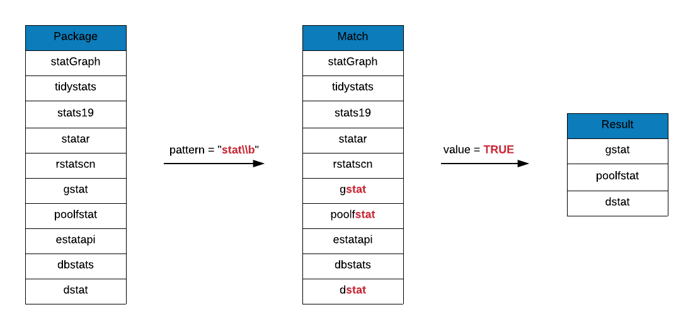
```

## Word Boundary

<hr>

```{r boundary_code_3}
grep(x = r_packages, pattern = "stat\\b", value = TRUE)
```

## Word Boundary

<hr>

<br>

```{r word_boundary_3, echo=FALSE, fig.align="center", out.width="100%"}
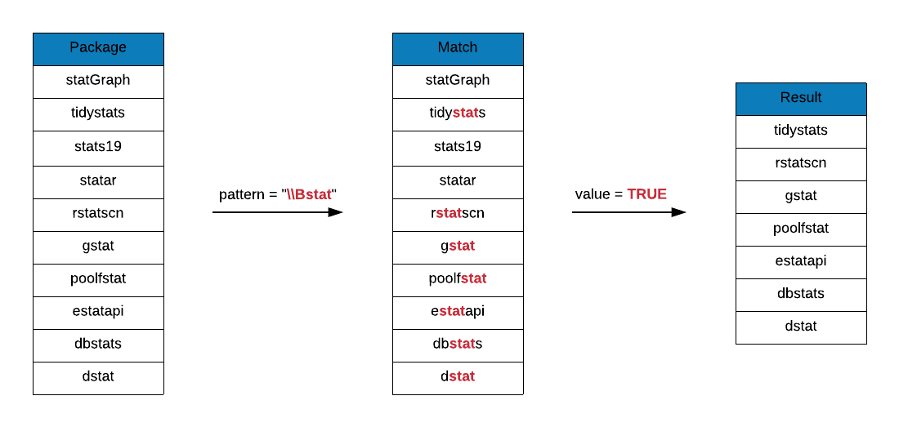
```

## Word Boundary

<hr>

```{r boundary_code_4}
grep(x = r_packages, pattern = "\\Bstat", value = TRUE)
```

## Word Boundary

<hr>

<br>

```{r word_boundary_4, echo=FALSE, fig.align="center", out.width="100%"}
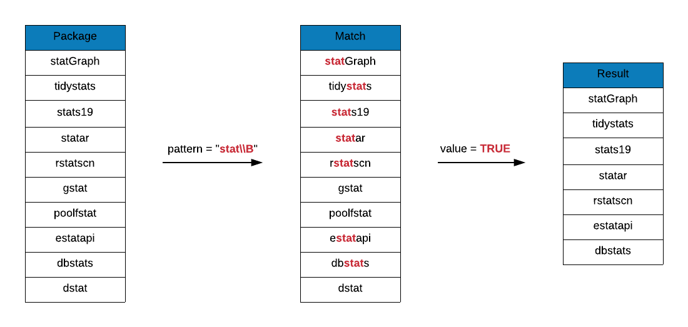
```

## Word Boundary

<hr>

```{r boundary_code_5}
grep(x = r_packages, pattern = "stat\\B", value = TRUE)
```

## Word Boundary

<hr>

<br>

```{r word_boundary_5, echo=FALSE, fig.align="center", out.width="100%"}
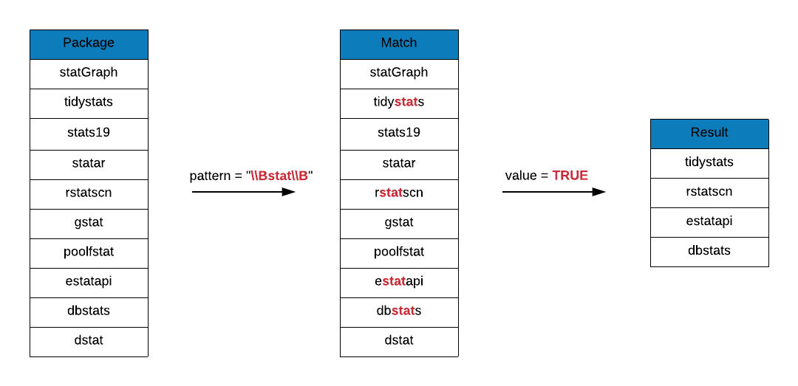
```

## Word Boundary

<hr>

```{r boundary_code_6}
grep(x = r_packages, pattern = "\\Bstat\\B", value = TRUE)
```


## Character Classes

<hr>

<br>

```{r character_class_numbers, echo=FALSE, fig.align="center", out.width="100%"}

```

## Character Classes

<hr>

```{r character_code_1}
grep(x = top_downloads, pattern = "[aeiou]", value = TRUE)
```

## Character Classes

<hr>

```{r character_code_2}
grep(x = r_packages, pattern = "[0-9]", value = TRUE)
```

## Character Classes

<hr>

```{r character_code_3}
grep(x = r_packages, pattern = "^[0-9]", value = TRUE)
```

## Character Classes

<hr>

```{r character_code_4}
grep(x = r_packages, pattern = "[0-9]$", value = TRUE)
```

## Character Classes

<hr>

```{r character_code_5}
grep(x = r_packages, pattern = "^[A-Z][A-Z]{1, }[A-Z]$", value = TRUE)
```

## {data-background="img/ws_section_case_studies.png"}

## Blood Group

<hr>

<br>

```{r cs_blood_group_pattern, echo=FALSE, fig.align="center", out.width="100%"}
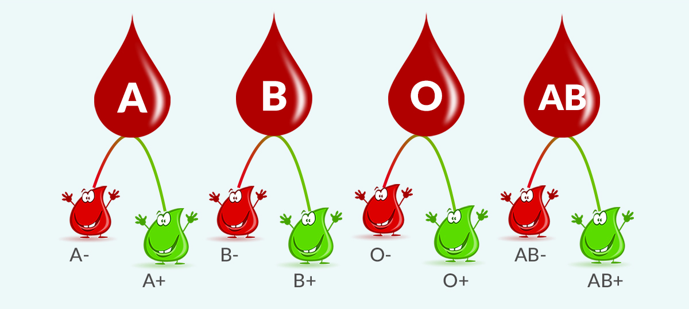
```

## Blood Group

<hr>

<br>

```{r cs_blood_group, echo=FALSE, fig.align="center", out.width="100%"}
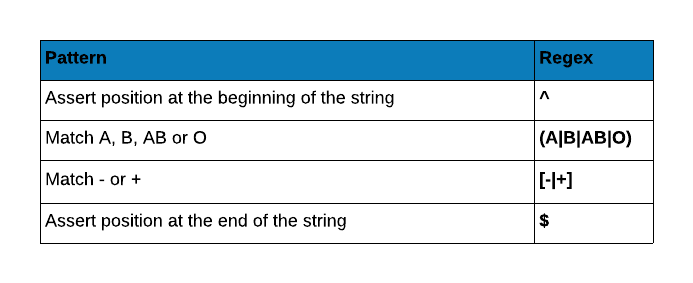
```

## Blood Group

<hr>

```{r blood_group}
blood_pattern <- "^(A|B|AB|O)[-|+]$"
blood_sample <- c("A+", "C-", "AB+")
grep(x = blood_sample, pattern = blood_pattern, value = TRUE)
```

## email id

<hr>

<br>

```{r cs_email_pattern, echo=FALSE, fig.align="center", out.width="100%"}

```

## email id

<hr>

<br>

```{r cs_email, echo=FALSE, fig.align="center", out.width="100%"}
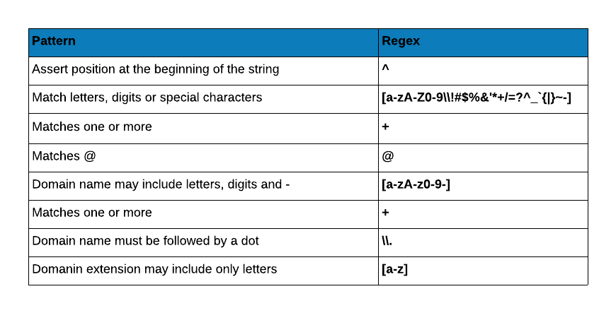
```

## email id

<hr>

```{r email_validation}
email_pattern <- "^[a-zA-Z0-9\\!#$%&'*+/=?^_`{|}~-]+@[a-zA-Z0-9-]+\\.[a-z]"
emails <- c("test9+_A@test.com", "test@test..com", "test-test.com")
grep(x = emails, pattern = email_pattern, value = TRUE)
```

##  PAN Number Validation

<hr>

<br>

```{r cs_pan_pattern_1, echo=FALSE, fig.align="center", out.width="100%"}

```

##  PAN Number Validation

<hr>

<br>

```{r cs_pan_pattern_2, echo=FALSE, fig.align="center", out.width="100%"}

```

##  PAN Number Validation

<hr>

<br>

```{r cs_pan, echo=FALSE, fig.align="center", out.width="100%"}
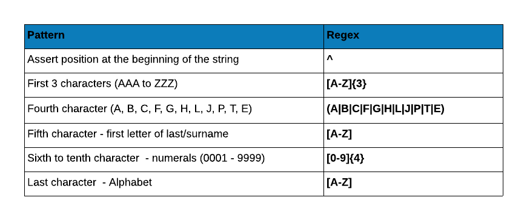
```

##  PAN Number Validation

<hr>

```{r pan_validation}
pan_pattern <- "^[A-Z]{3}(A|B|C|F|G|H|L|J|P|T|E)[A-Z][0-9]{4}[A-Z]"
my_pan <- c("AJKHT3865H", "AJKNT38655", "A2KNT3865H", "AJKDT3865H")
grep(x = my_pan, pattern = pan_pattern, value = TRUE)
```

##  GST Number Validation

<hr>

<br>

```{r cs_gst_pattern, echo=FALSE, fig.align="center", out.width="100%"}

```

##  GST Number Validation

<hr>

<br>

```{r cs_gst, echo=FALSE, fig.align="center", out.width="100%"}
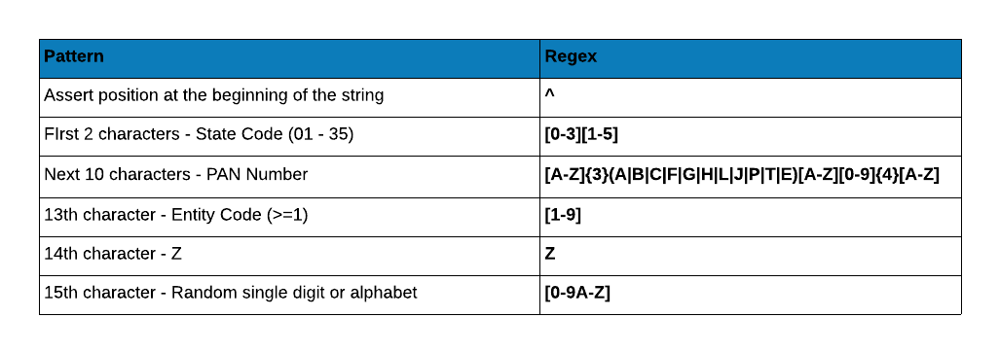
```

##  GST Number Validation

<hr>

```{r gst_validation}
gst_pattern <- "^[0-3][1-5][A-Z]{3}(A|B|C|F|G|H|L|J|P|T|E)[A-Z][0-9]{4}[A-Z][1-9]Z[0-9A-Z]"
sample_gst <- c("22AAAAA0000A1Z5", "22AAAAA0000A1Z", "42AAAAA0000A1Z5",
                "38AAAAA0000A1Z5", "22AAAAA0000A0Z5", "22AAAAA0000A1X5",
                "22AAAAA0000A1Z$")
grep(x = sample_gst, pattern = gst_pattern, value = TRUE)
```

## Other Applications

<hr>

- R variable names
- R file names and extensions
- password validation
- camelcase
- currency format
- date of birth
- date validation
- decimal number
- full name / first name
- html tags
- https url 
- phone number 
- ip address 
- month name

## References

<hr>

- https://www.rstudio.com/wp-content/uploads/2016/09/RegExCheatsheet.pdf
- https://stringr.tidyverse.org/articles/regular-expressions.html
- https://r4ds.had.co.nz/strings.html
- https://github.com/rstudio/cheatsheets/blob/master/strings.pdf
- https://www.garrickadenbuie.com/project/regexplain/

## {data-background="img/thankyou.png"}
