## {data-background="stringr.png"}

## Connect With Us

<hr>

- Website     (https://www.rsquaredacademy.com/)
- Free Online R Courses   (https://rsquared-academy.thinkific.com/)
- R Packages  (https://pkgs.rsquaredacademy.com)
- Shiny Apps  (https://apps.rsquaredacademy.com)
- Blog        (https://blog.rsquaredacademy.com)
- GitHub      (https://github.com/rsquaredacademy)
- YouTube     (https://www.youtube.com/user/rsquaredin/)
- Twitter     (https://twitter.com/rsquaredacademy)
- Facebook    (https://www.facebook.com/rsquaredacademy/)
- Linkedin    (https://in.linkedin.com/company/rsquared-academy)

## Resources

<hr>

- <a href="https://slides.rsquaredacademy.com/mba/mba.html" target="_blank">Slides</a>
- <a href="https://github.com/rsquaredacademy-education/online-courses/tree/master/association-rule-mining-in-r" target="_blank">Code & Data</a>
- <a href="https://rstudio.cloud/project/335377" target="_blank">RStudio Cloud</a>

## {data-background="img/ws_agenda.png"}

<br>
<br>
<br>
<br>
<br>

- what are regular expressions?
- why use regular expression?
- what can you do with regular expressions?
	- find a word in a string
	- replace string
	- match a single character
	- match one of any of several letters
	- match series of range of characters

## {data-background="img/ws_section_intro.png"}

## Introduction

<hr>
 
## Libraries

<hr>

```{r install, eval=FALSE}
library(cranlogs)
library(dplyr)
```

```{r str1, echo=FALSE, eval=TRUE, results='hide', message=FALSE}
library(cranlogs)
library(dplyr)
```

## Top R Packages

<hr>

```{r top_downloads}
top_downloads <- 
  cran_top_downloads(when = "last-week") %>%
  pull(package)

top_downloads
```

## grep

<hr>

<br>

```{r grep_index, echo=FALSE, fig.align="center", out.width="100%"}

```

## grep - Value

<hr>

<br>

```{r grep_value, echo=FALSE, fig.align="center", out.width="100%"}
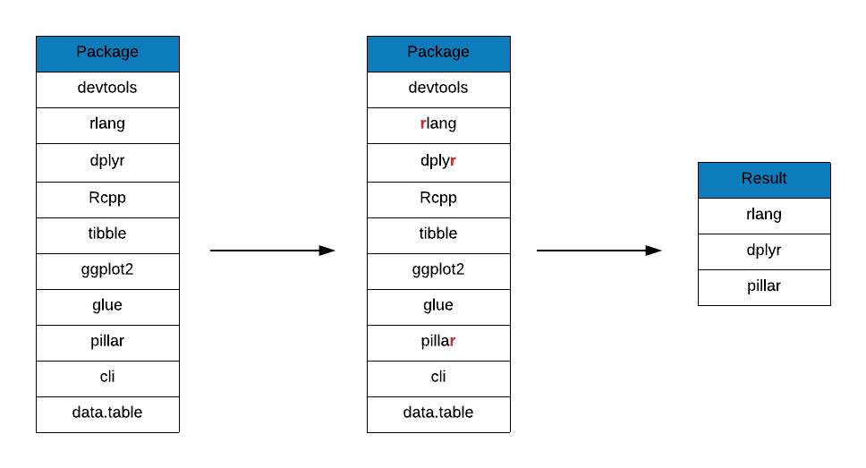
```

## grep - Ignore Case

<hr>

<br>

```{r grep_ignore_case, echo=FALSE, fig.align="center", out.width="100%"}
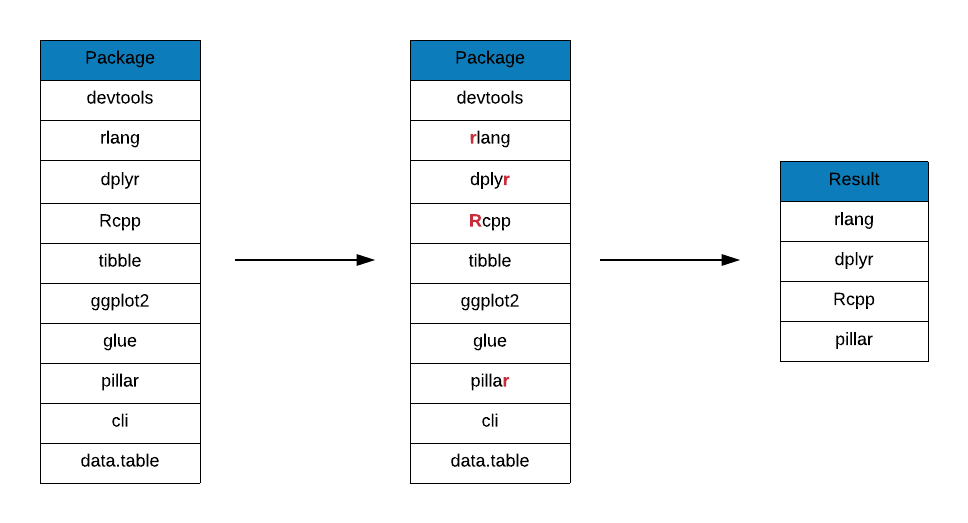
```

## grep - Invert

<hr>

<br>

```{r grep_invert, echo=FALSE, fig.align="center", out.width="100%"}
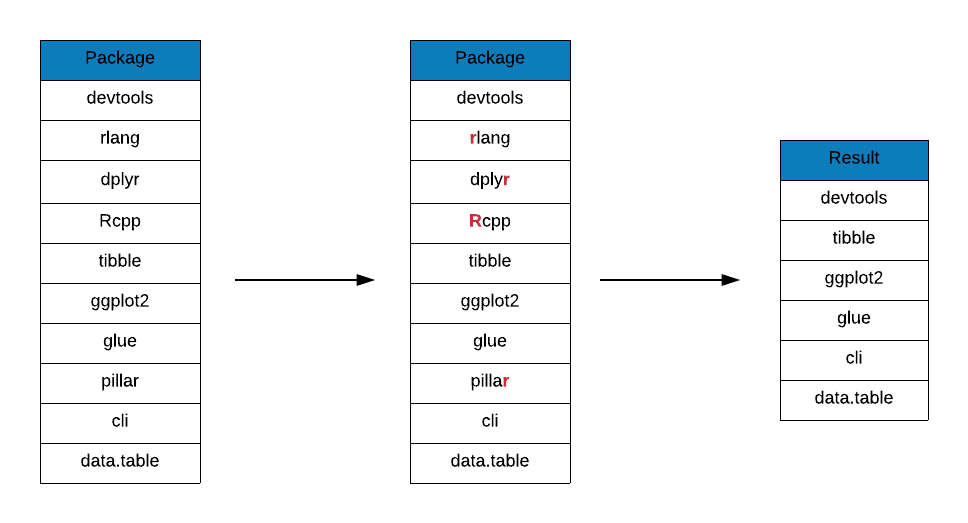
```

## grepl

<hr>

<br>

```{r grepl, echo=FALSE, fig.align="center", out.width="100%"}
knitr::include_graphics("img/regex_grepl.png")
```

## grepl - Ignore Case

<hr>

<br>

```{r grepl_ignore_case, echo=FALSE, fig.align="center", out.width="100%"}
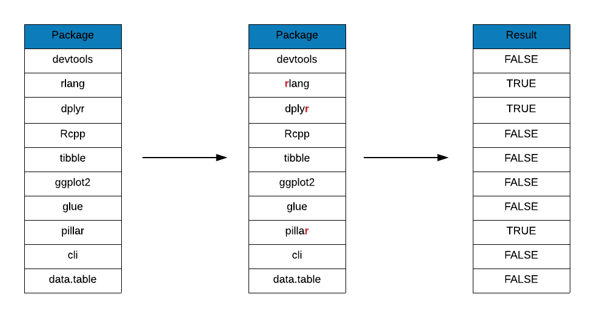
```

## regexpr

<hr>

```{r regexpr}
r_packages <- c("purrr", "olsrr", "blorr")
regexpr("r", r_packages)
```

## gregexpr

<hr>

```{r gregexpr}
gregexpr("r", r_packages)
```

## regexec

<hr>

```{r regexec}
regexec("r", r_packages)
```

## sub

<hr>

<br>

```{r sub, echo=FALSE, fig.align="center", out.width="100%"}
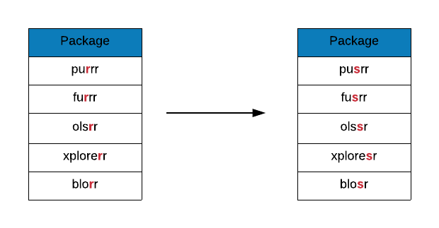
```

## gsub

<hr>

<br>

```{r gsub, echo=FALSE, fig.align="center", out.width="100%"}
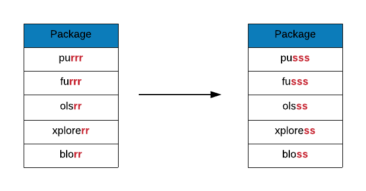
```

## Anchors - Start

<hr>

<br>

```{r anchor_start}, echo=FALSE, fig.align="center", out.width="100%"}
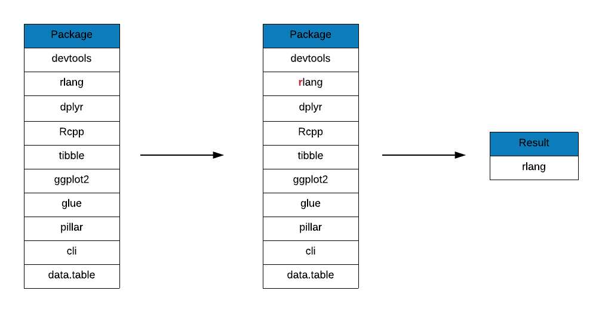
```

## Anchors - Start (Ignore Case)

<hr>

<br>

```{r anchor_start_ignore_case, echo=FALSE, fig.align="center", out.width="100%"}
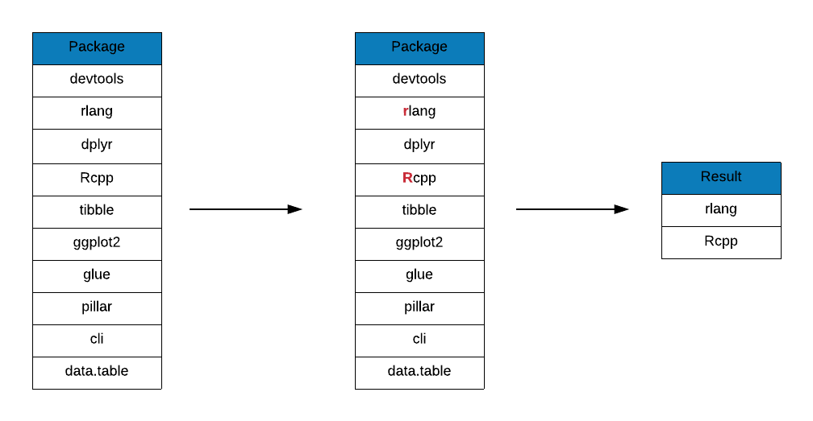
```

## Anchors - End

<hr>

<br>

```{r anchor_end, echo=FALSE, fig.align="center", out.width="100%"}
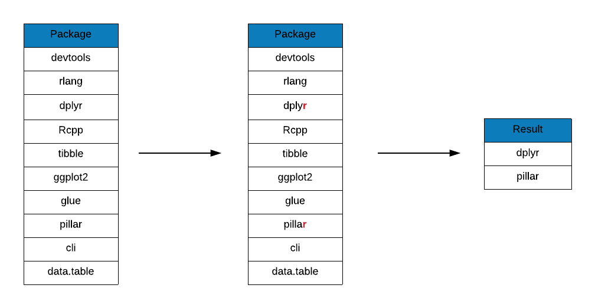
```

## Meta Characters

<hr>

<br>

```{r meta_characters, echo=FALSE, fig.align="center", out.width="100%"}
knitr::include_graphics("img/regex_meta_characters.png")
```

## Quantifiers

<hr>

<br>

```{r quantifier_dot, echo=FALSE, fig.align="center", out.width="100%"}
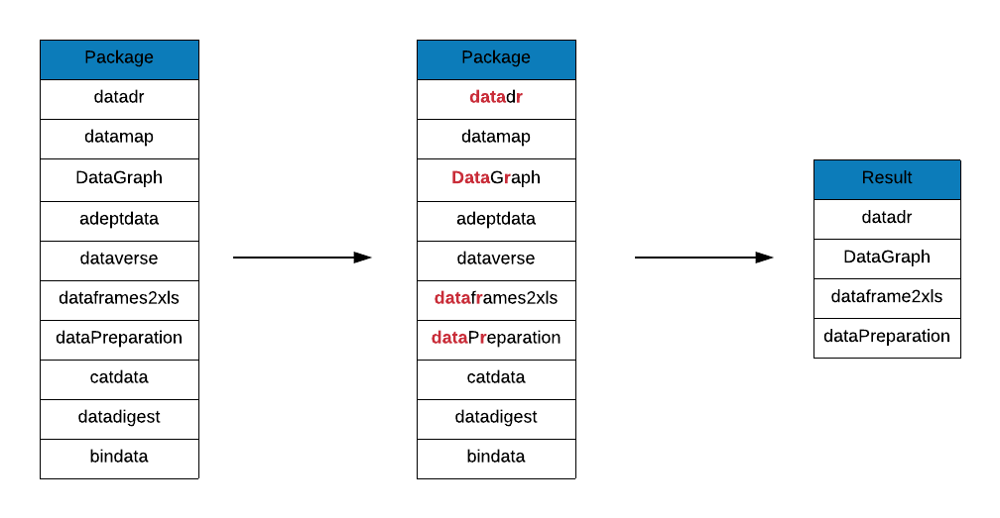
```

## Quantifiers

<hr>

```{r quantifiers_2}
grep(x = top_downloads, pattern = "dr?", value = TRUE)
```

## Quantifiers

<hr>

```{r quantifiers_3}
grep(x = top_downloads, pattern = "dr*", value = TRUE)
```

## Quantifiers

<hr>

```{r quantifiers_4}
grep(x = top_downloads, pattern = "dp+", value = TRUE)
```

## Quantifiers

<hr>

<br>

```{r quantifier_exact_n_match, echo=FALSE, fig.align="center", out.width="100%"}
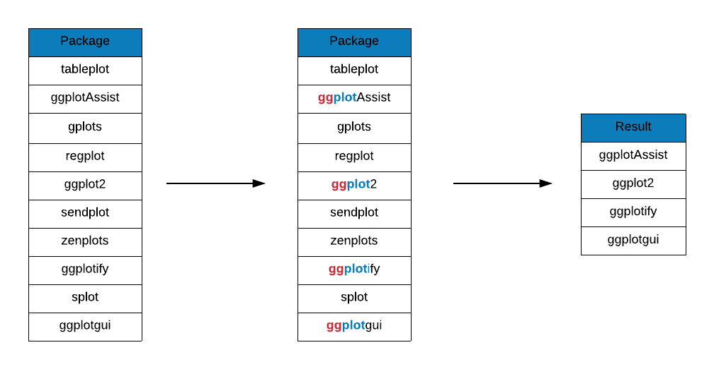
```

## Quantifiers

<hr>

<br>

```{r quantifier_match_one_or_more, echo=FALSE, fig.align="center", out.width="100%"}

```

## Quantifiers

<hr>

<br>

```{r quantifier_match_between, echo=FALSE, fig.align="center", out.width="100%"}
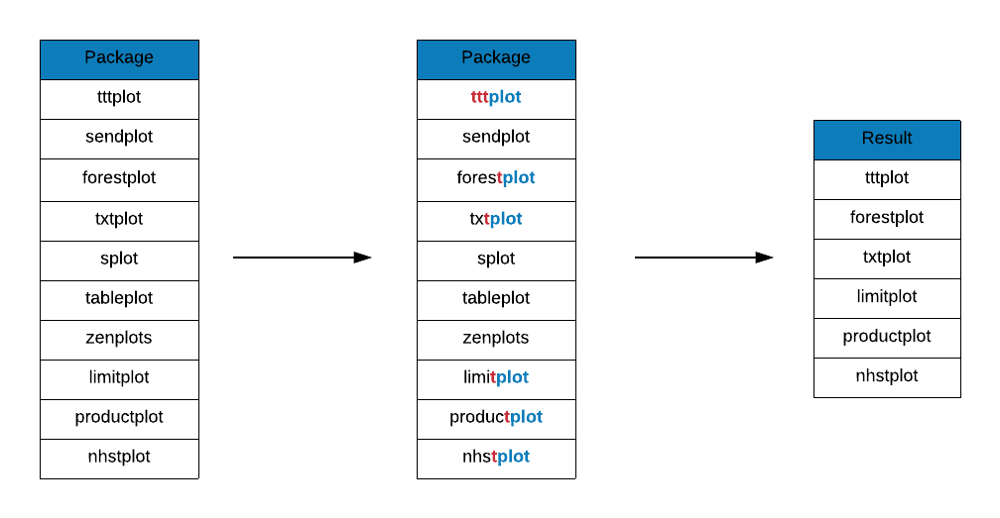
```

## OR

<hr>

<br>

```{r or_round, echo=FALSE, fig.align="center", out.width="100%"}
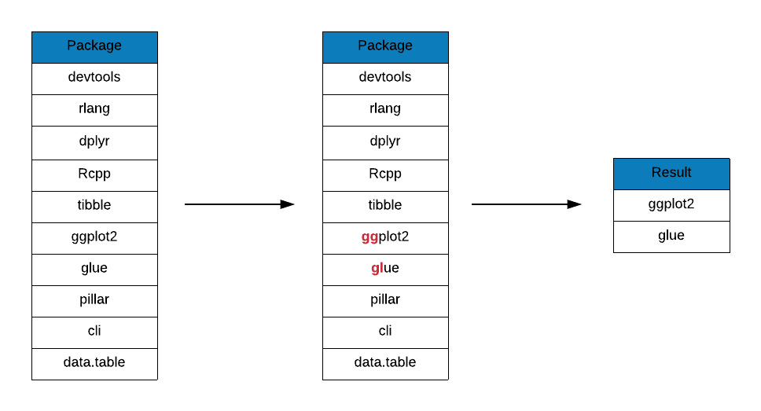
```

## OR

<hr>

<br>

```{r or_square, echo=FALSE, fig.align="center", out.width="100%"}
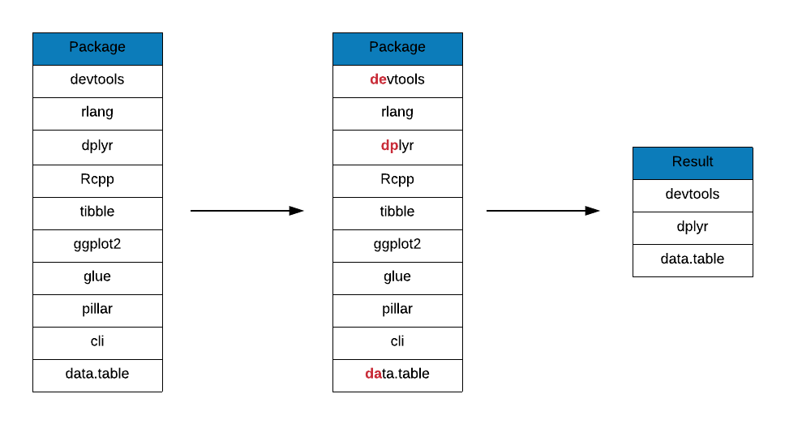
```

## Sequences

<hr>

```{r seq_1}
grep(x = top_downloads, pattern = "\\d", value = TRUE)
```

## Sequences

<hr>

```{r seq_2}
grep(x = "125", pattern = "\\D", value = TRUE)
```

## Sequences

<hr>

```{r seq_3}
grep(x = c("hell o", "hello"), pattern = "\\s", value = TRUE)
```

## Sequences

<hr>

```{r seq_4}
grep(x = c("hell o", "  ", "hello"), pattern = "\\S", value = TRUE)
```

## Sequences

<hr>

```{r seq_5}
grep(x = c("%", "hello"), pattern = "\\w", value = TRUE)
```

## Sequences

<hr>

```{r seq_6}
grep(x = c("%", "hello"), pattern = "\\W", value = TRUE)
```

## Sequences

<hr>

```{r seq_7}
grep(x = c("categorical", "hello"), pattern = "\\bcat", value = TRUE)
grep(x = c("hellocat", "hello"), pattern = "cat\\b", value = TRUE)
```

## Sequences

<hr>

```{r seq_8}
grep(x = c("polycater", "hello"), pattern = "\\Bcat", value = TRUE)
```
## Character Classes

<hr>

```{r char_1}
grep(x = top_downloads, pattern = "[aeiou]", value = TRUE)
grep(x = top_downloads, pattern = "[aiu]", value = TRUE)
```

## Character Classes

<hr>

```{r char_2}
grep(x = top_downloads, pattern = "[0-9]", value = TRUE)
```

## Character Classes

<hr>

```{r char_3}
# 4. [a-z] matches any lower case letter
```

## Character Classes

<hr>

```{r char_4}
# 4.1 [^a-z] matches no letter from a to z
```

## Character Classes

<hr>

```{r char_5}
# 5. [A-Z] matches any upper case letter
```

## Character Classes

<hr>

```{r char_6}
# 6. [a-zA-z0-9] matches any digit or lower/upper case letter
```

## References

<hr>

- https://www.rstudio.com/wp-content/uploads/2016/09/RegExCheatsheet.pdf
- https://stringr.tidyverse.org/articles/regular-expressions.html
- https://r4ds.had.co.nz/strings.html
- https://github.com/rstudio/cheatsheets/blob/master/strings.pdf
- https://www.garrickadenbuie.com/project/regexplain/

## {data-background="img/thankyou.png"}
