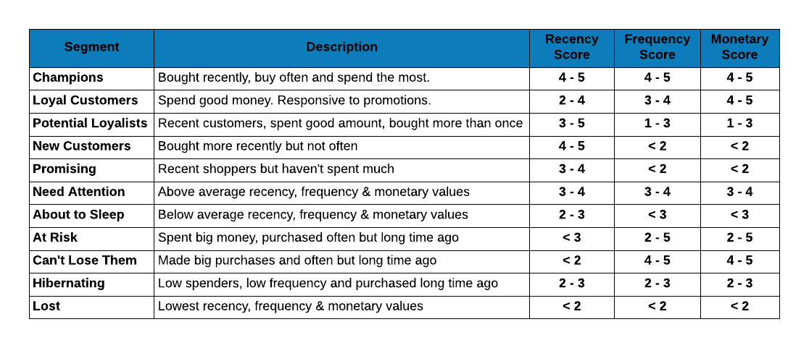

## {data-background="img/rfm_cover_image.png"}

## Connect With Us

<hr>

- Website     (https://www.rsquaredacademy.com/)
- Free Online R Courses   (https://rsquared-academy.thinkific.com/)
- R Packages  (https://pkgs.rsquaredacademy.com)
- Shiny Apps  (https://apps.rsquaredacademy.com)
- Blog        (https://blog.rsquaredacademy.com)
- GitHub      (https://github.com/rsquaredacademy)
- YouTube     (https://www.youtube.com/user/rsquaredin/)
- Twitter     (https://twitter.com/rsquaredacademy)
- Facebook    (https://www.facebook.com/rsquaredacademy/)
- Linkedin    (https://in.linkedin.com/company/rsquared-academy)

## Resources

<hr>

- <a href="https://slides.rsquaredacademy.com/rfm/rfm.html" target="_blank">Slides</a>
- <a href="https://blog.rsquaredacademy.com/customer-segmentation-using-rfm-analysis/" target="_blank">Blog Post</a>
- <a href="https://github.com/rsquaredacademy-education/online-courses/tree/master/customer-segmentation-using-rfm-analysis/script" target="_blank">Code & Data</a>
- <a href="https://rstudio.cloud/project/416146" target="_blank">RStudio Cloud</a>
- <a href="https://apps.rsquaredacademy.com/" target="_blank">Shiny App</a>
- <a href="https://rfm.rsquaredacademy.com/" target="_blank">R Package</a>

## {data-background="img/rfm_agenda.png"}

## {data-background="img/ws_section_case_study.png"}

## Transaction Data

<hr>

<br>
<br>

```{r rfm_raw_data, fig.align='center', echo=FALSE, out.width="200%"}

```

## RFM Table

<hr>

<br>
<br>
<br>
<br>
<br>

```{r rfm_table, fig.align='center', echo=FALSE}

```

## RFM Score

<hr>

<br>
<br>
<br>
<br>
<br>

```{r rfm_table_score, fig.align='center', echo=FALSE}

```

## Segments

<hr>

<br>
<br>
<br>
<br>
<br>

```{r rfm_segments, fig.align='center', echo=FALSE, out.width = "100%"}

```

## {data-background="img/ws_section_concepts.png"}

## Introduction

<hr>

**RFM** (recency, frequency, monetary) analysis is a behavior based technique 
used to segment customers by examining their transaction history  such as

- how recently a customer has purchased (recency)
- how often they purchase (frequency)
- how much the customer spends (monetary)

It is based on the marketing axiom that **80% of your business comes from 20% 
of your customers**. RFM helps to identify customers who are more likely to 
respond to promotions by segmenting them into various categories.

## Applications

<hr>

<br>

```{r rfm_applications, fig.align='center', echo=FALSE, out.width = "100%"}

```

## RFM Table

<hr>

<br>

```{r rfm_raw_sorted, fig.align='center', echo=FALSE, out.width = "100%"}

```

## RFM Table

<hr>

<br>

```{r rfm_raw_sorted_aggregate, fig.align='center', echo=FALSE, out.width = "100%"}

```

## Metrics

<hr>

<br>

```{r rfm_metrics, fig.align='center', echo=FALSE, out.width = "100%"}

```

## Recency 

<hr>

<br>

```{r rfm_recency_computation, fig.align='center', echo=FALSE, out.width = "100%"}

```

## Frequency 

<hr>

<br>
<br>

```{r rfm_frequency_computation, fig.align='center', echo=FALSE, out.width = "100%"}

```

## Monetary Value 

<hr>

<br>


```{r rfm_monetary_computation, fig.align='center', echo=FALSE, out.width = "100%"}

```

## Monetary Score 

<hr>

<br>

```{r rfm_monetary_score_interval, fig.align='center', echo=FALSE, out.width = "100%"}

```

## Frequency Score 

<hr>

<br>

```{r rfm_frequency_score_interval, fig.align='center', echo=FALSE, out.width = "100%"}

```

## Recency Score 

<hr>

<br>

```{r rfm_recency_score_interval, fig.align='center', echo=FALSE, out.width = "100%"}

```

## RFM Score

<hr>

<br>
<br>

<p style="text-align:center">RFM Score = Recency Score * 100 + Frequency Score * 10 + Monetary Score</p>

<br>
<br>

```{r rfm_table_score_calc, fig.align='center', echo=FALSE}

```

## Segments

<hr>

<br>
<br>

```{r rfm_segments_example, fig.align='center', echo=FALSE, out.width = "100%"}

```

## Segments

<hr>

<br>
<br>
<br>
<br>
<br>

```{r rfm_segments_2, fig.align='center', echo=FALSE, out.width = "100%"}

```


## {data-background="img/ws_section_demo.png"}

```{r libs2, echo=FALSE, message=FALSE, warning=FALSE}
library(rfm)
library(tibble)
library(knitr)
library(kableExtra)
library(magrittr)
library(dplyr)
library(ggplot2)
library(DT)
library(grDevices)
library(RColorBrewer)
```

## Segmented Customer Data

<hr>

```{r segment_data, echo=FALSE}
analysis_date <- lubridate::as_date("2006-12-31", tz = "UTC")
rfm_result <- rfm_table_order(rfm_data_orders, customer_id, order_date, revenue, analysis_date)

segment_names <- c("Champions", "Loyal Customers", "Potential Loyalist",
  "New Customers", "Promising", "Need Attention", "About To Sleep",
  "At Risk", "Can't Lose Them", "Hibernating", "Lost")

recency_lower   <- c(4, 2, 3, 4, 3, 3, 2, 1, 1, 2, 1)
recency_upper   <- c(5, 4, 5, 5, 4, 4, 3, 2, 1, 3, 1)
frequency_lower <- c(4, 3, 1, 1, 1, 3, 1, 2, 4, 2, 1)
frequency_upper <- c(5, 4, 3, 1, 1, 4, 2, 5, 5, 3, 1)
monetary_lower  <- c(4, 4, 1, 1, 1, 3, 1, 2, 4, 2, 1)
monetary_upper  <- c(5, 5, 3, 1, 1, 4, 2, 5, 5, 3, 1)

segments <- rfm_segment(rfm_result, segment_names, recency_lower, recency_upper,
frequency_lower, frequency_upper, monetary_lower, monetary_upper)
segments %>%
  select(-recency_score, -frequency_score, -monetary_score) %>%
  kable() %>%
  kable_styling(full_width = TRUE, font_size = 12) 
```

## Segments

<hr>

<br>
<br>

```{r segment_names, echo=FALSE, eval=TRUE}
segment <- c(
  "Champions", "Loyal Customers", "Potential Loyalist",
  "New Customers", "Promising", "Need Attention",
  "About To Sleep", "At Risk", "Can't Lose Them", "Hibernating",
  "Lost"
)
```

```{r segment_description, echo=FALSE, eval=TRUE}
description <- c(
  "Bought recently, buy often and spend the most",
  "Spend good money. Responsive to promotions",
  "Recent customers, spent good amount, bought more than once",
  "Bought more recently, but not often",
  "Recent shoppers, but haven't spent much",
  "Above average recency, frequency & monetary values",
  "Below average recency, frequency & monetary values",
  "Spent big money, purchased often but long time ago",
  "Made big purchases and often, but long time ago",
  "Low spenders, low frequency, purchased long time ago",
  "Lowest recency, frequency & monetary scores"
)
```

```{r segment_values, echo=FALSE, eval=TRUE}
recency   <- c("4 - 5", "2 - 4", "3 - 5", "4 - 5", "3 - 4", "3 - 4", "2 - 3", "< 3", "< 2", "2 - 3", "< 2")
frequency <- c("4 - 5", "3 - 4", "1 - 3", "< 2", "< 2", "3 - 4", "< 3", "2 - 5", "4 - 5", "2 - 3", "< 2")
monetary  <- c("4 - 5", "4 - 5", "1 - 3", "< 2", "< 2", "3 - 4", "< 3", "2 - 5", "4 - 5", "2 - 3", "< 2")

segments <- tibble(
  Segment = segment, Description = description,
  R = recency, `F` = frequency, M = monetary
)
```

```{r segments, echo=FALSE, eval=TRUE}
segments %>%
  kable() %>%
  kable_styling(full_width = TRUE, font_size = 18)
```


## Segment Size

<hr>

<br>
<br>

```{r rfm_customers, echo=FALSE}
segments <- rfm_segment(rfm_result, segment_names, recency_lower, recency_upper,
frequency_lower, frequency_upper, monetary_lower, monetary_upper)
segments %>%
  count(segment) %>%
  arrange(desc(n)) %>%
  rename(Segment = segment, Count = n)
```

## Median Recency

<hr>

<br>

```{r avg_recency, fig.align='center', fig.height=5, fig.width=6, echo=FALSE}
rfm_plot_median_recency(segments)
```

## Median Frequency

<hr>

<br>

```{r avg_frequency, fig.align='center', fig.height=5, fig.width=6, echo=FALSE}
rfm_plot_median_frequency(segments)
```

## Median Monetary Value

<hr>

<br>

```{r avg_monetary, fig.align='center', fig.height=5, fig.width=6, echo=FALSE}
rfm_plot_median_monetary(segments)
```

## Your Turn..

<hr>

If you look at the distribution of segments, around 13% of the customers are in the `Others` segment For segmentation to be effective and optimal, the `Others` segment should be eliminated or should have few customers only. Redefine the segments and try to reduce the number of customers in the `Others` segment.

We have defined 11 segments. Try to combine some of the exisiting segments and bring down the total segments to around 6 or 8.
 
The RFM score we generated uses score between 1 and 5. Try to create segments by using a score between 1 and 3 i.e. the lowest RFM should be 111 and the highest should be 333 instead of 555.

Reverse the scores i.e. so far we have assigned a score of 5 to customers who visited recently, frequently and had higher transaction amount and 1 to customers who visited way back, rarely and have low transaction amount. Reverse this score pattern and create the segments.

## {data-background="img/thankyou.png"}

