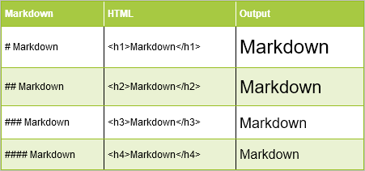

## {data-background="rmarkdown_banner.png"}

## Agenda

<hr>

- what is Markdown?
- what is RMarkdown?
- how is RMarkdown different from Markdown
- install TinyTex
- explore RMarkdown syntax
- explore and learn to create
    - documents
	- presentations
	- websites
	- books
	- blogs

## Markdown

<hr>

- [Markdown](https://daringfireball.net/projects/markdown/) is a text
  to HTML conversion tool
- created by [John Gruber](https://daringfireball.net/)
- is written in Perl
- is free software
- and you can try it online using [Dingus](https://daringfireball.net/projects/markdown/dingus) 
  

## RMarkdown

<hr>

RMarkdown combines the core syntax of Markdown with embedded R code chunks to
create dynamic documents. It enables easy creation of dynamic documents, reports
and presentations which are fully reproducible.

With RMarkdown, we can combine R codes, plots and text to create beautiful
reports and presentations. The reports can be generated in different formats
such as:

- PDF
- HTML
- MS Word

The best part about RMarkdown is when you have to make some changes to your code
or the underlying data and recreate the entire document. You can make the
necessary changes and RMarkdown will recreate the document with just a single
click of a button.

## Libraries

<hr>

Install and load the [rmarkdown](https://cran.r-project.org/web/packages/rmarkdown/)
package.

```{r install, eval=FALSE}
# install
library(rmarkdown)
```

## Tinytex

<hr>

In order to generate PDF documents/presentations, you will need
LaTex. If you have not heard of or installed LaTex, you can instead 
use [TinyTex](https://yihui.name/tinytex/). 

```{r tinytex, eval=FALSE}
install.packages("tinytex")
tinytex::install_tinytex()
```

## RMarkdown Syntax

<hr>

> - headers
> - emphasis
> - lists
> - links
> - images
> - code chunks

## Headers

<hr>

<br>

```{r headers, echo=FALSE, fig.align="center", out.width="90%"}

```

## Emphasis

<hr>

<br>

```{r emphasis, echo=FALSE, fig.align="center", out.width="90%"}

```

## Unordered Lists

<hr>

<br>

```{r unordered, echo=FALSE, fig.align="center", out.width="90%"}

```

## Ordered Lists

<hr>

<br>

```{r ordered, echo=FALSE, fig.align="center", out.width="90%"}

```

## Links

<hr>

<br>

```{r links, echo=FALSE, fig.align="center", out.width="90%"}

```

## Images

<hr>

<br>

```{r images, echo=FALSE, fig.align="center", out.width="90%"}

```

## Code Chunks

<hr>

It is when creating reports that contain R code, plots and other outputs that
we will appreciate RMarkdown the most. It saves us from the cut/copy/paste
ritual while saving time and minimising errors.

Whenever the code or data changes, RMarkdown will automatically regenerate the
whole document with the updated results and therein lies its magic.

<br>

```{r code, echo=FALSE, fig.align="center", out.width="90%"}

```

## Options

<hr>

<br>

```{r chunks, echo=FALSE, fig.align="center", out.width="90%"}

```

## Languages

<hr>

- R
- Python
- SQL
- Bash
- Rcpp
- C & Fortran
- Javascript & CSS
- Julia

## Documents

<hr>

- [HTML](https://bookdown.org/yihui/rmarkdown/html-document.html)
- [Notebooks](https://bookdown.org/yihui/rmarkdown/notebook.html)
- [PDF](https://bookdown.org/yihui/rmarkdown/pdf-document.html)
- [Word](https://bookdown.org/yihui/rmarkdown/word-document.html)
- [Markdown](https://bookdown.org/yihui/rmarkdown/markdown-document.html)

## Presentations

<hr>

- [ioslides](https://bookdown.org/yihui/rmarkdown/ioslides-presentation.html)
- [Beamer](https://bookdown.org/yihui/rmarkdown/beamer-presentation.html)
- [Slidify](http://slidify.org/)
- [xaringan](https://slides.yihui.name/xaringan/)
- [reveal.js](https://github.com/rstudio/revealjs)

## Websites

<hr>

- [RMarkdown Websites](https://rmarkdown.rstudio.com/)
- [Blogs](https://bookdown.org/)
- [Books](https://bookdown.org/yihui/blogdown/)
- [Interactive Tutorials](https://rstudio.github.io/learnr/index.html)

## References

<hr>

- [Markdown](https://daringfireball.net/projects/markdown/)
- [RMarkdown Website](https://rmarkdown.rstudio.com/)
- [RMarkdown Book](https://bookdown.org/yihui/rmarkdown/)
- [Cheat Sheet](http://www.rstudio.com/wp-content/uploads/2015/02/rmarkdown-cheatsheet.pdf)
- [Reference Guide](http://www.rstudio.com/wp-content/uploads/2015/03/rmarkdown-reference.pdf)

## {data-background="thankyou.png"}
