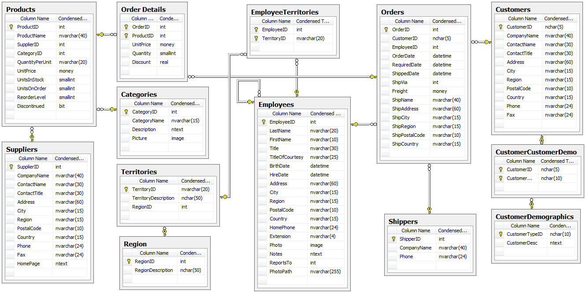

## {data-background="dbi_cover_image.png"}

## {data-background="dbi_agenda.png"}

<br>
<br>
<br>
<br>

- introduction to SQL
- review  of database basics
- how to retrieve data
- using comments
- summary
- resources

## SQL

<hr>

- **S**tructured **Q**uery **L**anguage
- used for communicating with databases
- used to query, update, manipulate data
- access and control databases
- most widely used database language

## Databases

<hr>

- database system
- DBMS 
- tables
- schema 
- columns
- rows
- primary keys

## Top Relational Database

<hr>

<br>

```{r sql_database_vendors, echo=FALSE, fig.align="center", out.width="50%"}
knitr::include_graphics("relational_databases.jpg")
```

## Northwind Database

<hr>

- originally created by Microsoft
- sales data for a fictitious company **Northwind Traders**
- includes the following tables
    - Product
    - Order
    - OrderDetail
    - Supplier
    - Shipper
    - Category
    - Customer
    - Employee
    - EmployeeTerritory
    - Region
    - Territory

## Northwind Database

<hr>

<br>

```{r sql_nwind, echo=FALSE, fig.align="center", out.width="100%"}

```

## SELECT - Retrieve Data

<hr>

- individual columns
- multiple columns
- all columns
- distinct rows
- limiting results

## Using Comments

<hr>

- `-- this is a comment`
- `# this is also a comment`
- `/* this is a` <br> `multi line comment */`

## Summary

<hr>

In this tutorial, you

- learnt what sql is and why it is useful?
- reviewed database basics
- learnt how to 
    - retrieve single/multiple/all columns
    - return distinct rows
    - limit results
    - comment SQL code

## Resources

<hr>

- <a href="https://slides.rsquaredacademy.com/sql/sqlite.html#/section" target="_blank">Slides</a>
- <a href="https://blog.rsquaredacademy.com/working-with-databases-using-r/" target="_blank">Blog Post</a>
- <a href="https://github.com/rsquaredacademy-education/online-courses/" target="_blank">Code & Data</a>
- <a href="https://rstudio.cloud/project/430439" target="_blank">RStudio Cloud</a>
- <a href="https://rsquared-academy.thinkific.com/courses/working-with-databases-using-r" target="_blank">Online Course</a>

## Connect With Us

<hr>

- Website     (https://www.rsquaredacademy.com/)
- Free Online R Courses   (https://rsquared-academy.thinkific.com/)
- R Packages  (https://pkgs.rsquaredacademy.com)
- Shiny Apps  (https://apps.rsquaredacademy.com)
- Blog        (https://blog.rsquaredacademy.com)
- GitHub      (https://github.com/rsquaredacademy)
- YouTube     (https://www.youtube.com/user/rsquaredin/)
- Twitter     (https://twitter.com/rsquaredacademy)
- Facebook    (https://www.facebook.com/rsquaredacademy/)
- Linkedin    (https://in.linkedin.com/company/rsquared-academy)

## {data-background="thankyou.png"}

