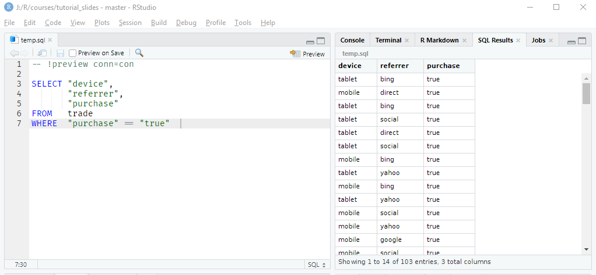
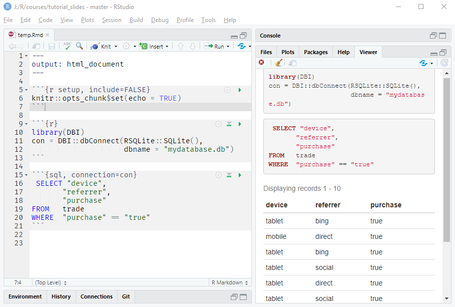

## {data-background="dbi_cover_image.png"}

## Connect With Us

<hr>

- Website     (https://www.rsquaredacademy.com/)
- Free Online R Courses   (https://rsquared-academy.thinkific.com/)
- R Packages  (https://pkgs.rsquaredacademy.com)
- Shiny Apps  (https://apps.rsquaredacademy.com)
- Blog        (https://blog.rsquaredacademy.com)
- GitHub      (https://github.com/rsquaredacademy)
- YouTube     (https://www.youtube.com/user/rsquaredin/)
- Twitter     (https://twitter.com/rsquaredacademy)
- Facebook    (https://www.facebook.com/rsquaredacademy/)
- Linkedin    (https://in.linkedin.com/company/rsquared-academy)

## Resources

<hr>

- <a href="https://slides.rsquaredacademy.com/rfm/rfm.html" target="_blank">Slides</a>
- <a href="https://blog.rsquaredacademy.com/customer-segmentation-using-rfm-analysis/" target="_blank">Blog Post</a>
- <a href="https://github.com/rsquaredacademy-education/online-courses/tree/master/customer-segmentation-using-rfm-analysis/script" target="_blank">Code & Data</a>
- <a href="https://rstudio.cloud/project/416146" target="_blank">RStudio Cloud</a>
- <a href="https://rsquared-academy.thinkific.com/" target="_blank">Online Course</a>


## {data-background="dbi_agenda.png"}

<br>
<br>
<br>
<br>

- connect to database
- explore database
- read & write data
- run SQL script 
- knitr SQL engine
- query data using dplyr
- visualize data with dbplot
- modeling data with tidypredict
- handling credentials

## Libraries

<hr>

```{r lite1, eval=FALSE}
library(DBI)
library(dbplyr)
library(dplyr)
library(dbplot)
library(ggplot2)
library(modeldb)
library(tidypredict)
library(config)
```

```{r liteload, echo=FALSE, eval=TRUE, results='hide', warning=FALSE, message=FALSE}
library(DBI)
library(dbplyr)
library(dplyr)
library(dbplot)
library(ggplot2)
library(modeldb)
library(tidypredict)
library(config)
```

## {data-background="dbi_section_connect.png"}

## Connect

<hr>

```{r lite2}
con <- DBI::dbConnect(RSQLite::SQLite(), dbname = "mydatabase.db")
```

## Connection Summary

<hr>

```{r lite3}
summary(con)
```

## List Tables

<hr>

```{r lite6}
dbListTables(con)
```

## List Fields

<hr>

```{r lite7}
DBI::dbListFields(con, "ecom")
```

## Data Dictionary

<hr>

- id: row id
- referrer: referrer website/search engine
- os: operating system
- browser: browser
- device: device used to visit the website
- n_pages: number of pages visited
- duration: time spent on the website (in seconds)
- repeat: frequency of visits
- country: country of origin
- purchase: whether visitor purchased
- order_value: order value of visitor (in dollars)

## {data-background="dbi_section_query_data.png"}

## Querying Data

<hr>

- read entire table
- read few rows
- read data in batches

## Entire Table

<hr>

```{r lite8}
DBI::dbReadTable(con, 'ecom')
```

## Few Rows

<hr>

```{r lite9}
DBI::dbGetQuery(con, "select * from ecom limit 10")
```

## Read Data in Batches

<hr>

```{r lite10}
query  <- DBI::dbSendQuery(con, 'select * from ecom')
result <- DBI::dbFetch(query, n = 30)
result
```

## Your Turn

<hr>

- list fields in the `trade` table
- read all rows & columns from the `trade` table
- read first 30 rows from the `trade` table

## {data-background="dbi_section_query_details.png"}

## Query Status

<hr>

```{r lite11}
DBI::dbHasCompleted(query)
```

## Query Info

<hr>

```{r lite12}
DBI::dbGetInfo(query)
```

## Latest Query

<hr>

```{r lite13}
DBI::dbGetStatement(query)
```

## Rows Fetched

<hr>

```{r lite14}
DBI::dbGetRowCount(query)
```

## Rows Affected

<hr>

```{r lite15}
DBI::dbGetRowsAffected(query)
```

## Column Info

<hr>

```{r lite16}
DBI::dbColumnInfo(query)
```

## Clear Results

<hr>

```{r lite17}
DBI::dbClearResult(query)
```

## {data-background="dbi_section_tables.png"}

## Check Table Name

<hr>

```{r dblisttable}
DBI::dbExistsTable(con, "trial")
```

## Create Table

<hr>

```{r lite18} 
# sample data
x     <- 1:10
y     <- letters[1:10]
trial <- tibble::tibble(x, y)

# write table to database
DBI::dbWriteTable(con, "trial", trial)
```

## List Tables

<hr>

```{r lite19}
DBI::dbListTables(con)
```

## Query Data

<hr>

```{r lite20}
DBI::dbGetQuery(con, "select * from trial limit 5")
```

## Overwrite Table

<hr>

```{r lite21}
# sample data
x      <- sample(100, 10)
y      <- letters[11:20]
trial2 <- tibble::tibble(x, y)

# overwrite table trial
DBI::dbWriteTable(con, "trial", trial2, overwrite = TRUE)
```

## View Data

<hr>

```{r lite21a}
DBI::dbGetQuery(con, "select * from trial")
```

## Append Data

<hr>

```{r lite23}
# sample data
x      <- sample(100, 10)
y      <- letters[5:14]
trial3 <- tibble::tibble(x, y)

# append data
DBI::dbWriteTable(con, "trial", trial3, append = TRUE)
```

## View Data

<hr>

```{r lite23a}
DBI::dbGetQuery(con, "select * from trial")
```

## Insert Rows

<hr>

```{r lite25}
DBI::dbExecute(con,
  "INSERT into trial (x, y) VALUES (32, 'c'), (45, 'k'), (61, 'h')"
)
```

## View Data

<hr>

```{r lite25a}
DBI::dbGetQuery(con, "select * from trial")
```

## Insert Rows

<hr>

```{r lite26}
DBI::dbSendStatement(con,
  "INSERT into trial (x, y) VALUES (25, 'm'), (54, 'l'), (16, 'y')"
)
```

## View Data

<hr>

```{r lite26a}
DBI::dbGetQuery(con, "select * from trial")
```

## Append Table

<hr>

```{r lite32}
trial_new <- data.frame(x = 30, y = 'k')
DBI::sqlAppendTable(con, "trial", trial_new)
```

## View Data

<hr>

```{r lite32a}
DBI::dbGetQuery(con, "select * from trial")
```

## Remove Table

<hr>

```{r lite28}
DBI::dbRemoveTable(con, "trial")
```

## Generate SQL Query

<hr>

```{r lite31}
DBI::sqlCreateTable(con, "new", c(x = "integer", y = "text"))
```

## Your Turn

<hr>

- check if `mytable` exists in the database
- create new table `mytable` using the first 3 rows of `mtcars` data set
- list all tables to check if the new table has been created
- overwrite `mytable` with the first 10 rows of `mtcars` data set
- append the 20th row of `mtcars` data set to `mytable`
- create a new table using the last 5 rows of `mtcars` and append it to `mytable`
- remove `mytable`

## {data-background="dbi_section_data_types.png"}

## Data Type

<hr>

```{r lite27}
DBI::dbDataType(RSQLite::SQLite(), "a")
DBI::dbDataType(RSQLite::SQLite(), 1:5)
DBI::dbDataType(RSQLite::SQLite(), 1.5)
```

## {data-background="dbi_section_sql_scripts.png"}

## Running SQL Scripts

<hr>

<br>
<br>
<br>

```{r sql_scripts, echo=FALSE, fig.align="center", out.width="100%"}

```

## {data-background="dbi_section_knitr_sql_engine.png"}

## knitr SQL Engine

<hr>

```{r knitr_sql_engine, echo=FALSE, fig.align="center", out.width="100%"}

```

## Your Turn

<hr>

- check the data type of `"NULL"`
- use SQL script to select `duration`, `n_visit` from `trade` table
where `device` has the value `tablet`
- create a html report for the above sql query using the knitr SQL engine

## {data-background="dbi_section_data_transformation.png"}

## Reference Data

<hr>

```{r dbply3}
ecom2 <- tbl(con, "ecom")
ecom2
```

## Query Data

<hr>

```{r dbply4}
tos_query <- 
  ecom2 %>% 
  select(referrer, device, duration) %>% 
  filter(device == "laptop") %>% 
  group_by(referrer) %>% 
  summarise(avg_tos = mean(duration)) %>% 
  arrange(avg_tos)

tos_query
```

## Collect Data

<hr>

```{r dbply9}
collect(tos_query)
```

## Display Query

<hr>

```{r dbply7}
show_query(tos_query)
```


## Explain 

<hr>

```{r dbply_explain}
explain(tos_query)
```

## Simulate

<hr>

```{r dbply_simulate}
ecom2 %>% 
  group_by(referrer) %>% 
  summarise(avg_tos = mean(duration))  %>% 
  sql_render(simulate_mysql())
```

## Your Turn

<hr>

- use `tbl()` to reference `trade` table as `trade2`
- use dplyr verbs to compute average duration for `device` from the `trade` table
- store the above query in a variable `tos_device` 
- use `show_query()` to display the underlying SQL query of `tos_device`
- use `collect()` to retrieve data from `tos_device`
- use `explain()` to display the underlying computation logic of `tos_device`

## {data-background="dbi_section_data_visualization.png"}

## dbplot

<hr>

- box plot
- bar plot
- histogram
- line chart
- raster plot

## Bar Plot

<hr>

```{r dbplot1, fig.align='center', fig.height=5}
ecom2 %>% 
  dbplot_bar(device) + xlab("Device") + ylab("Count") + ggtitle("Device Distribution")
```

## Line Chart

<hr>

```{r dbplot2, fig.align='center', fig.height=5}
ecom2 %>% 
  dbplot_line(n_visit) + xlab("Visits") + ylab("Count") 
```

## Your Turn

<hr>

- create bar plot of `referrer` column from the `trade` table
- create line chart of `n_visit` column from the `trade` table

## {data-background="dbi_section_data_modeling.png"}

## Modeling

<hr>

- [modeldb](https://tidymodels.github.io/modeldb/index.html)
- [tidypredict](https://tidymodels.github.io/tidypredict/index.html)

## Simple Regression 

<hr>

```{r modeldb1}
ecom2 %>% 
  select(duration, n_visit) %>% 
  modeldb::linear_regression_db(duration)
```

## Multiple Regression 

<hr>

```{r modeldb2}
ecom2 %>% 
  select(duration, n_visit, n_pages) %>%
  modeldb::linear_regression_db(duration)
```

## Categorical Variables

<hr>

```{r modeldb3}
ecom2 %>% 
  select(duration, device) %>%
  add_dummy_variables(device, values = c("laptop", "mobile", "tablet")) %>% 
  modeldb::linear_regression_db(duration)
```

## Full Example

<hr>

```{r modeldb4}
ecom2 %>% 
  select(duration, n_visit, n_pages, device) %>%
  add_dummy_variables(device, values = c("laptop", "mobile", "tablet")) %>% 
  modeldb::linear_regression_db(duration, sample_size = 1000)
```

## Your Turn

<hr>

- regress `duration` on `n_pages` 
- regress `duration` on `referrer`
- and finally regress `duration` on `n_pages`, `n_visit` and `referrer`

## Predict Inside Database

<hr>

```{r tp1}
model <- lm(duration ~ device + referrer + n_visit + n_pages, data = ecom2)
model
```

## Fit

<hr>

```{r tp3}
tidypredict_fit(model)
```

## Fit

<hr>

```{r tp4}
ecom2 %>% 
  tidypredict_to_column(model) %>% 
  select(duration, fit)
```

## SQL

<hr>

```{r tp2}
tidypredict_sql(model, con)
```

## {data-background="dbi_section_close_connection.png"}

## Close Connection

<hr>

```{r lite30}
DBI::dbDisconnect(con)
```

## {data-background="dbi_section_connections_tab.png"}

## {data-background="dbi_section_handling_credentials.png"}

## Handling Credentials

<hr>

- .Renviron
- options
- [config](https://github.com/rstudio/config)
- [keyring](https://github.com/r-lib/keyring)

## {data-background="dbi_section_summary.png"}

## Summary

<hr>

- [DBI](http://r-dbi.github.io/DBI/) to connect and interact with databases
- [dplyr](https://dplyr.tidyverse.org/index.html) and [dbplyr](https://dbplyr.tidyverse.org/index.html) for data transformation
- [dbplot](https://edgararuiz.github.io/dbplot/index.html) for data visualization
- [modeldb](https://tidymodels.github.io/modeldb/) and [tidypredict](https://tidymodels.github.io/tidypredict/) for data modeling
- [config](https://github.com/rstudio/config), [keyring](https://github.com/r-lib/keyring), .Renviron and `options()` to handle credentials
- always close the database connection

## References

<hr>

- [Big Data with R](https://rstudio.github.io/bigdataclass/index.html)
- [Databases Using R](https://db.rstudio.com/)
- [DBI](http://r-dbi.github.io/DBI/)
- [dbplyr](https://dbplyr.tidyverse.org/index.html)
- [dbplot](https://edgararuiz.github.io/dbplot/index.html)
- [modeldb](https://tidymodels.github.io/modeldb/)
- [tidypredict](https://tidymodels.github.io/tidypredict/)
- [config](https://github.com/rstudio/config)
- [keyring](https://github.com/r-lib/keyring)

## {data-background="thankyou.png"}

