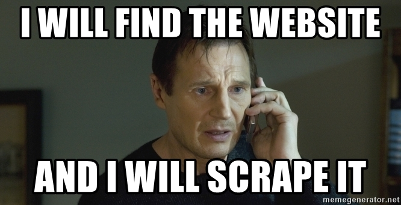
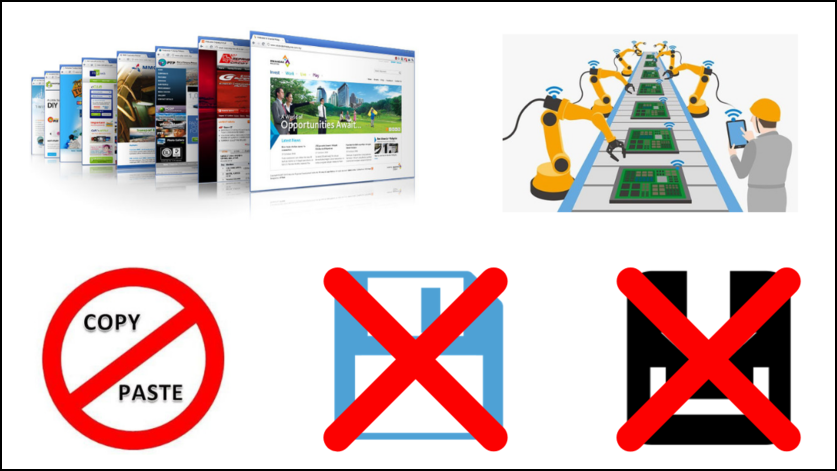

```{r setup, include=FALSE}
knitr::opts_chunk$set(echo = TRUE)
```

```{r cover_image, echo=FALSE, fig.align='center', out.width="80%"}

```

## Introduction

<hr>

So you want to know the range of products being sold by your competitor. You go 
to their website and see all the products (along with the details) and want to 
compare it with your own range of products. Great! How do you do that? How do 
you get the details available on the website into a format in which you can 
analyse it?

- Can you copy/paste the data from their website?
- Can you see some save button?
- Can you download the data?

Hmmm.. If you have these or similar questions on your mind, you have come to 
the right place. In this post, we will learn about web scraping using R. **If 
you like a more structured approach, try our free online course, 
[Web Scraping with R]()**.

## The What?

<hr>

```{r cover_what, echo=FALSE, fig.align='center', out.width="80%"}

```

What exactly is web scraping or web mining or web harvesting? It is a 
technique for extracting data from websites. Remember, websites contain wealth 
of useful data but designed for human consumption and not data analysis. The 
goal of web scraping is to take advantage of the pattern or structure of web 
pages to extract and store data in a format suitable for data analysis.

## The Why?

<hr>

```{r why, echo=FALSE, fig.align='center', out.width="80%"}

```

Now, let us understand why we may have to scrape data from the web.

- **Data Format**: As we said earlier, there is a wealth of data on websites 
but designed for human consumption. As such, we cannot use it for data analysis 
as it is not in a suitable format/shape/structure.
- **No copy/paste**: We cannot copy & paste the data into a local file. Even if 
we do it, it will not be in the required format for data analysis.
- **No save/download**: There are no options to save/download the required data 
from the websites. We cannot right click and save or click on a download button 
to extract the required data.
- **Automation**: With web scraping, we can automate the process of data 
extraction/harvesting.

<hr color="black">

## The How?

<hr>

```{r how, echo=FALSE, fig.align='center', out.width="80%"}
knitr::include_graphics("web-scraping/img/blog_ws_how_border.png")
```

- **robots.txt**: One of the most important and overlooked step is to check the 
**robots.txt** file to ensure that we have the permission to access the web 
page without violating any terms or conditions. In R, we can do this using the 
[robotstxt](https://cran.r-project.org/package=robotstxt) 
by [rOpenSci](https://ropensci.org/).
- **Fetch**: The next step is to fetch the web page using the 
[xml2](https://cran.r-project.org/package=xml2) package and store it so that we 
can extract the required data. Remember, you fetch the page once and store it 
to avoid fetching multiple times as it may lead to your IP address being 
blocked by the owners of the website.
- **Extract/Store/Analyze**: Now that we have fetched the web page, we will use 
[rvest](https://rvest.tidyverse.org/) to extract the data and store it for 
further analysis.


## Use Cases

<hr>

```{r use_cases, echo=FALSE, fig.align='center', out.width="80%"}
knitr::include_graphics("web-scraping/img/blog_ws_use_cases_border.png")
```

Below are few use cases of web scraping:

- **Contact Scraping**: Locate contact information including email addresses, 
phone numbers etc.
- **Monitoring/Comparing Prices**: How your competitors price their products, 
how your prices fit within your industry, and whether there are any 
fluctuations that you can take advantage of.
- **Scraping Reviews/Ratings**: Scrape reviews of product/services and use it
for text mining/sentiment analysis etc.

## Things to keep in mind...

<hr>

```{r keep_in_mind, echo=FALSE, fig.align='center', out.width="80%"}
knitr::include_graphics("web-scraping/img/blog_ws_keep_in_mind_border.png")
```

- **Static & Well Structured**: Web scraping is best suited for static & well structured web pages. In one of 
our case studies, we demonstrate how badly structured web pages can hamper data
extraction.
- **Code Changes**: The underling HTML code of a web page can change anytime due to changes in
design or for updating details. In such case, your script will stop working. It
is important to identify changes to the web page and modify the web scraping script accordingly.
- **API Availability**: In many cases, an API (application programming interface) is made available 
by the service provider or organization. It is always advisable to use the API
and avoid web scraping. The [httr]() package has a nice introduction on 
interacting with APIs.
- **IP Blocking**: Do not flood websites with requests as you run the risk of getting blocked.
Have some time gap between request so that your IP address in not blocked from 
accessing the website.
- **robots.txt**: We cannot emphasize this enough, always review the **robots.txt** file to 
ensure you are not violating any terms and conditions.

## Case Studies

<hr>

```{r case_studies, echo=FALSE, fig.align='center', out.width="80%"}

```

- **Best selling mobile phones**: In the first case study, we will scrape the 
best selling mobile phones from website of Amazon India and extract the name, 
color, rating, number of reviews, real and discounted price.
- **IMDB top 50 movies**: In this case study we will scrape the IMDB website 
to extract the title, year of release, certificate, runtime, genre, rating, 
votes and revenue of the top 50 movies.
- **Most visited websites**: In this case study, we will look at the 50 most 
visited websites in the world including the category to which they belong, 
average time on site, average pages browsed per vist and bounce rate.
- **List of RBI governors** : In this final case study, we will scrape the list
of RBI Governors from Wikipedia, and analyze the background from which they
came i.e whether there were more economists or bureaucrats?

<hr color="black">

<a href="https://www.rsquaredacademy.com/" target="_blank"></a>

<hr color="black">


## HTML Basics

<hr>

To be able to scrape data from websites, we need to understand how the web 
pages are structured. In this section, we will learn just enough HTML to be 
able to start scraping data from websites.

### HTML, CSS & JAVASCRIPT

<hr>

```{r html_css_js, echo=FALSE, fig.align='center', out.width="80%"}

```

A web page typically is made up of the following:

#### HTML

**HTML** (Hyper Text Markup Language) takes care of the content. You need to 
have a basic knowledge of HTML tags as the content is located with these tags.

#### CSS

**CSS** (Cascading Style Sheets) takes care of the appearance of the contente.
While you don't need to look into the CSS of a web page, you should be able to
identify the **id** or **class** that manage the appearance of content.

#### JS

**JS** (Javascript) takes care of the behavior of the web page. 

### HTML Tags

<hr>

Below is a list of basic and important HTML tags you should know before you
get started with web scraping.

```{r html_tags, echo=FALSE, fig.align='center', out.width="80%"}
knitr::include_graphics("web-scraping/img/html_tags.jpg")
```

### DOM 

<hr>

```{r html_dom, echo=FALSE, fig.align='center', out.width="80%"}
knitr::include_graphics("web-scraping/img/blog_ws_html_dom_border.png")
```

**DOM** (Document Object Model) defines the logical structure of a document
and the way it is accessed and manipulated. In the above image, you can that
the HTML is structured as a tree and you trace path to any node or tag. We 
will use a similar approach in our case studies.

### HTML Attributes

<hr>

```{r html_attributes, echo=FALSE, fig.align='center', out.width="80%"}
knitr::include_graphics("web-scraping/img/blog_ws_html_attributes_crop.png")
```

### Class, Div & Style

<hr>

```{r html_tags_2, echo=FALSE, fig.align='center', out.width="80%"}

```

<hr color="black">

<p>
<a href="https://www.youtube.com/user/rsquaredin/" target="_blank"></a>
</p>

<hr color="black">

## Libraries

<hr>

We will be the following R packages in this tutorial. 

```{r libs, message=FALSE, warning=FALSE}
library(robotstxt)
library(rvest)
library(xml2)
library(dplyr)
library(stringr)
library(forcats)
library(magrittr)
library(tidyr)
library(ggplot2)
library(lubridate)
library(tibble)
library(purrr)
```

## Best Selling Mobile Phones

<hr>

```{r top_mobiles, echo=FALSE, fig.align='center', out.width="80%"}

```

In this first case study, we will scrape the details of best selling smart
phones from [Amazon](https://www.amazon.in/mobile-phones/b?ie=UTF8&node=1389401031&ref_=nav_shopall_sbc_mobcomp_all_mobiles).
Our goal is to extract the following:

- Brand name
- Color
- Rating 
- Number of reviews
- Real price
- Actual price (after discount)

As mentioned earlier, we will first check if we can scrape data from the web 
page using `paths_allowed()` from the **robotstxt** package. We need to 
specify the url of the web page using the `paths` argument. If we can access
the web page, `paths_allowed()` will return `TRUE`, else `FALSE`.

Since it has returned `TRUE`, let us go ahead and download the web page using
`read_html()` from the **xml2** package and store it in `top_phones`. We do 
this to ensure not to make repeated requests to the website which may lead to
our IP address being blocked. 

### Brand Name

<hr>

```{r mobile_brand_name, echo=FALSE, fig.align='center', out.width="80%"}
knitr::include_graphics("web-scraping/img/blog_ws_mobile_brand_name_border.png")
```

The first detail we want to extract is the brand name of the phone. If you look
at the HTML code, it is nested within a hyperlink, defined by `<a>`. The link 
is inside a section identified by the class `crwTitle`. We will use this 
information to ask **rvest** to extract text content which will give us the 
brand name.

The location is specified using `html_nodes()` and the text extracted using 
`hmtl_text()`. Since `crwTitle` is a class, we use `.` before it but not for
`a` as it is a HTML tag. Both the class and the tag are specified with quotes 
and separated by space.

If you observe the output, it includes the following:

- brand name
- color
- RAM
- storage capacity

To extract the brand name, we will use `str_split()` from **stringr** and
specify the pattern `\\(` i.e split the string @ the first opening bracket.
Since `(` is a special character, we use `\\` for escaping. Next, we use
`map_chr()` from the **purrr** package to extract the first element from 
the resulting list. Finally, we remove the white space using `str_trim()`.

The whole point of the above exercise is to show that extracting the data
using **rvest** is just one part of web scraping. We need to spend enough
time tidying and reshaping the data to get it into a format useful for data
analysis.

### Color

<hr>

```{r mobile_color, echo=FALSE, fig.align='center', out.width="80%"}

```

In the previous step, we observed that the data extracted from `top_mobiles`
included the color of the mobile as well. So the location of the color in 
the HTML is same; within the hyperlink of the `crwTitle` section. But now,
we want to extract the color and not the brand name.

We will split the original string @ `(` and extract the second part which
includes:

- color
- RAM
- storage capacity

The color is separated from the rest by a comma. We will use the `,` to split
the string and extract the color using `map_chr()` i.e. extract the first
element from the resulting list. 

### Rating

<hr>

```{r mobile_rating, echo=FALSE, fig.align='center', out.width="80%"}
knitr::include_graphics("web-scraping/img/blog_ws_mobile_rating_border.png")
```

Let us extract the ratings for the phones now. If you look at the HTML code,
we can locate rating within the following:

- `<span>`
- `<a>`
- `.crwProductDetail`

It is wrapped within `<span>` identified by the class `.a-icon-alt` which is 
inside a hyperlink in the section identified by the class `.crwProductDetail`.

In the outptut, you can observe the text **out of 5 stars** for each rating.
Let us get rid of this text by selecting the first 3 characters using 
`str_sub()`. We pick the first 3 characters using the `start` and `end` 
arguments and supply them the values `1` and `3`. Finally, we convert the
rating to a number using `as.numeric()`.


### Number of Reviews

<hr>

```{r mobile_reviews, echo=FALSE, fig.align='center', out.width="80%"}

```

Now that we know the rating for each of the top 10 best selling smart phones, 
let us find out how many people have reviewed them. The number of reviews is
located within the following:

- hyperlink identified by the class `.a-link-normal`
- `<span>` tag identified by the class `.a-size-small`
- section identified by the class `.crwProductDetail`

We use the above information within `html_nodes()` to extract the data. Now 
let us clean it up a bit and convert it into a number instead of leaving it
as a character. If you use `as.numeric()` directly, you will see `NA` in 
the result, the reason being the presence of comma in the number of reviews.
First, we need to get rid of the comma, which we will do using `str_replace()`.
We replace the comma with nothing as shown in the code below and then convert
it into a number. 

### Real Price

<hr>

The price is one of the most important factor when it comes to choosing a
smart phone. Let us look at the price of the best selling mobile phones. Again,
looking at the HTML code, the price can be located within the following:

- `<span>` tag identified by the class `.a-text-strike`
- section identified by the class `crwPrice` and `.crwProductDetail`

Using the above information, we can extract the price of the mobile phones 
which is returned as a character vector but we need to convert it to numeric 
if we are to analyze it further. Let use convert the price to a number using 
the following steps:

- use `str_trim()` to remove the white spaces
- exclude the currency information using `str_sub()`
- replace the comma using `str_replace()`
- remove the decimal values using `str_split()`
- extract the price from the resulting list using `map_chr()`
- convert the price to a number `using as.numeric()`

```{r mobile_real_price, echo=FALSE, fig.align='center', out.width="80%"}
knitr::include_graphics("web-scraping/img/blog_ws_real_price_border.png")
```

### Actual Price

<hr>

```{r mobile_actual_price, echo=FALSE, fig.align='center', out.width="80%"}

```

Deep discounts are one of the strategies adopted by ecommerce firms to drive
sales. Let us look at the actual price (after discount price) of the best 
selling mobile phones. The discounted price can be located within the 
following:

- `<span>` tag identified by the class `.crwActualPrice`
- section identified by the class `crwPrice` and `.crwProductDetail`

Using the above information, we can extract the discounted price of the mobile 
phones. Let use convert the price to a number using the same steps as in the
case of real price.

<hr color="black">

<a href="https://apps.rsquaredacademy.com/" target="_blank"></a>

<hr color="black">


## IMDB Top 50 

<hr>

```{r imdb_top_50, echo=FALSE, fig.align='center', out.width="80%"}

```

In this case study, we will extract the following details of the top 50 movies
from the IMDB website:

- title
- year of release
- certificate
- runtime
- genre
- rating
- votes
- revenue

### Title

<hr>

```{r imdb_movie_name, echo=FALSE, fig.align='center', out.width="80%"}
knitr::include_graphics("web-scraping/img/blog_ws_imdb_movie_name_border.png")
```

As we did in the previous case study, we will look at the HTML code of the IMDB
web page and locate the title of the movies in the following way:

- hyperlink inside `<h3>` tag
- section identified with the class `.lister-item-content`

In other words, the title of the movie is inside a hyperlink (`<a>`) which
is inside a level 3 heading (`<h3>`) within a section identified by the class
`.lister-item-content`.


### Year of Release

<hr>

```{r imdb_movie_year, echo=FALSE, fig.align='center', out.width="80%"}

```

The year in which a movie was released can be located in the following way:

- `<span>` tag identified by the class `.lister-item-year`
- nested inside a level 3 heading (`<h3>`)
- part of section identified by the class `.lister-item-content`


If you look at the output, the year is enclosed in round brackets and is a
character vector. We need to do 2 things now:

- remove the round bracket
- convert year to class `Date` instead of character

We will use `str_sub()` to extract the year and convert it to `Date` using
`as.Date()` with the format `%Y`. Finally, we use `year()` from **lubridate** 
package to extract the year from the previous step.

### Certificate

<hr>

```{r imdb_movie_certificate, echo=FALSE, fig.align='center', out.width="80%"}
knitr::include_graphics("web-scraping/img/blog_ws_imdb_movie_certificate_border.png")
```

The certificate given to the movie can be located in the following way:

- `<span>` tag identified by the class `.certificate`
- nested inside a paragraph (`<p>`)
- part of section identified by the class `.lister-item-content`


### Runtime

<hr>

```{r imdb_movie_runtime, echo=FALSE, fig.align='center', out.width="80%"}

```

The runtime of the movie can be located in the following way:

- `<span>` tag identified by the class `.runtime`
- nested inside a paragraph (`<p>`)
- part of section identified by the class `.lister-item-content`

### Genre

<hr>

```{r imdb_movie_genre, echo=FALSE, fig.align='center', out.width="80%"}

```

The genre of the movie can be located in the following way:

- `<span>` tag identified by the class `.genre`
- nested inside a paragraph (`<p>`)
- part of section identified by the class `.lister-item-content`


### Rating

<hr>

```{r imdb_movie_rating, echo=FALSE, fig.align='center', out.width="80%"}
knitr::include_graphics("web-scraping/img/blog_ws_imdb_movie_rating_border.png")
```

The rating of the movie can be located in the following way:

- part of the section identified by the class `.ratings-imdb-rating`
- nested within the section identified by the class `.ratings-bar`

Since rating is returned as a character vector, we will use `as.numeric()` to
convert it into a number.

### XPATH

<hr>

```{r imdb_movie_xpath, echo=FALSE, fig.align='center', out.width="80%"}
knitr::include_graphics("web-scraping/img/blog_ws_html_xpath_border.png")
```

### Votes

<hr>

```{r imdb_movie_votes, echo=FALSE, fig.align='center', out.width="80%"}
knitr::include_graphics("web-scraping/img/blog_ws_imdb_movie_votes_border.png")
```

To extract votes from the web page, we will use a different technique. In this
case, we will use **xpath** and **attributes** to locate the total number of 
votes received by the top 50 movies.

**xpath** is specified using the following:

- tab
- attribute name
- attribute value

In case of votes, they are the following:

- `meta`
- `itemprop`
- `ratingCount`

Next, we are not looking to extract text value as we did in the previous examples
using `html_text()`. Here, we need to extract the value assingned to the 
`content` attribute within the `<meta>` tag using `html_attribute()`.

Finally, we convert the votes to a number using `as.numeric()`.

### Revenue

<hr>

```{r imdb_movie_revenue, echo=FALSE, fig.align='center', out.width="80%"}
knitr::include_graphics("web-scraping/img/blog_ws_imdb_movie_revenue_border.png")
```

We wanted to extract both revenue and votes without using **xpath** but the way
in which they are structured in the HTML code forced us to use **xpath** to 
extract votes. If you look at the HTML code, both votes and revenue are located
inside the same tag with the same attribute name and value i.e. there is no 
distinct way to identify either of them. 

In case of revenue, the **xpath** details are as follows:

- `<span>`
- `name`
- `nv`

Next, we will use `html_text()` to extract the revenue.

To extract the revenue as a number, we need to do some string hacking as 
follows:

- extract values that begin with `$`
- omit missing values
- convert values to character using `as.character()`
- append NA where revenue is missing
- remove `$` and `M` 
- convert to number using `as.numeric()`

<hr color="black">

<a href="https://pkgs.rsquaredacademy.com/" target="_blank"></a>

<hr color="black">

## Top Websites

<hr>

```{r top_websites, echo=FALSE, fig.align='center', out.width="80%"}
knitr::include_graphics("web-scraping/img/blog_ws_cs_top_websites_border.png")
```

In this case study, we will extract the following details of the 50 movst 
visited websites in the world:

- ranking
- domain
- category
- change in ranking
- average time spent on the website
- average pages visited per visit
- bounce rate

Let us look at the code and the output first.

Surprising right! Whenever data is structured as a table in HTML, you need to 
specify the class `.table` in `html_node()` and it will return all the tables 
in the web page after which you can use `html_table()` to extract and convert 
the whole table to a `data.frame` in R.

Since the names of the columns are very long, we have renamed them to be 
concise and descriptive.

Now, let us look at the categories to which these top 50 websites belong using
`count()` from **dplyr**. We will sort the result in descending order using the
`sort` argument and assign it the value `TRUE`.

Let us club some of them to remove the sub categories.

Let us calculate the `%` of these categories and plot them.

## RBI Governors

<hr>

```{r rbi_governors, echo=FALSE, fig.align='center', out.width="80%"}
knitr::include_graphics("web-scraping/img/blog_ws_rbi_governors_border.png")
```

In this case study, we are going to extract the list of 
RBI (Reserve Bank of India) Governors. The author of this blog post comes from
an Economics background and as such was intereseted in knowing the professional
background of the Governors prior to their taking charge at India's central 
bank.

The data in the Wikipedia page is luckily structured as a table and we can 
extract it using `html_table()`. There are 2 tables in the web page and we 
are interested in the second table. Using `extract2()` from the **magrittr**
package, we will extract the table containing the details of the Governors.

Let us arrange the data by number of days served. The `Term in office` column
contains this information but it also includes the text days. Let us split this
column into two columns, `term` and `days`, using `separate()` from tidyr and 
then select the columns `Officeholder` and `term` and arrange it in descending
order using `desc()`.

What we are interested is in the background of the Governors? Use `count()` 
from **dplyr** to look at the backgound of the Governors and the respective 
counts. 

Let us club some of the categories into **Bureaucrats** as they belong to the
Indian Administrative/Civil Services. The missing data will be renamed as `No Info`.
The category `Career Reserve Bank of India officer` is renamed as `RBI Officer`
to make it more concise.

Hmmm.. So there were more bureaucrats than economists.

## Summary

<hr>

- web scraping is the extraction of data from web sites
- best for static & well structured HTML pages
- review robots.txt file  
- HTML code can change any time
- if API is available, please use it
- do not overwhelm websites with requests

*To get in depth knowledge of R & data science, you can 
[enroll here](https://rsquared-academy.thinkific.com/) for our free online R 
courses.*


