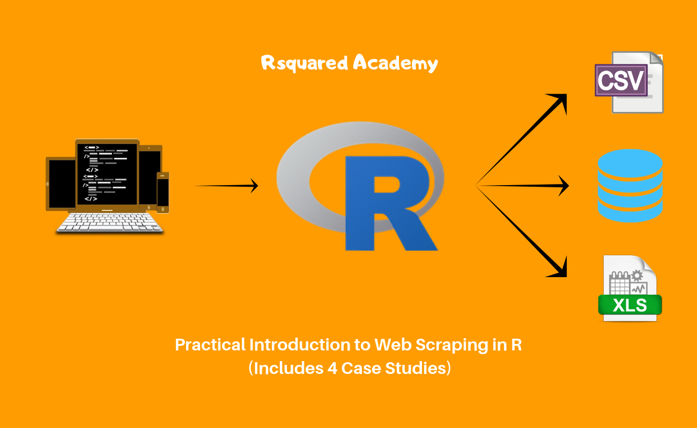
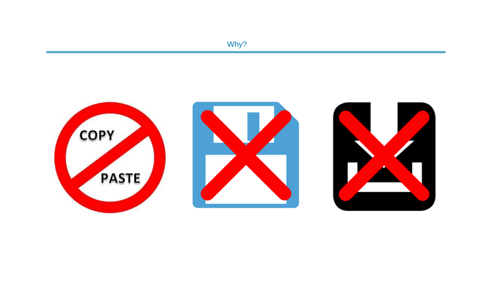
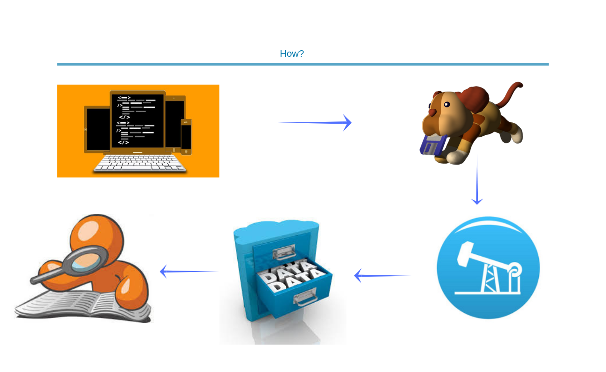
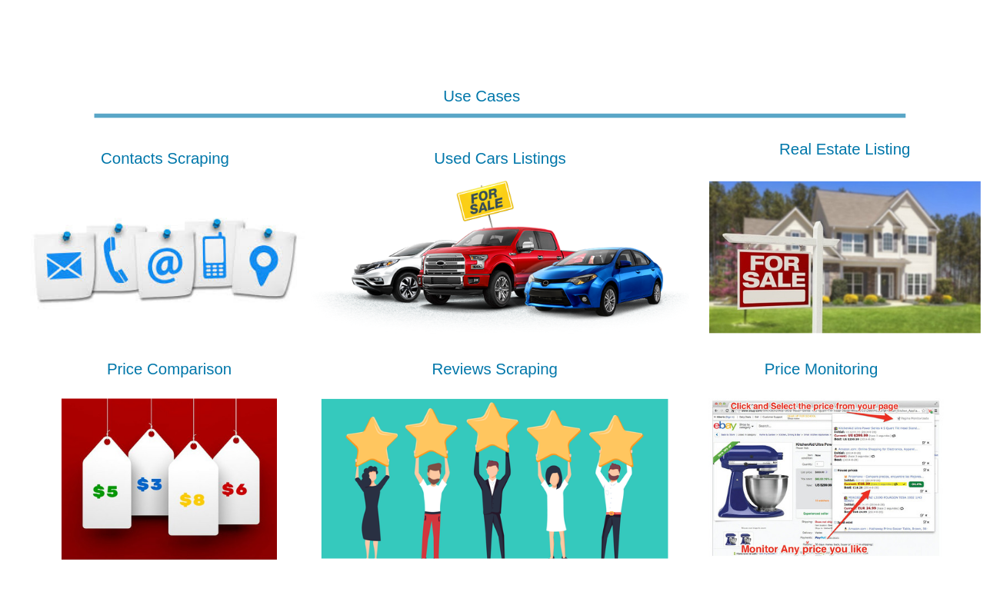

```{r setup, include=FALSE}
knitr::opts_chunk$set(echo = TRUE)
```

## Introduction

<hr>

```{r cover_image, echo=FALSE, fig.align='center'}

```

So you want to know the range of products being sold by your competitor. You go 
to their website and see all the products (along with the details) and want to 
compare it with your own range of products. Great! How do you do that? How do 
you get the details available on the website into a format in which you can 
analyse it?

- Can you copy/paste the data from their website?
- Can you see some save button?
- Can you download the data?

Hmmm.. If you have these or similar questions on your mind, you have come to 
the right place. In this post, we will learn about web scraping using R. **If 
you like a more structured approach, try our free online course, 
[Web Scraping with R]()**.

## The What?

<hr>

```{r cover_what, echo=FALSE, fig.align='center'}

```

So, what exactly is web scraping or web mining or web harvesting? It is a 
technique for extracting data from websites. Remember, websites contain wealth 
of useful data but designed for human consumption and not data analysis. The 
goal of web scraping is to take advantage of the pattern or structure of web 
pages to extract and store data in a format suitable for data analysis.

## The Why?

<hr>

```{r why, echo=FALSE, fig.align='center'}

```

- data not available in a suitable format
- copy/paste does not work
- no option to save/download data
- automate data extraction/harvesting

## The How?

<hr>

```{r how, echo=FALSE, fig.align='center'}

```

- check robots.txt file
- fetch the web page
- extract, store & analyze

## Use Cases

<hr>

```{r use_cases, echo=FALSE, fig.align='center'}

```

- scraping contact details
- monitoring online price changes
- comparing prices across websites
- scraping reviews/ratings
- real estate listings
- used car prices

## Things to keep in mind...

<hr>

```{r keep_in_mind, echo=FALSE, fig.align='center'}

```

- best for static & well structured web pages
- the underling HTML code can change anytime
- if an API is availabel, please use it
- do not overwhelm websites with requests as you run
the risk of getting blocked
- review robots.txt file to ensure that you are not
violating any terms and conditions

## Case Studies

<hr>

```{r case_studies, echo=FALSE, fig.align='center', out.width="100%"}
knitr::include_graphics("web-scraping/img/blog_ws_case_studies_border.png")
```

- best selling mobile phones
- IMDB top 50 movies
- most visited websites 
- list of RBI governors

## HTML Basics

<hr>

To be able to scrape data from websites, we need to understand how the web 
pages are structured. In this section, we will learn enough about HTML to be 
able to start scraping data from websites.

### HTML, CSS & JAVASCRIPT

<hr>

```{r html_css_js, echo=FALSE, fig.align='center'}

```

### HTML Tags

<hr>

```{r html_tags, echo=FALSE, fig.align='center'}

```

### DOM 

<hr>

```{r html_dom, echo=FALSE, fig.align='center'}

```

### HTML Attributes

<hr>

```{r html_attributes, echo=FALSE, fig.align='center'}
knitr::include_graphics("web-scraping/img/ws_html_attributes.png")
```

### Class, Div & Style

<hr>

```{r html_tags_2, echo=FALSE, fig.align='center'}

```

## Libraries

<hr>

```{r libs, message=FALSE, warning=FALSE}
library(robotstxt)
library(rvest)
library(selectr)
library(xml2)
library(dplyr)
library(stringr)
library(forcats)
library(magrittr)
library(tidyr)
library(ggplot2)
library(lubridate)
library(tibble)
library(purrr)
```

## Best Selling Mobile Phones

<hr>

```{r top_mobiles, echo=FALSE, fig.align='center'}

```

## Summary

<hr>

- web scraping is the extraction of data from web sites
- best for static & well structured HTML pages
- review robots.txt file  
- HTML code can change any time
- if API is available, please use it
- do not overwhelm websites with requests


