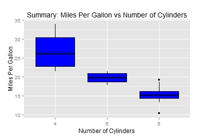

## Intro

----

This is the first module of the course **Data Visualization With R**. The objective of the course is to provide a gentle introduction to working with base graphics in R.

## What is data visualization?

----

In simple words, data visualization is the representation of data in graphical format. 


## Why visualize data?

- Explore: Visualization helps in exploring and explaining patterns and trends
- Detect: Patterns or anomalies in data can be detected by looking at graphs
- Make sense: Possible to make sense of large amount of data efficiently and in time
- Communicate: Easy to communicate and share the insights from data

----

Compare the below output and the boxplot and you will agree that **A picture is worth a thousand words**

----

```{r compare}
by(mtcars$mpg, mtcars$cyl, summary)
```

----
  



## R Graphics System

## Graphics

It is part of base R and is the fundamental package for visualizing data.
It has a lot of good features and we can create all the basic plots using it.

## ggplot2

[ggplot2](http://ggplot2.tidyverse.org/index.html), created by Hadley Wickham, is based on the Grammar of Graphics written by Leland Wilkinson. It has a structured approach to data visualization and builds upon the features available in the Graphics and Lattice packages.

## Lattice

The [lattice](https://CRAN.R-project.org/package=lattice) package is inspired by Trellis Graphics and created by [Deepayan Sarkar](http://www.isid.ac.in/~deepayan/). It is a very powerful data visualization system with an emphasis on multivariate data.


## Plot Basics

----

The `plot()` function is the fundamental tool to build plots in the **Graphics** package. It is a generic function and creates appropriate plot based on the input received from the user. In this post, we will explore the `plot()` function using differnt types of data and observe the corresponding plots created. We will use the `mtcars` data set throughout this section.

----

Use the `help()` function to learn more about the `plot()` function and the `mtcars` data set.

```{r help, eval=FALSE}
help(plot)
help(mtcars)
```

## mtcars 

----

Let us take a quick look at the `mtcars` data set before we build the plots:

----

```{r mtcars}
head(mtcars)
```

----

## variable info

----

```{r data2}
str(mtcars)
```

----

Now that we have some idea about the data set, let us explore the `plot()` function. We will use the following different data inputs and observe the kind of plots that are generated:

- Case 1: 1 continuous variable
- Case 2: 1 categorical variable
- Case 3: 2 continuous variables
- Case 4: 2 categorical variables
- Case 5: 1 continuous and 1 categorical variable
- Case 6: 1 categorical and 1 continuous variable

*Case 5 and 6 might look similar but the difference lies in the variables being assigned to the X and Y axes.*

## Case 1: One continuous variable

----

We will us the variable `mpg` (Miles per Gallon).

```{r plot1,fig.align='center',fig.height=5,fig.width=5}
plot(mtcars$mpg)
```

----

The `plot()` function creates a **Scatter Plot** when a single continuous variable is used as the input. We cannot infer much from this plot. Let us plot a categorical variable and see what happens.

## Case 2: One categorical variable

----

Let us use the `cyl` (number of cylinders) variable for this case but before we create the plot, the variable must be converted to type `factor` using the `as.factor()` function:

```{r plot2,fig.align='center',fig.height=5,fig.width=5}
plot(as.factor(mtcars$cyl))
```

----

The `plot()` function creates a **Bar Plot** when the input is a factor/categorical variable.

## Case 3: Two continuous variables

----

So far we have used only 1 variable as the input for the `plot()` function but from now on we will use 2 variables. In this case, let us look at the relationship between `disp` (displacement) and `mpg` (mileage) of the cars. `disp` is represented by the X axis and `mpg` by the Y axis.

----

```{r plot3,fig.align='center',fig.height=5,fig.width=5}
plot(mtcars$disp, mtcars$mpg)
```

----

The **Scatter Plot** created represents the relationship between `disp` and `mpg`.

## Case 4: Two categorical variables

----

In this case, we will use `am` (transmission type) and `cyl` (number of cylinders). `am` will be represented by the X axis and `cyl` by the Y axis.

----

```{r plot4,fig.align='center',fig.height=5,fig.width=5}
plot(as.factor(mtcars$am), as.factor(mtcars$cyl))
```

----

A **stacked bar plot** is created when the inputs to the `plot()` function are factor/categorical. In the next 2 cases, we will use a combination of both continuous and categorical variables.

## Case 5: Continuous/Categorical variable

----

In this case, we will use 1 continuous and 1 categorical variable. Let us use `mpg` and `cyl`. `mpg` will be represented on the X axis and `cyl` on the Y axis.

----

```{r plot5,fig.align='center',fig.height=5,fig.width=5}
plot(mtcars$mpg, mtcars$cyl)
```

----

A **scatter plot** is created but we cannot infer much from this type of plot.

## Case 6: Categorical/Continuous variable

----

In this case, we will use 1 categorical and 1 continuous variable. Let us use `cyl` and  `mpg`. `cyl` will be represented on the X axis and `mpg` on the Y axis.

----

```{r plot6,fig.align='center',fig.height=5,fig.width=5}
plot(as.factor(mtcars$cyl), mtcars$mpg)
```

----

A **box plot** is generated and we can examine the distribution of `mpg` for the different levels of `cyl`.


## Summary

----

In this first post, we have explored the `plot()` function to understand the different types of plots it can create based on the input types. 


## Next Steps..

Before we begin to build different plots such as bar plots, box plots, scatter plots or line plots, we will quickly learn how to add title and labels to a plot. In the next module, we will learn the following:

- Title & subtitle
- Axis labels & range
- Color, font style and size


