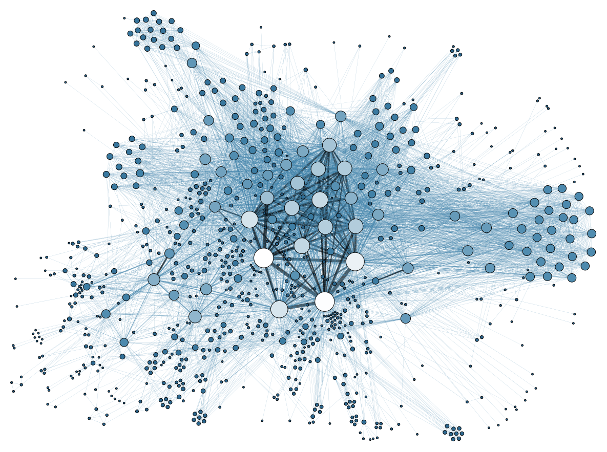

## {data-background="thankyou.png"}

## Agenda

<hr>

- what is data visualization
- why visualize data
- understand R graphics system
    - graphics
    - ggplot2
    - lattice
- build some simple plots

## What is data visualization?

<hr>

In simple words, data visualization is the representation of data in graphical format. 



## Why visualize data?

<hr>

- Explore: Visualization helps in exploring and explaining patterns and trends
- Detect: Patterns or anomalies in data can be detected by looking at graphs
- Make sense: Possible to make sense of large amount of data efficiently and in time
- Communicate: Easy to communicate and share the insights from data


## R Graphics System

<hr>

- graphics 
- ggplot2
- lattice

## Graphics

<hr>

- It is part of base R and is the fundamental package for visualizing data.
- It has a lot of good features and we can create all the basic plots using it.

## ggplot2

<hr>

[ggplot2](http://ggplot2.tidyverse.org/index.html), created by Hadley Wickham, is based on the Grammar of Graphics written by Leland Wilkinson. It has a structured approach to data visualization and builds upon the features available in the Graphics and Lattice packages.

## Lattice

<hr>

The [lattice](https://CRAN.R-project.org/package=lattice) package is inspired by Trellis Graphics and created by [Deepayan Sarkar](http://www.isid.ac.in/~deepayan/). It is a very powerful data visualization system with an emphasis on multivariate data.


## Getting Help

<hr>

Use the `help()` to learn more about `plot()` function and `mtcars` data set.

```{r help, eval=FALSE}
help(plot)
help(mtcars)
```

## mtcars 

<hr>


```{r mtcars}
head(mtcars)
```

## variable info

<hr>

```{r data2}
str(mtcars)
```

## plot()

<hr>

Now that we have some idea about the data set, let us explore the `plot()` function. We will use the following different data inputs and observe the kind of plots that are generated:

- Case 1: 1 continuous variable
- Case 2: 1 categorical variable
- Case 3: 2 continuous variables
- Case 4: 2 categorical variables
- Case 5: 1 continuous and 1 categorical variable
- Case 6: 1 categorical and 1 continuous variable

## One continuous variable

<hr>

```{r plot1,fig.align='center',fig.height=5,fig.width=5}
plot(mtcars$mpg)
```

## One categorical variable

<hr>

```{r plot2,fig.align='center',fig.height=5,fig.width=5}
plot(as.factor(mtcars$cyl))
```

## Two continuous variables

<hr>

```{r plot3,fig.align='center',fig.height=5,fig.width=5}
plot(mtcars$disp, mtcars$mpg)
```

## Two categorical variables

<hr>

```{r plot4,fig.align='center',fig.height=5,fig.width=5}
plot(as.factor(mtcars$am), as.factor(mtcars$cyl))
```

## Continuous/Categorical variable

<hr>

```{r plot5,fig.align='center',fig.height=5,fig.width=5}
plot(mtcars$mpg, mtcars$cyl)
```

## Categorical/Continuous variable

<hr>

```{r plot6,fig.align='center',fig.height=5,fig.width=5}
plot(as.factor(mtcars$cyl), mtcars$mpg)
```

## {data-background="thankyou.png"}

<!-- To do: -->
<!--   - add intro slide -->
<!--   - image for why visualize data -->
<!--   - condense information about plotting system -->
<!--   - add info about interactive plotting libraries -->
  